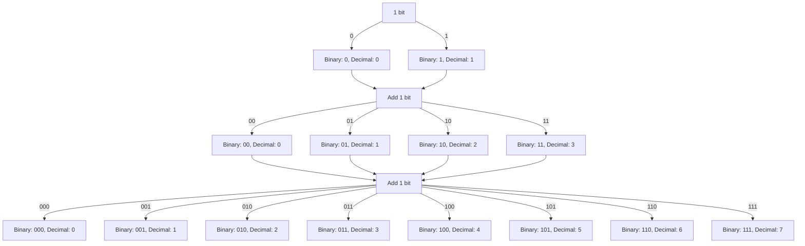

# Understanding Bits and Bytes: A Technical Deep Dive

---

## What is a Bit?

A **bit** is the smallest unit of information in a digital system. It holds a value of either:

- `0` (off, false)
- `1` (on, true)

In modern computers, a bit represents one of two electrical states, and these states form the foundation of digital data. Bits are used for binary arithmetic, memory allocation, data transmission, and much more. 

---

## What is a Byte?

A **byte** is a group of 8 bits and is the smallest addressable unit of memory in most modern computer architectures. A byte can represent 256 different values (`2^8 = 256`), and it is often used to store a character, like a letter or a digit, in systems using standard encodings such as **ASCII**.

---

## The Light Method: Visualizing Bits

A simple yet effective way to explain bits is by using light switches. Here is how it works:

Imagine a light switch:
- If the light is **off**, the state is `0`.
- If the light is **on**, the state is `1`.

By combining multiple switches, we can represent more complex values. For example:
- One switch (`1 bit`) can represent 2 values: `0` or `1`.
- Two switches (`2 bits`) can represent 4 values: `00`, `01`, `10`, and `11`.
- Three switches (`3 bits`) can represent 8 values: `000`, `001`, `010`, `011`, `100`, `101`, `110`, and `111`.

This is why bits are fundamental for digital devices—they act like "on/off" switches that store and process binary data.

---

## Relationship Between Bits and Bytes

The relationship between bits and bytes is straightforward but crucial:

- **1 Byte = 8 Bits**
- **1 Kilobyte (KB) = 1,000 Bytes** (in marketing terms, decimal)
- **1 Kibibyte (KiB) = 1,024 Bytes** (in computing terms, binary)
- **1 Megabyte (MB) = 1,000,000 Bytes** (decimal)
- **1 Mebibyte (MiB) = 1,048,576 Bytes** (binary)

This distinction between binary and decimal measurements is important in various contexts, especially when calculating file sizes and memory. Often this distinction is not even done by professionell, even though it is very important to know this.

---

## Binary System: The Foundation of Bits and Bytes

The **binary system** (base-2) uses only two digits (`0` and `1`) to represent values. This system is the foundation of how bits and bytes work. Each bit in a binary number has a value that is a power of 2, starting from the rightmost bit:

| Binary | Decimal Equivalent |
|--------|---------------------|
| 0000   | 0                   |
| 0001   | 1                   |
| 0010   | 2                   |
| 0011   | 3                   |
| 0100   | 4                   |
| 1111   | 15                  |

To convert a binary number to decimal, we sum the values of the bits that are set to `1`.

---

## Difference Between KB and KiB

### **KB (Kilobyte)**

- **1 KB = 1,000 Bytes**
- Used in marketing, data transmission, and consumer-facing products (like hard drives and SD cards).
- Based on the **decimal** system.

### **KiB (Kibibyte)**

- **1 KiB = 1,024 Bytes**
- Used in technical computing contexts, such as operating systems, and memory allocation.
- Based on the **binary** system (powers of 2).

#### Why Does This Matter?

The use of **KB** (decimal) vs **KiB** (binary) leads to confusion for consumers. For example, a hard drive marketed as **500 GB** may show up as **465 GiB** in your operating system. This happens because hard drive manufacturers use the decimal system (1000 bytes = 1 KB), while most operating systems use the binary system (1024 bytes = 1 KiB).

> **INFO**: This is why a 500 GB drive might show "less" capacity when viewed in Windows or other operating systems—it’s really using binary numbers.

---

## Size Units Beyond Bytes: Table

Below is a table that shows how storage units scale in both **decimal** (used in marketing) and **binary** (used by computers):

|Unit|Symbol|Bytes (Decimal)|Bytes (Binary)|
|---|---|---|---|
|Kilobyte|KB|1,000 bytes|1,024 bytes|
|Kibibyte|KiB|1,024 bytes|1,024 bytes|
|Megabyte|MB|1,000,000 bytes|1,048,576 bytes|
|Mebibyte|MiB|1,048,576 bytes|1,048,576 bytes|
|Gigabyte|GB|1,000,000,000 bytes|1,073,741,824 bytes|
|Gibibyte|GiB|1,073,741,824 bytes|1,073,741,824 bytes|
|Terabyte|TB|1,000,000,000,000 bytes|1,099,511,627,776 bytes|
|Tebibyte|TiB|1,099,511,627,776 bytes|1,099,511,627,776 bytes|

> **NOTE**: The larger the units, the more significant the difference between decimal and binary measurements. This becomes especially important when dealing with multi-terabyte storage.

---
## Significance of Difference at Large Storage Sizes (TB vs TiB)

At smaller sizes like KB or MB, the difference between decimal and binary systems is minor, but at larger sizes, such as **TB** (Terabytes), the difference becomes substantial.

### Example: 24TB Hard Drive

Let's consider a common **24TB** hard drive used in server environments. Here's how the discrepancy plays out:

- **Advertised as 24TB**: Using the decimal system, a 24TB drive is marketed as **24,000,000,000,000 bytes**.
- **Actual size in TiB**: The real usable space in a binary system (used by operating systems) is calculated as:

$$\text{Actual Size (TiB)} = \frac{24,000,000,000,000 \ \text{bytes}}{1,099,511,627,776 \ \text{bytes/TiB}} \approx 21.82 \ \text{TiB}$$

This formula shows how to calculate the actual size in Tebibytes (TiB) from the advertised size in bytes by dividing by the bytes per Tebibyte.

Thus, the operating system would show approximately **21.82 TiB**, not **24TB**. This difference of over **2 TiB** is significant, especially in environments where multiple large drives are used.

#### Why Does This Matter in Enterprise Environments?

- In **server farms**, **data centers**, or large storage arrays where dozens or hundreds of multi-terabyte drives are used, this discrepancy can result in **significant loss** of expected capacity.
- If you’re building a storage cluster with **10 x 24TB** drives, you might expect **240TB** of total storage, but you would only have about **218.2 TiB** of actual usable space.
- In high-performance computing environments, where every terabyte counts, understanding this discrepancy is crucial for accurate capacity planning and storage allocation.

---
## How Computers Recognize 0 and 1 Electrically

At the hardware level, a computer uses electrical signals to represent **bits**. Each bit is stored and transmitted as a voltage:

- **0**: Typically a **low voltage** or **no signal** (close to 0V).
- **1**: Typically a **high voltage** (e.g., 3.3V or 5V, depending on the system).

These voltage differences are processed by **transistors** (tiny switches) that control the flow of electricity in a circuit. When the voltage is high, the transistor "opens" the circuit, representing a `1`. When the voltage is low, the circuit remains "closed", representing a `0`.

### How Does This Work in Practice?

In modern CPUs, **billions of transistors** are used to process these electrical signals. The arrangement and switching of these transistors allow the CPU to perform complex computations, process instructions, and handle data.

#### Electrical Noise and Error Detection

- **Noise**: Electrical signals in circuits can be affected by **electromagnetic interference** (EMI) or other noise, which can cause errors in determining whether the signal is a `0` or `1`.
- **Error Detection**: Techniques like **parity bits** or **checksums** are used to ensure data integrity. For example, when data is transmitted, an extra bit (the parity bit) may be added to indicate whether the number of `1`s in the data is even or odd. If the received data has the wrong parity, the system can detect an error.

---

## Bits and Bytes in Storage and Marketing

Storage manufacturers tend to use the **decimal** system (base-10) to advertise the capacity of hard drives, SSDs, and other storage devices. This results in larger-sounding numbers:

- **1 GB** in marketing terms is **1,000,000,000 bytes** (decimal).
- But in the **binary** system, which operating systems use, **1 GiB** is **1,073,741,824 bytes**.

This difference is why

, when you buy a "500 GB" hard drive, your operating system shows only around **465 GiB** of usable space. The discrepancy comes from the difference between how storage is measured in **decimal** vs how it's reported in **binary**.

### Example: A "500 GB" Hard Drive

- **Marketing Size (500 GB)**: `500,000,000,000 bytes`
- **Actual Size in GiB**: `500,000,000,000 / 1,073,741,824 ≈ 465 GiB`

---

## Conclusion

Bits and bytes are at the core of all digital information processing. Understanding how they work, how they are measured, and the difference between **binary** and **decimal** measurements is crucial for IT professionals. Bits represent binary data at the electrical level, while bytes offer a larger, more practical unit for storing and transmitting information. The difference between **KB** and **KiB** is an important distinction that explains why marketed storage sizes differ from what operating systems report, due to the differing systems of measurement.

---

## Further Reading

- [CS50 Lecture on Binary and Bits](https://youtu.be/IDDmrzzB14M?t=1345)