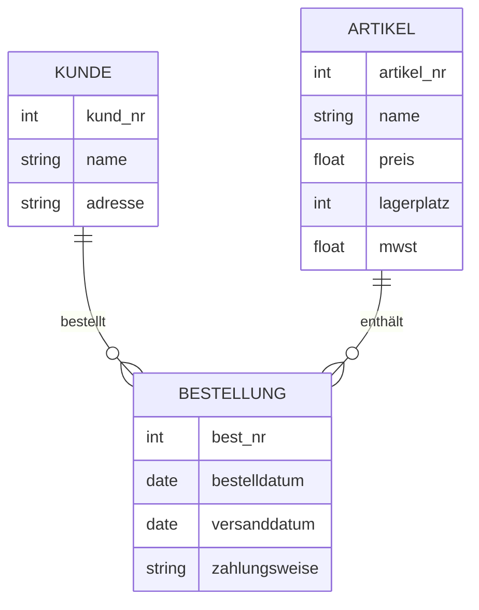
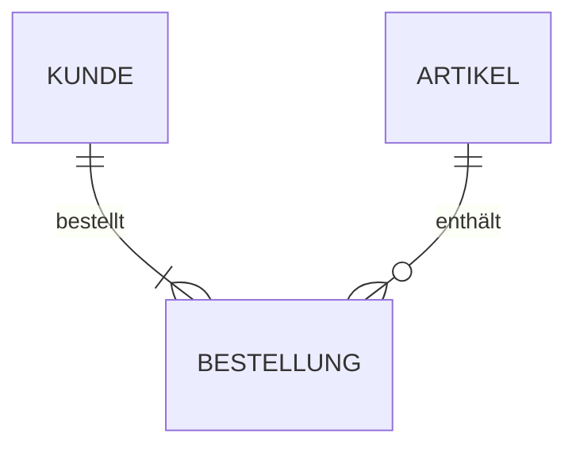
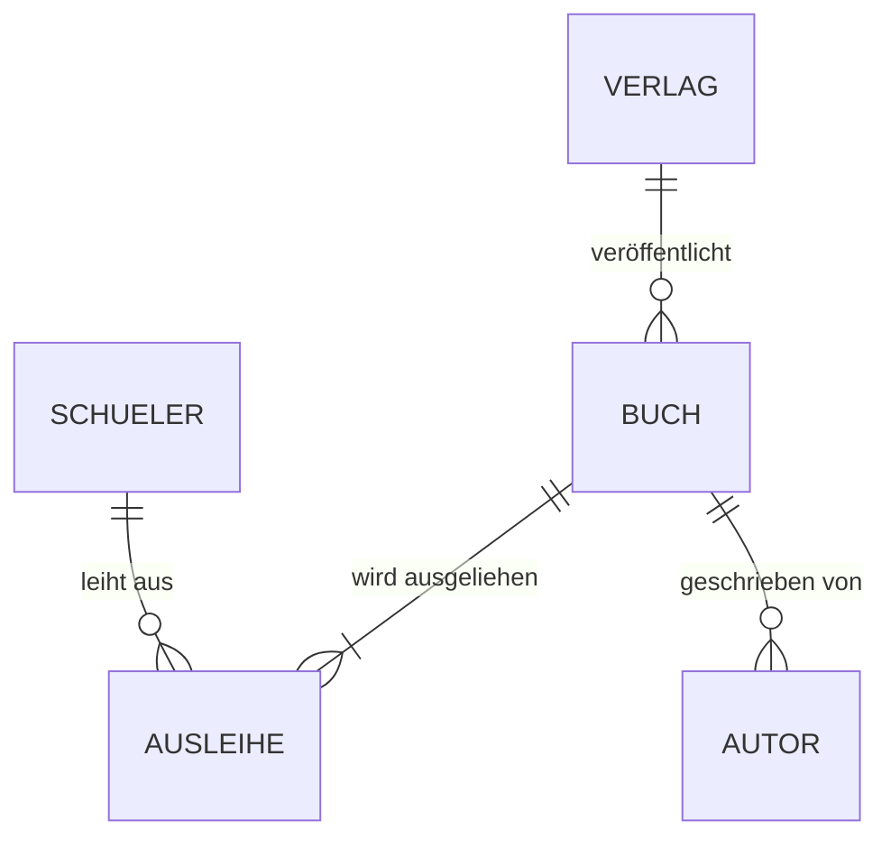

# 📘 Begriffsdefinitionen

| Begriff                                        | Definition                                                                                                                                                                             |
| ---------------------------------------------- | -------------------------------------------------------------------------------------------------------------------------------------------------------------------------------------- |
| **Entität**                                    | Ein Objekt oder Ding, das in der Datenbank gespeichert wird. Zum Beispiel: Kunde, Artikel, Bestellung.                                                                                 |
| **Attribut**                                   | Eine Eigenschaft einer Entität, die zusätzliche Informationen speichert. Zum Beispiel: Name, Preis, Kundennummer.                                                                      |
| **Beziehung**                                  | Eine Verknüpfung zwischen zwei oder mehr Entitäten. Zum Beispiel: Kunde bestellt Artikel, Schüler leiht Buch aus.                                                                      |
| **Kardinalität**                               | Gibt an, wie viele Entitäten an einer Beziehung teilnehmen. Kardinalitäten umfassen 1:1, 1:n, m:n.                                                                                     |
| **Entity-Relationship-Diagramm (ER-Diagramm)** | Ein visuelles Modell zur Darstellung von Entitäten und deren Beziehungen untereinander.                                                                                                |
| **Schlüsselattribut**                          | Ein Attribut, das eine Entität eindeutig identifiziert, wie z.B. Kundennummer, Bestellnummer oder ISBN.                                                                                |
| **Normalisierung**                             | Der Prozess der Optimierung einer Datenbankstruktur durch Aufteilung der Daten in verschiedene Tabellen, um Redundanzen und Anomalien zu vermeiden.                                    |
| **Primärschlüssel (Primary Key)**              | Ein Attribut oder eine Kombination von Attributen, das jede Zeile in einer Tabelle eindeutig identifiziert.                                                                            |
| **Fremdschlüssel (Foreign Key)**               | Ein Attribut in einer Tabelle, das auf den Primärschlüssel einer anderen Tabelle verweist, um Beziehungen zwischen den Tabellen herzustellen.                                          |
| **1:1-Beziehung**                              | Eine Beziehung, bei der jede Entität genau einer anderen Entität zugeordnet ist. Zum Beispiel: Person besitzt einen Ausweis.                                                           |
| **1:n-Beziehung**                              | Eine Beziehung, bei der eine Entität mit vielen anderen Entitäten in Verbindung stehen kann. Zum Beispiel: Ein Kunde kann mehrere Bestellungen haben.                                  |
| **m:n-Beziehung**                              | Eine Beziehung, bei der viele Entitäten mit vielen anderen Entitäten in Verbindung stehen können. Zum Beispiel: Lehrer unterrichten mehrere Schüler, und Schüler haben mehrere Lehrer. |

---

# 📚 Phasen des Datenbankentwurfs

## 1. Anforderungsanalyse
In dieser Phase wird festgelegt, **welche Daten gespeichert werden sollen** und **wer Zugriff auf welche Daten hat**. Zu den wesentlichen Fragen gehören:
- Welche Informationen müssen in der Datenbank erfasst werden? 
- Welche Benutzergruppen benötigen Zugriff auf bestimmte Daten? 

## 2. Konzeptioneller Entwurf
Hier wird ein **Entity-Relationship-Diagramm (ER-Diagramm)** erstellt, um die Struktur der Daten zu modellieren. Im Fokus stehen:
- Entitäten (Objekte)
- Beziehungen zwischen diesen Entitäten
- Attribute der Entitäten

Ein **ER-Diagramm** wird verwendet, um diese Strukturen visuell darzustellen. Beispiel:

## 3. Logischer Entwurf
Die Struktur aus dem konzeptionellen Entwurf wird in ein konkretes Datenmodell des gewählten Datenbanksystems umgesetzt. Wichtige Schritte:
- Umsetzung des ER-Diagramms in Tabellen
- Durchführung der **Normalisierung** (Vermeidung von Redundanzen und Anomalien)

### Beispiel: Normalisierung
| Tabelle 1: Kunden           | Tabelle 2: Bestellungen       |
|-----------------------------|-------------------------------|
| **Kundennummer** (Primary Key) | **Bestellnummer** (Primary Key) |
| Name                        | Kundennummer (Foreign Key)    |
| Adresse                     | Bestelldatum                 |

## 4. Implementierung
Die Datenbank wird im gewählten Datenbanksystem erstellt. Dazu gehören:
- **Erzeugung der Tabellen**
- **Festlegung von Benutzergruppen und Zugriffrechten**
- **Eingabe von Daten und Erstellen von Sichten (Views)** für die Abfrage der Daten

---

# 💡 Entity-Relationship-Modell (ER-Modell)

Das **ER-Modell** beschreibt Entitäten (z.B. „Kunde“, „Artikel“), deren Beziehungen zueinander und deren Attribute.

### Wichtige Begriffe:
- **Entitätstyp**: z.B. „Kunde“, „Artikel“
- **Beziehungstyp**: z.B. „bestellt“ (zwischen Kunde und Artikel)
- **Attribut**: Eigenschaften einer Entität, z.B. „Kundennummer“
- **Kardinalität**: Gibt an, wie viele Entitäten miteinander in Beziehung stehen  
  - Beispiel: 1:1, 1:n, m:n

---

# 📊 Beispiele für Datenmodelle

### PC-Versandhandel:
- **Artikel**: Artikelnummer, Preis, Lagerplatz, Mehrwertsteuersatz
- **Kunden**: Kundennummer, Name, Adresse
- **Bestellungen**: Bestelldatum, Versanddatum, Zahlungsweise

### Schulbibliothek:
- **Schüler** leihen **Bücher** aus
- **Bücher**: ISBN, Titel, können mehrere Autoren haben
- **Autoren** schreiben Bücher, **Verlage** veröffentlichen diese

---

# 🔗 Beziehungstypen

### 1:1-Beziehung
- Beispiel: **Person** besitzt **Ausweis**  
  _Eine Person hat genau einen Ausweis_

### 1:n-Beziehung
- Beispiel: **Kunde** besitzt **Kreditkarte**  
  _Ein Kunde kann mehrere Kreditkarten besitzen_

### m:n-Beziehung
- Beispiel: **Lehrer** unterrichtet **Schüler**  
  _Ein Lehrer unterrichtet mehrere Schüler, und ein Schüler wird von mehreren Lehrern unterrichtet_

---

# 🔑 Schlüsselattribute

Ein Schlüsselattribut identifiziert eine Entität **eindeutig** und wird im ER-Diagramm unterstrichen dargestellt.

| Schlüsselattribut | Beispiel-Wert |
|-------------------|---------------|
| best_nr           | 10023         |
| kund_nr           | 45789         |
| buch_nr           | 567890        |
| kfz_nr            | B12345        |

### Beispiele für den Einsatz:
- In einem **PC-Versandhandel** wird die **best_nr** (Bestellnummer) verwendet, um jede Bestellung eindeutig zu identifizieren.
- In einer **Bibliothek** könnte die **buch_nr** (Buchnummer) verwendet werden, um jedes Buch eindeutig zu identifizieren.

---

# 📝 Übungen zu Beziehungstypen

Hier sind einige Beziehungstypen, die zur Übung dienen können:
- **m:n**: Lehrer unterrichtet Schüler  
  _Ein Lehrer unterrichtet mehrere Schüler, und ein Schüler wird von mehreren Lehrern unterrichtet._
  
- **m:n**: Kunde bestellt Artikel  
  _Ein Kunde kann mehrere Artikel bestellen, und jeder Artikel kann von mehreren Kunden bestellt werden._

---

# 📖 A1.1: Verständnisfragen

### Zweck eines Datenbanksystems (DBS):
- Verwaltung von großen Datenmengen
- Sicherstellung von Datenintegrität und -sicherheit
- Ermöglicht schnellen Zugriff und effiziente Verarbeitung von Daten
- Unterstützt Mehrbenutzerbetrieb (mehrere Nutzer können gleichzeitig auf die Daten zugreifen)
- Bietet Mechanismen zur Datensicherung und Wiederherstellung

### Bestandteile eines Datenbanksystems (DBS):
- **Datenbank**: Sammlung von strukturierten Daten
- **Datenbankmanagementsystem (DBMS)**: Software zur Verwaltung und Steuerung der Datenbank
- **Anwendungen/Benutzeroberflächen**: Schnittstellen, über die Benutzer auf die Daten zugreifen können

---

# 🛠 Teilbereiche der SQL:

1. **Data Definition Language (DDL)**: Definition und Strukturierung der Datenbank (z.B. Tabellen erstellen)
2. **Data Manipulation Language (DML)**: Einfügen, Ändern und Löschen von Daten in der Datenbank
3. **Data Query Language (DQL)**: Abfragen und Auslesen von Daten (SELECT-Befehle)
4. **Data Control Language (DCL)**: Kontrolle des Zugriffs auf die Datenbank (z.B. Rechteverwaltung)

---

# 🛠 Phasen der Entwicklung eines DBS:

1. **Anforderungsanalyse**: Klärung, welche Daten benötigt werden und wie sie genutzt werden sollen
2. **Entwurf**: Strukturierung der Daten und Festlegung der Datenbankstruktur
3. **Implementierung**: Technische Umsetzung der Datenbank und des DBMS
4. **Testen**: Überprüfung der Funktionalität und Korrektheit
5. **Betrieb und Wartung**: Nutzung der Datenbank und Anpassungen bei Bedarf

---

# 🔍 Vergleich: Entwicklung eines Javaprogramms vs. Entwicklung eines DBS:

### Gemeinsamkeiten:
- Beide beginnen mit einer Anforderungsanalyse und einem Entwurf.
- Es gibt eine Implementierungsphase, in der das System technisch umgesetzt wird.
- Beide müssen getestet werden, um Fehler zu finden und zu beheben.

### Unterschiede:
- **Javaprogramm**: Fokus liegt auf der Entwicklung von Logik und Funktionen in einem Programm.
- **DBS**: Fokus liegt auf der Strukturierung und Verwaltung von Daten sowie auf der effizienten Datenverarbeitung.
- **Javaprogramm**: Hauptsächlich auf Programmiersprachenebene (Java), während bei DBS zusätzlich die Struktur und Verwaltung von Datenbanken berücksichtigt wird.

---

💡 **INFO**: Für weitere Details und Übungsbeispiele zu ER-Diagrammen, empfiehlt es sich, interaktive Tools wie [dbdiagram.io](https://dbdiagram.io) zu nutzen.
