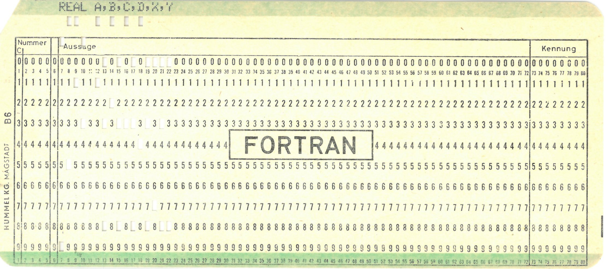

## 1. Informatik als Wissenschaft:
**Definition**: Informatik wird als eine interdisziplinäre Wissenschaft betrachtet, die sowohl theoretische als auch praktische Aspekte verbindet. Sie umfasst Grundlagenforschung, angewandte Forschung und ingenieurwissenschaftliche Methoden.

**Forschungsmethoden**: In der Informatik gibt es eine breite Vielfalt an Forschungsmethoden, darunter empirische (experimentelle Datenanalyse), theoretische (Mathematik, Logik) und ingenieurwissenschaftliche Ansätze (Entwurf und Implementierung von Systemen).

**Gesellschaftliche Bedeutung**: Die Relevanz der Informatik wird durch die zunehmende Abhängigkeit der Gesellschaft von informationsverarbeitenden Systemen immer größer. Die Informatik spielt eine zentrale Rolle in allen Lebensbereichen, von der Wirtschaft bis zur Medizin und prägt unsere Zukunft maßgeblich.

## 2. Geschichte der Rechentechnik:
**Frühe Hilfsmittel**: Die ersten Rechenhilfsmittel wie der Abakus wurden im Altertum entwickelt. Der Abakus war ein mechanisches Gerät zur Durchführung von Grundrechenarten und wird als einer der ersten "Digitalrechner" betrachtet.


(AI generated picture of an Abakus)

**Algorithmen und Zahlen**: Der persische Mathematiker Muhammad ibn Musa al-Khwarizmi schrieb im 9. Jahrhundert das Werk, das das Dezimalsystem und die Grundlage der Algorithmen (abgeleitet von seinem Namen) beschreibt. Auch Fibonacci trug zur Verbreitung des Dezimalsystems in Europa bei.

**Mechanische Rechenmaschinen**:
- **Blaise Pascal** entwickelte 1642 die Pascaline, eine der ersten mechanischen Rechenmaschinen, die addieren und subtrahieren konnte.
- **Gottfried Wilhelm Leibniz** entwarf in den 1670er Jahren eine Rechenmaschine, die auf dem binären Zahlensystem basierte. Seine Ideen zur binären Arithmetik gelten als Grundlage der modernen Informatik.
- **Charles Babbage** konzipierte den ersten mechanischen Computer, die Difference Engine und später die Analytical Engine. Diese Maschine enthielt grundlegende Komponenten eines modernen Computers, wie eine Zentraleinheit und einen Speicher.
- **Ada Lovelace** war die erste, die erkannte, dass eine Maschine wie Babbages Analytical Engine nicht nur zur Berechnung, sondern zur Verarbeitung allgemeiner Informationen verwendet werden konnte. Ihr Programm zur Berechnung der Bernoulli-Zahlen wird als das erste Computerprogramm der Geschichte betrachtet.

## 3. Entstehung moderner Computer:
- **Hermann Hollerith** entwickelte das Lochkartenverfahren, das 1890 erstmals bei der US-Volkszählung angewendet wurde. Dieses Verfahren war eine wichtige Grundlage für spätere Entwicklungen im Bereich der Datenspeicherung und -verarbeitung.

(source: https://commons.wikimedia.org/wiki/File:Lochkarte_FORTRAN.jpg)
- **Konrad Zuse**: Zuse baute 1938 die Z1, einen mechanischen Computer. 1941 stellte er die Z3 vor, die als erster funktionsfähiger programmierbarer Computer der Welt gilt. Diese arbeitete mit binärer Gleitpunktarithmetik und war programmierbar.
- **Relaisrechner**: In den USA baute Howard Aiken den Mark I, der für militärische Berechnungen eingesetzt wurde, während in Deutschland Konrad Zuse an der Weiterentwicklung seiner Maschinen arbeitete.
- **Elektronenröhrenrechner**: Mit der Entwicklung der Elektronenröhre als Schaltelement gelang der Schritt zu deutlich schnelleren Computern. Der bekannteste Vertreter dieser Ära ist der ENIAC (1946), der für ballistische Berechnungen verwendet wurde und über 18.000 Elektronenröhren verfügte.

## 4. Programmiersprachen:
- **Maschinensprache**: Die ersten Computerprogramme waren in Maschinensprache geschrieben, was bedeutet, dass der Programmcode direkt auf die Hardwarebefehle des Prozessors abzielte.
- **Assemblersprachen**: Mit der Entwicklung von Assemblersprachen wurde die Programmierung einfacher, da sie mnemonische Codes anstelle von Binärzahlen verwendeten.
- **Höhere Programmiersprachen**:
  - **FORTRAN**: Eine der ersten höheren Programmiersprachen, entwickelt für numerische Berechnungen. Sie wurde hauptsächlich in wissenschaftlichen und technischen Bereichen verwendet.
  - **COBOL**: Entwickelt für Geschäfts- und Verwaltungssysteme, ist COBOL stark an die natürliche Sprache angelehnt und wurde von Grace Hopper maßgeblich beeinflusst.
  - **Lisp**: Die erste funktionale Programmiersprache, die von John McCarthy für Anwendungen in der Künstlichen Intelligenz entwickelt wurde. Lisp führte Konzepte wie dynamische Typisierung und Rekursion ein.
  - **Plankalkül**: Von Konrad Zuse entwickelte Sprache, die bereits viele moderne Konzepte beinhaltete, jedoch nie auf einem funktionsfähigen Computer implementiert wurde.
  - **Java**: In den 1990er Jahren entwickelt, wurde Java als plattformunabhängige Programmiersprache konzipiert. Java-Programme laufen auf der Java Virtual Machine (JVM), wodurch sie auf jeder Hardware ausgeführt werden können, die über die JVM verfügt.

## 5. Entwicklung des Internets:
Das ARPANET war das erste Netzwerk, das den Grundstein für das heutige Internet legte. Es wurde 1969 zwischen vier amerikanischen Universitäten aufgebaut.

Die Entwicklung des Transmission Control Protocols (TCP) und später des Internet Protocols (IP) ermöglichte die Vernetzung von Computern weltweit.

Tim Berners-Lee erfand das World Wide Web (WWW), indem er die ersten Webbrowser und das Hypertext Markup Language (HTML) entwickelte, um Informationen im Internet durch Links miteinander zu verbinden.

## 6. Wichtige Personen in der Informatik:
- **Ada Lovelace**: Die erste Programmiererin, die ein Programm zur Berechnung der Bernoulli-Zahlen für die Analytical Engine von Babbage schrieb.
- **Edsger W. Dijkstra**: Entwickelte den nach ihm benannten Dijkstra-Algorithmus, der zur Berechnung der kürzesten Wege in einem Graphen dient. Er war auch ein wichtiger Befürworter des strukturierten Programmierens.
- **Grace Hopper**: Entwickelte den ersten Compiler und war maßgeblich an der Entwicklung von COBOL beteiligt. Sie prägte den Begriff "debugging", als sie einen Fehler (eine Motte) in einem Computer entdeckte.
- **Donald Knuth**: Autor der Buchreihe _The Art of Computer Programming_, ein Standardwerk der Informatik. Er entwickelte das Textsatzsystem TEX und gilt als Begründer der algorithmischen Analyse.
- **Alan Turing**: Begründer der theoretischen Informatik und der Turing-Maschine, einem Modell eines universellen Computers. Er spielte eine entscheidende Rolle bei der Entschlüsselung des Enigma-Codes im Zweiten Weltkrieg.

Turing machine:

(source: https://commons.wikimedia.org/wiki/File:TuringBombeBletchleyPark.jpg)

---
## 1. Begriff der Wissenschaft:
Wissenschaft wird definiert als systematische und methodische Erweiterung des Wissens. Sie sammelt Informationen, erforscht Gegenstandsbereiche, stellt Hypothesen auf, testet und widerlegt diese, um neues Wissen zu generieren und zu veröffentlichen.

Wissenschaftliches Arbeiten umfasst:
- Systematisches Vorgehen zur Gewinnung neuer Erkenntnisse und zur Lösung von Praxisproblemen.
- Anknüpfung an bestehendes Wissen und Analyse des aktuellen Forschungsstands.
- Veröffentlichung von Ergebnissen, die nachvollziehbar, überprüfbar und nutzbar für andere sind.
- Orientierung an international anerkannten Qualitätskriterien für wissenschaftliches Arbeiten.

Es gibt unterschiedliche Wissenschaftsdisziplinen, je nach Gegenstandsbereich und Ziel:
- Naturwissenschaften: Physik, Chemie, Biologie.
- Geisteswissenschaften: Literaturwissenschaften, Philosophie.
- Sozialwissenschaften: Soziologie, Politikwissenschaften.
- Ingenieurswissenschaften: Maschinenbau, Elektrotechnik, Informatik.
- Strukturwissenschaften: Mathematik und Teile der Informatik.

## 2. Wissenschaft und Forschung:
Forschung wird in Grundlagenforschung und angewandte Forschung unterteilt:
- **Grundlagenforschung**: Zielt auf das Verständnis von Theorien und Prinzipien ohne praktisches Ziel. Beispiel: Theoretische Informatik.
- **Angewandte Forschung**: Orientiert sich an praktischen Zielen und sucht nach Lösungen für konkrete Probleme. Beispiel: Bioinformatik, Computergraphik.

Beide Forschungsarten sind miteinander verzahnt und fördern sich gegenseitig.

## 3. Wissenschaftsphilosophie:
- **Induktion vs. Deduktion**:
  - Deduktive Schlüsse sind wahrheitserhaltend (logisch zwingend), während induktive Schlüsse auf Einzelbeobachtungen basieren und weniger sicher sind.
  - David Hume stellte die Kritik an der Induktion auf: Induktive Schlüsse können nicht objektiv begründet werden, da sie auf Annahmen beruhen, dass die Zukunft sich wie die Vergangenheit verhält.
- **Naiver Falsifikationismus (Karl Popper)**:
  - Wissenschaft sollte kühne Theorien aufstellen, die durch Experimente widerlegt werden können. Eine Theorie kann nie bewiesen, sondern nur falsifiziert werden.
  - Eine Theorie gilt als "bewährt", wenn sie viele Tests bestanden hat, aber das bedeutet nicht, dass sie wahr ist.
  - Popper unterschied zwischen Wissenschaft und Pseudowissenschaft (z. B. Psychoanalyse, Marxismus), da Pseudowissenschaften nicht falsifizierbar sind.
- **Raffinierter Falsifikationismus (Imre Lakatos)**:
  - Lakatos erweiterte Poppers Idee, indem er Forschungsprogramme anstelle einzelner Theorien betrachtete. Ein Programm besteht aus einem Theoriekern und einem Schutzgürtel aus Zusatztheorien. Werden Zusatztheorien widerlegt, bleibt der Theoriekern unangetastet.
  - Forschungsprogramme werden als degenerativ oder progressiv eingestuft, je nachdem, ob sie neue Phänomene erklären können oder nicht.
- **Thomas Kuhn**:
  - Wissenschaft verläuft in Phasen: Vorparadigmatische Phase, Normalwissenschaft, Krise und wissenschaftliche Revolution.
  - Kuhn prägte den Begriff des Paradigmas, das als Rahmen für wissenschaftliche Aktivitäten dient. Ein Paradigmenwechsel tritt auf, wenn das bestehende Paradigma durch ein neues ersetzt wird.
  - Kuhn sprach auch von der Inkommensurabilität: Paradigmen sind oft nicht miteinander vergleichbar, da sie unterschiedliche Begriffe und Methoden verwenden.

## 4. Wissenschaftsethik und wissenschaftliche Qualitätskriterien:
Wissenschaftliche Arbeit muss ethisch korrekt sein und bestimmte Qualitätskriterien erfüllen:
- **Verantwortung**: Wissenschaftler tragen Verantwortung für die Genauigkeit und die Folgen ihrer Forschung.
- **Ehrlichkeit**: Wahrheitsgetreue Darstellung der Ergebnisse, korrekte Zitierung und Vermeidung von Täuschungen.
- **Objektivität**: Unvoreingenommenheit und Sachlichkeit in der Darstellung und Argumentation.
- **Überprüfbarkeit**: Ergebnisse müssen nachvollziehbar und wiederholbar sein.
- **Reliabilität und Validität**: Reliabilität bezieht sich auf die Messgenauigkeit, Validität auf die Gültigkeit der Messung.
- **Verständlichkeit**: Wissenschaftliche Arbeiten müssen klar und präzise formuliert werden.
- **Relevanz**: Die Arbeit sollte neues Wissen schaffen oder Praxisprobleme lösen.
- **Logische Argumentation**: Deduktive Schlüsse müssen korrekt und schlüssig sein.
- **Originalität**: Wissenschaftliche Arbeiten sollten neue Ideen oder Methoden einbringen.
- **Nachvollziehbarkeit**: Ergebnisse müssen logisch und nachvollziehbar dargestellt werden.
- **Fairness**: Respekt gegenüber anderen Wissenschaftlern, Anerkennung von Leistungen und Einhaltung von ethischen Standards.

---
## 1. Literaturrecherche und Zitieren
Literaturrecherche ist ein essenzieller Bestandteil jeder wissenschaftlichen Arbeit, um den aktuellen Forschungsstand zu erfassen. Die Recherche erfolgt in verschiedenen Phasen: Was suche ich, wo suche ich, wie suche ich, was verwende ich und wie beschaffe ich die Literatur?

Wichtige Quellen: Universitätsbibliotheken, OPAC-Systeme, Google Scholar, spezialisierte Datenbanken (z.B. DBLP, IEEE).

Bei der Literaturrecherche sollte man besonders darauf achten, zitierfähige und zitierwürdige Quellen zu nutzen, die wissenschaftlichen Qualitätskriterien genügen.

Schlüsselbegriffe und Suchstrategien sind entscheidend, um relevante Literatur zu finden. Trunkierungen und logische Operatoren (und, oder, nicht) sind wichtige Hilfsmittel bei der Suche.

## 2. Zitierarten und Zitatweisen
Es wird zwischen direkten und indirekten Zitaten unterschieden:
- **Direkte Zitate**: Wortgenaue Übernahme von Textstellen, die in Anführungszeichen gesetzt werden.
- **Indirekte Zitate**: Sinngemäße Übernahme von Aussagen, die in eigenen Worten formuliert werden, oft mit "vgl." gekennzeichnet.

Es gibt unterschiedliche Zitierweisen (z.B. Harvard, numerische Zitierweise, Zitieren mit Namenskürzel). Wichtig ist, eine einheitliche Zitierweise durchgehend zu verwenden.

## 3. Struktur wissenschaftlicher Arbeiten
Eine wissenschaftliche Arbeit gliedert sich in folgende Abschnitte:
- **Abstract**: Eine kurze Zusammenfassung der wichtigsten Punkte der Arbeit (Ziel, Methode, Ergebnisse).
- **Einleitung**: Einführung in das Thema, Zielsetzung und bisherige Arbeiten werden dargestellt.
- **Hauptteil**: Detaillierte Ausarbeitung des Themas, basierend auf den gesammelten Daten und der eigenen Forschung.
- **Schluss**: Zusammenfassung der Ergebnisse und Ausblick auf zukünftige Forschungsmöglichkeiten.

Die Struktur hängt oft vom Typ der Arbeit ab (Seminararbeit, Abschlussarbeit) und sollte mit der Betreuerin abgestimmt werden.

## 4. Wissenschaftlicher Schreibstil
Klarheit und Präzision sind wesentliche Merkmale des wissenschaftlichen Schreibens. Die Sprache sollte sachlich, objektiv und präzise sein.

Zentrale Begriffe müssen klar definiert und konsequent verwendet werden.

Visualisierungen (Diagramme, Tabellen) sind sinnvoll, um komplexe Informationen verständlicher zu machen.

Der Schreibstil muss logisch und nachvollziehbar sein, sodass alle Aussagen gut begründet sind und keine Lücken in der Argumentation auftreten.

## 5. Vorbereitung und Präsentation
Vorträge und Präsentationen sind ebenfalls ein wichtiger Bestandteil des wissenschaftlichen Arbeitens.

Eine gute Vorbereitung umfasst die Klärung der Rahmenbedingungen (Dauer, Publikum, verfügbare Medien) sowie die sorgfältige Auswahl der Inhalte.

Beim Präsentieren gilt das Prinzip: Weniger ist mehr. Es ist besser, weniger Inhalte klar zu erklären, als zu viele Inhalte oberflächlich zu behandeln.

## 6. Quellenverzeichnis und Bibliographie
Das Literaturverzeichnis enthält alle verwendeten Quellen in der Arbeit. Jede Quelle muss eindeutig und vollständig angegeben werden, damit sie nachvollzogen werden kann.

Die Formatierung des Literaturverzeichnisses muss einheitlich sein, und alle notwendigen Informationen zur Identifikation der Quellen müssen enthalten sein (Autor, Titel, Erscheinungsjahr, Verlag etc.).

## 7. Tipps für wissenschaftliches Schreiben
Vor dem Verfassen einer wissenschaftlichen Arbeit sollten zentrale Argumente in einer groben Gliederung organisiert werden.

Frühzeitig anfangen: Das Schreiben sollte nicht aufgeschoben werden, da es ein Prozess ist, bei dem sich die Argumentation weiterentwickelt.

Lektorat: Es ist ratsam, die Arbeit von einer anderen Person lesen zu lassen, um Stil, Verständlichkeit und Fehler zu überprüfen.

---
## 1. Einführung in LaTeX
- **Was ist LaTeX?**: LaTeX ist ein flexibles und plattformunabhängiges Textsatzsystem, das besonders für die Erstellung wissenschaftlicher Publikationen in hoher Druckqualität geeignet ist. Es wird oft für Dokumente verwendet, die mathematische Formeln, wissenschaftliche Publikationen, Bücher oder Präsentationen enthalten.
- **Geschichte**: 
  - LaTeX wurde in den 1980er Jahren von **Leslie Lamport** basierend auf dem TeX-System von **Donald Knuth** entwickelt.
  - **TeX**: Knuth entwickelte TeX, um Buchdruckqualität, insbesondere bei mathematischen Texten, zu ermöglichen.
  - LaTeX basiert auf TeX, bietet jedoch zusätzlich einfache Makros für die Nutzer.

## 2. Installation und erste Schritte
- **Distributionen**: Es gibt verschiedene LaTeX-Distributionen, darunter **TeX Live** und **MiKTeX**. Diese Distributionen bieten die benötigten Programme und Bibliotheken, um LaTeX auf verschiedenen Betriebssystemen zu installieren.
- **Online-Editoren**: Es gibt auch webbasierte Editoren wie **Overleaf**, die LaTeX direkt im Browser nutzen lassen und besonders für kollaboratives Arbeiten geeignet sind.
- **Grundstruktur eines Dokuments**: Ein LaTeX-Dokument beginnt mit der Angabe der Dokumentenklasse, z. B. `\documentclass{article}` gefolgt von `\begin{document}` und `\end{document}`.

    Beispiel:

    ```latex
    \documentclass{article}
    \begin{document}
    Text hier einfügen
    \end{document}
    ```

## 3. Schreiben und Kompilieren
LaTeX wird nicht wie ein gewöhnliches Textverarbeitungsprogramm verwendet. Stattdessen schreibst du den Text in einem Texteditor und fügst spezielle LaTeX-Befehle hinzu. Danach kompilierst du das Dokument, um eine PDF-Datei zu erstellen.

- **Kompilierung**: Du kannst LaTeX über einen Texteditor mit LaTeX-Unterstützung kompilieren oder über die Kommandozeile. Dabei werden Fehler oder Warnungen angezeigt, die dir helfen, dein Dokument zu korrigieren.

## 4. Grundlegende LaTeX-Befehle
LaTeX verwendet sogenannte **Befehle** oder **Makros**, die mit einem Backslash `\` beginnen.

- Beispiel für fettgedruckten Text:

    ```latex
    \textbf{Dies ist fett.}
    ```

- Beispiel für kursive Schrift:

    ```latex
    \textit{Dies ist kursiv.}
    ```

- **Absätze** werden durch eine Leerzeile voneinander getrennt und Zeilenumbrüche können explizit durch `\\` gesetzt werden.

## 5. Dokumentenstruktur und Layout
- **Kapitel und Abschnitte**: Mit LaTeX kannst du Dokumente leicht in Kapitel und Abschnitte unterteilen:
  - `\section{Einleitung}`
  - `\subsection{Hintergrund}`

- **Verzeichnisse**: Du kannst automatisch ein Inhaltsverzeichnis erstellen, indem du den Befehl `\tableofcontents` an der gewünschten Stelle einfügst.

- **Querverweise**: Mit LaTeX kannst du innerhalb des Dokuments auf andere Abschnitte oder Seiten verweisen, z. B. mit `\label` und `\ref`.

## 6. Formatierung und Schriftbild
- LaTeX bietet viele Möglichkeiten zur **Formatierung von Text**. Es unterstützt fette, kursive, unterstrichene und hochgestellte Schrift sowie viele andere Formatierungen.
- **Zentrieren von Text**:

    ```latex
    \begin{center}
    Dieser Text ist zentriert.
    \end{center}
    ```

- **Schriftarten und Schriftgrößen** können ebenfalls verändert werden. Standardmäßig verwendet LaTeX eine Roman-Schriftart und eine Schriftgröße von 10pt.

## 7. Fehlerbehandlung und Warnungen
Beim Kompilieren eines LaTeX-Dokuments können Fehler oder Warnungen auftreten, die LaTeX in einer Log-Datei oder auf der Konsole ausgibt. Die häufigsten Fehler entstehen durch vergessene Klammern oder falsche Befehle.

- **Fehlersuche**: LaTeX-Editoren bieten oft eine Funktion, um Fehler leicht zu finden und zu beheben.

## 8. Verzeichnisse
Neben Inhaltsverzeichnissen kannst du auch **Tabellen-** und **Abbildungsverzeichnisse** automatisch erstellen lassen, wenn du Tabellen und Abbildungen in deinem Dokument verwendest.

## 9. Literaturverzeichnis
LaTeX bietet verschiedene Möglichkeiten, **Literaturverzeichnisse** zu erstellen, darunter die Verwendung von BibTeX oder der nativen `thebibliography`-Umgebung.

- **BibTeX** verwendet eine separate Literaturdatenbank-Datei (`.bib`), in der alle zitierten Werke aufgeführt sind.

## 10. Erstellung von Titelseiten
Du kannst in LaTeX leicht eine **Titelseite** erstellen, indem du den Titel, den Autor und das Datum definierst:

    ```latex
    \title{Mein Dokument}
    \author{Max Mustermann}
    \date{\today}
    \maketitle
    ```

## 11. Zusätzliche Funktionen und Pakete
LaTeX bietet eine Vielzahl von **Paketen**, die zusätzliche Funktionen bereitstellen, z. B. für mathematische Formeln oder Tabellen. Diese Pakete werden in der Präambel eingebunden:

    ```latex
    \usepackage{paketname}
    ```

---

