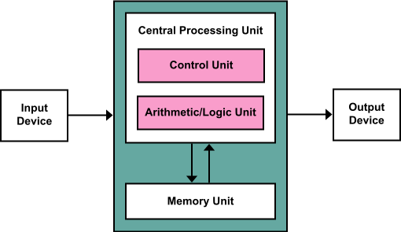

### TL;DR

The **CPU** (Central Processing Unit) is the core processing component in a computer responsible for executing instructions and managing data flow. Here’s a quick breakdown of essential CPU concepts:

- **CPU Components**:
  - **Control Unit (CU)**: Directs operations.
  - **Arithmetic Logic Unit (ALU)**: Performs computations.
  - **Registers**: Fast storage for immediate data access.
  - **Cache**: Multi-level (L1, L2, L3) memory for high-speed data access.

- **Architectures**:
  - **Von Neumann**: Unified memory for data and instructions, but prone to bottlenecks.
  - **Harvard**: Separate memory for data and instructions, allowing parallel data and instruction access.

- **Performance Factors**:
  - **Clock Speed**: Measured in GHz, it determines how many cycles a CPU can perform per second.
  - **Multicore Processors**: Modern CPUs feature multiple cores for parallel processing, enhanced by **Hyper-Threading** (Intel) or **SMT** (AMD).
  - **Thermal Design Power (TDP)**: Indicates the amount of heat a CPU generates, crucial for cooling system selection.

- **Instruction Sets**:
  - Common architectures include **x86**, **ARM**, and **x64**, each optimized for different performance and power efficiency goals.

- **Cache Levels**:
  - **L1 Cache**: Small, fast, per-core.
  - **L2 Cache**: Larger, slower, often shared between cores.
  - **L3 Cache**: Even larger, shared across all cores.

- **Overclocking**: The process of increasing a CPU’s clock speed beyond its rated limit for enhanced performance, often requiring superior cooling solutions.

- **Cooling**: Essential to maintain CPU performance, with solutions ranging from **air coolers** to **liquid cooling systems** for high-performance setups.

### Key Technologies

- **Hyper-Threading** (Intel) and **Simultaneous Multithreading (SMT)** (AMD): Enable a single core to process multiple threads simultaneously, boosting performance in multithreaded applications.

- **Clock Speed & Multicore Performance**: Clock speed (measured in GHz) determines how fast a CPU can execute instructions, while multiple cores allow for better parallel task execution, improving performance in complex applications like video editing or gaming.

- **Power Consumption and Heat**:
  - **TDP**: The thermal design power rating shows how much heat a CPU generates, guiding cooling system requirements.
  - Efficient cooling, such as **air cooling** or **liquid cooling**, is necessary to avoid **thermal throttling** (reducing clock speed to prevent overheating).

### Common CPU Types

- **Desktop Processors**: Balances performance and power consumption for everyday computing and gaming.
- **Server Processors**: High core counts and enhanced multithreading for data centers and enterprise workloads.
- **Mobile Processors**: Optimized for energy efficiency, often with integrated graphics for lightweight devices like laptops.

### Performance Enhancement

- **Overclocking**: Increasing clock speed to improve performance, often used by enthusiasts. Requires better cooling systems to handle increased heat output.

- **Turbo Boost (Intel) / Precision Boost (AMD)**: Automatic, temporary increases in clock speed to handle demanding tasks.

# Essentials

## What is a CPU (Central Processing Unit)?
 <br />
A **Central Processing Unit (CPU)** is the primary component of a computer responsible for executing instructions from programs by performing basic arithmetic, logic, control, and input/output (I/O) operations. Often referred to as the "brain" of the computer, the CPU plays a crucial role in system performance. It interprets and processes data fetched from memory and provides control to other components of the computer, coordinating operations with memory, storage, and peripherals.

## 2. CPU Architecture Basics

### 2.1 Von Neumann Architecture
 <br />
The **Von Neumann architecture** is based on a design where the CPU, memory, and I/O share a common bus for transferring data. It uses a single memory space for both instructions (program code) and data, which makes it simpler but prone to bottlenecks due to simultaneous access needs.

Key features:
- Unified memory for data and instructions.
- Sequential instruction processing.
- Susceptible to "Von Neumann bottleneck" due to limited bandwidth.

### 2.2 Harvard Architecture
 <br />
The **Harvard architecture** splits the memory into two separate areas: one for data and another for instructions. This allows for simultaneous access to instructions and data, improving speed and efficiency. It's more complex but is often used in specialized computing environments (e.g., microcontrollers).

Key features:
- Separate storage and signal pathways for data and instructions.
- Improved speed due to parallelism.
- Used primarily in embedded systems.

### 3.1 Control Unit (CU)
 <br />
The **Control Unit (CU)** is the central nervous system of the CPU, responsible for coordinating the execution of instructions and managing the flow of data within the processor. It does not perform actual data processing tasks itself but instead oversees the entire operation, ensuring that the CPU components work together seamlessly. Think of the CU being a manager, does not help in the actual Operation, but tells who to do what and when.


# 🎛️ Control Unit: Functions, Types, and Importance

The **Control Unit (CU)** is the brain behind the CPU's orchestration of operations.

---

## 🚀 Functions of the Control Unit

1.  🧠 **Instruction Fetching**: 
   - The CU begins the processing cycle by retrieving instructions from **main memory** (usually RAM). Using the **Program Counter (PC)**, it identifies the next instruction stored at a specific memory address.

2.  🔄 **Instruction Decoding**:
   - After fetching, the instruction needs to be interpreted. The CU decodes the binary-encoded instruction into **control signals** that correspond to specific operations. This step translates machine language into signals understood by the ALU and other components.

3.  🎛️ **Control Signal Generation**:
   - The CU generates control signals to direct the CPU components such as the **ALU**, **registers**, and the **memory interface**. These signals might command operations like:
     - 🗂️ Read data from memory
     - 💾 Write data to memory
     - ➕ Perform addition in the ALU
     - 📥 Store the result in a register

   ```mermaid
   graph TD;
   CU(Control Unit) --> ALU(ALU);
   CU --> Memory(Memory Interface);
   CU --> Registers(Registers);
   ```

4.  🚦 **Data Flow Coordination**:
   - The CU oversees data movement within the CPU. It ensures proper usage of **buses** (data pathways), like the **data bus**, **control bus**, and **address bus**, making sure data flows smoothly between the CPU, memory, and I/O devices.

5.  ⚙️ **Execution Management**:
   - During execution, the CU directs the **Arithmetic Logic Unit (ALU)** to perform tasks like calculations or comparisons. It also manages the **Program Counter (PC)** during branching operations (e.g., jumps or loops).
   
6.  🔀 **Pipeline Management** (in advanced CPUs):
   - In modern **pipelined CPUs**, multiple instructions are processed simultaneously at different stages. The CU ensures that instructions enter the pipeline in the right order and deals with challenges like **branch prediction** and **instruction hazards** for optimal efficiency.

---

## 🛠️ Types of Control Units:

1. ⚡ **Hardwired Control**:
   - Fixed logic circuits are used to interpret instructions and generate control signals. While fast, these units are **inflexible**, as the logic is hardcoded into the CPU, making modifications difficult.
     - 💡 **Pros**: Faster execution
     - ❗ **Cons**: Difficult to modify or upgrade

2. 🧑‍💻 **Microprogrammed Control**:
   - These units use a small memory area called the **control store** to generate control signals. Each instruction triggers a **microprogram** (a sequence of micro-operations) that creates the necessary control signals.
     - 💡 **Pros**: Flexible and easy to update
     - ❗ **Cons**: Slower than hardwired control

   ```mermaid
   graph LR;
   Instruction --> Microprogram --> Control_Signals;
   ```

---

## 🏆 Importance of the Control Unit:

The CU acts as the **conductor** of the CPU, directing operations and ensuring smooth communication between the ALU, memory, and I/O devices. It's crucial for executing complex programs efficiently, especially in **modern multi-core processors** where multiple tasks must be synchronized in parallel.

> ⚠️ **Note**: In advanced systems, the CU's role becomes even more critical for handling **multi-threading**, **branch prediction**, and **pipeline optimization**, making it an indispensable component for high-performance computing.

---

# ⚙️ 3.2 Arithmetic Logic Unit (ALU)

 <br />

The **Arithmetic Logic Unit (ALU)** is the part of the CPU responsible for executing arithmetic and logical operations. Often called the "computational engine" of the processor, the ALU directly handles the calculations that enable the CPU to process data, while the **Control Unit** directs overall operations.

---

## 🧮 Functions of the Arithmetic Logic Unit

1. ➕ **Arithmetic Operations**:
   - The ALU performs fundamental mathematical operations such as:
     - **Addition**: Summing two numbers.
     - **Subtraction**: Finding the difference between two numbers.
     - **Multiplication**: Some ALUs handle multiplication directly, while more complex processors use specialized hardware.
     - **Division**: Division may also be handled by the ALU or specialized circuits.

   ```mermaid
   graph LR;
   ALU --> Addition;
   ALU --> Subtraction;
   ALU --> Multiplication;
   ALU --> Division;
   ```

2. 🧩 **Logical Operations**:
   - The ALU also carries out bitwise logical operations, crucial for data manipulation and decision-making:
     - **AND**: Returns 1 if both bits are 1.
     - **OR**: Returns 1 if at least one bit is 1.
     - **XOR (Exclusive OR)**: Returns 1 only if the bits differ.
     - **NOT**: Inverts the bits (e.g., 1 becomes 0, and 0 becomes 1).

   ```mermaid
   graph LR;
   ALU --> AND;
   ALU --> OR;
   ALU --> XOR;
   ALU --> NOT;
   ```

3. 📊 **Comparison Operations**:
   - The ALU compares values, essential for decision-making in programs:
     - **Equality**: Checks if two values are equal.
     - **Greater than / Less than**: Determines if one value is larger or smaller.
     - **Sign detection**: Identifies if a number is positive or negative.

4. 🔀 **Bitwise Shifts and Rotations**:
   - The ALU also handles shifting bits in a number:
     - **Left Shift**: Shifts bits left, effectively multiplying by powers of two.
     - **Right Shift**: Shifts bits right, effectively dividing by powers of two.
     - **Rotation**: Rotates bits in a circular fashion either left or right.

   ```mermaid
   graph LR;
   ALU --> Left_Shift;
   ALU --> Right_Shift;
   ALU --> Rotation;
   ```

---

## Structure of the ALU

1. 📥 **Input/Output**:
   - The ALU typically has **two inputs** (operands) and **one output** (result). The **Control Unit** directs these operands from registers to the ALU.

2. 📝 **Flags Register**:
   - The ALU works with a **flags register** or **status register**, which is updated after each operation:
     - **Zero Flag (ZF)**: Set when the result is zero.
     - **Carry Flag (CF)**: Set when there's an overflow in addition.
     - **Overflow Flag (OF)**: Set when the result exceeds the representable range.
     - **Negative Flag (NF)**: Set if the result is negative.

   ```mermaid
   graph LR;
   ALU --> Zero_Flag;
   ALU --> Carry_Flag;
   ALU --> Overflow_Flag;
   ALU --> Negative_Flag;
   ```

3. ⚡ **Multipliers and Dividers** (in advanced ALUs):
   - High-performance CPUs often include dedicated **multiplier** and **divider** circuits, allowing faster execution of these operations compared to basic ALUs.

---

## 🔢 Types of ALUs

1. 🧑‍💻 **Simple ALUs**:
   - Found in micro controllers and basic processors, these ALUs handle integer operations (addition, subtraction, etc.) and are optimized for low power consumption, commonly used in **embedded systems**.

2. 💪 **Complex ALUs**:
   - Modern CPUs feature complex ALUs that support advanced operations like floating-point arithmetic, shifts, rotations, and vector operations (**SIMD**). These are designed for high performance.

3. 🧮 **Floating Point Units (FPUs)**:
   - Specialized ALUs for **floating-point arithmetic**, which involves decimal numbers. This is essential for scientific computations, 3D graphics, and tasks requiring high precision.

   ```mermaid
   graph LR;
   ALU --> Floating_Point_Unit;
   ```

---

## 🚀 ALU in Modern CPUs

In advanced CPUs, multiple ALUs work together to enable **parallel processing**, allowing the CPU to perform multiple arithmetic or logical operations simultaneously. This parallelism is key to handling demanding workloads in applications such as:

- **Machine Learning** 🧠
- **Scientific Simulations** 🔬
- **3D Rendering & Video Processing** 🎥

Parallel ALUs help improve performance in multi-threaded applications, speeding up tasks by dividing them across multiple execution units.

> 💡 **Note**: Modern ALUs are essential for boosting CPU performance, especially in fields requiring high computational power.

---
# 📝 3.3 Registers

**Registers** are high-speed, small storage locations within the CPU, designed for temporarily holding data and instructions during program execution. They are vital for enhancing the CPU's efficiency, as they provide **faster data access** compared to slower memory types such as RAM. By storing immediate data and instructions, registers enable the CPU to execute tasks with minimal delay, especially when working with the **ALU** and other CPU components.

---

## ⚙️ Functions of Registers

1. 📦 **Temporary Data Storage**:
   - Registers hold data that the CPU needs immediately for computation. This data could include:
     - Operands for arithmetic operations
     - Memory addresses for accessing data
     - Intermediate results from ongoing instruction execution

   ```mermaid
   graph LR;
   CPU --> Registers;
   Registers --> ALU;
   ```

2. ⚡ **Instruction Execution**:
   - Registers accelerate the **execution** of instructions by holding values that are directly processed by the **ALU** or accessed by memory. This minimizes the need for the CPU to fetch data from slower memory (like RAM), enhancing efficiency.

3. ### 🔄 **Control and Data Flow Management**:
   - Registers store essential data for managing control flow, such as instruction addresses, flags, and intermediate results. This smooths transitions between the instruction fetch, decode, and execution cycles, maintaining the efficiency of CPU operations.

---

## 🛠️ Types of Registers

1. 🧮 **Accumulator (ACC)**:
   - The **Accumulator** stores intermediate results from operations performed by the **ALU**. By keeping these results in the ACC, the CPU avoids writing them to slower memory, significantly speeding up arithmetic and logical operations.

   ```mermaid
   graph LR;
   ALU --> Accumulator;
   Accumulator --> CPU;
   ```

2. 🧭 **Program Counter (PC)**:
   - The **Program Counter** holds the memory address of the next instruction to be executed. It automatically updates after each instruction, ensuring that the CPU executes programs sequentially, unless a branch or jump occurs. In conditional operations, the PC may be modified to alter control flow.

   ```mermaid
   graph TD;
   Program_Counter --> Memory_Instruction;
   ```

3. 📑 **Instruction Register (IR)**:
   - The **Instruction Register** temporarily holds the current instruction being executed by the CPU. Once the instruction is fetched, the **Control Unit (CU)** decodes it, directing the rest of the CPU components to perform the required actions.

4. 🎛️ **General-Purpose Registers (GPRs)**:
   - **General-Purpose Registers** store temporary data, addresses, or values during computations. These registers, commonly denoted as **R0, R1, R2**, etc., provide flexible storage that can be used by the CPU for various tasks. The number of GPRs available varies by architecture but typically ranges from 8 to 32 in modern CPUs.

   ```mermaid
   graph LR;
   GPR[R0,R1,R2...] --> ALU;
   GPR --> Memory;
   ```

5. 🗂️ **Stack Pointer (SP)**:
   - The **Stack Pointer** holds the address of the top of the stack in memory. The stack is used for managing **function calls**, **local variables**, and **return addresses**. As data is pushed or popped from the stack, the SP is updated, playing a crucial role in handling recursive function calls and temporary storage during execution.

   ```mermaid
   graph TD;
   Stack_Pointer --> Stack_Memory;
   ```

6. 🚩 **Status Registers (Flags)**:
   - **Status Registers** store the outcomes of previous operations in the form of **flags**. These flags represent conditions like:
     - **Zero Flag (ZF)**: Set when an operation yields zero.
     - **Carry Flag (CF)**: Set when an operation results in a carry.
     - **Overflow Flag (OF)**: Set when a signed operation exceeds its range.
     - **Sign Flag (SF)**: Set when the result is negative.

   These flags are used to determine the next steps in program execution, such as triggering conditional branches or loops.

---

## 🚀 Importance of Registers

Registers play a critical role in **CPU performance** because they provide the **fastest access** to data. By storing frequently accessed values and instructions, registers reduce the need for the CPU to fetch data from slower memory like RAM. Their small size makes them highly efficient for rapid data manipulation, especially in tasks involving:

- **Pipelining**: Where multiple instructions are processed simultaneously at different stages.
- **Parallelism**: Modern CPUs use multiple cores to execute tasks concurrently, and registers help manage the data flow between them.

> 🔍 **Note**: The efficiency of registers is key to modern CPU designs, especially in handling parallel tasks and executing complex instructions without unnecessary delays.

---
# ⏲️ 3.4 Clock Speed and Clock Cycles

The **Clock Speed** of a CPU is a crucial measure of its performance, representing the number of **clock cycles** the CPU can execute per second. Measured in **gigahertz (GHz)**, it defines how many billion cycles the CPU can perform in one second. For instance, a clock speed of **3.0 GHz** means the CPU can execute **3 billion cycles per second**.

---

## ⏳ Clock Cycles

A **Clock Cycle** is the basic timing signal that synchronizes the operations within the CPU. Each cycle consists of two phases:
- **Rising edge**: The transition from low to high voltage.
- **Falling edge**: The transition from high to low voltage.

During each clock cycle, the CPU performs essential tasks such as **fetching**, **decoding**, **executing**, and **writing back** instructions. In modern CPUs, these steps overlap due to **pipelining**, significantly improving efficiency.


---

## ⚙️ Components of a Clock Cycle

1. 🔍 **Instruction Fetch**:
   - The CPU fetches the next instruction from memory, guided by the **Program Counter (PC)**. The instruction is then loaded into the **Instruction Register (IR)**.

2. 🔄 **Instruction Decode**:
   - The **Control Unit (CU)** decodes the instruction to determine what operation to perform and which operands are required.

3. ⚡ **Execution**:
   - The **Arithmetic Logic Unit (ALU)** performs the arithmetic or logical operation based on the decoded instruction. The operands are fetched from the **registers**, and the result is computed.

4. 💾 **Write Back**:
   - The result of the operation is written back to either a register or memory, making it available for subsequent instructions.


---

## 🔥 Clock Speed and Performance

- **Higher Clock Speed**: A higher clock speed indicates more cycles per second, meaning faster execution of instructions. For example, a **4.0 GHz** CPU can process **4 billion cycles per second**, generally resulting in better performance compared to a **2.0 GHz** CPU—provided all other factors are equal.

- **Instruction Throughput**: The number of cycles needed to execute an instruction can vary. Simple operations like **addition** may take one or two cycles, while complex instructions, like **floating-point division**, can take several. The **Instructions per Clock (IPC)** metric, which works alongside clock speed, is also critical for evaluating CPU performance.


---

## 📈 Factors Impacting Clock Speed Efficiency

1. 📉 **Pipelining**:
   - Modern CPUs break down the execution of instructions into multiple stages such as fetch, decode, and execute. Through **pipelining**, different instructions are processed simultaneously at different stages, boosting throughput without needing to increase clock speed.

   ```mermaid
   graph LR;
   Stage1[Fetch] --> Stage2[Decode];
   Stage2 --> Stage3[Execute];
   Stage3 --> Stage4[Write Back];
   ```

2. 🔥 **Heat and Power Consumption**:
   - Increasing clock speeds generates more heat, as transistors switch states faster. This leads to higher **power consumption** and requires better cooling solutions. If a CPU overheats, it may engage in **thermal throttling**, reducing clock speed to prevent damage and impacting performance during heavy workloads.

   ```mermaid
   graph LR;
   High_Clock_Speed --> Heat_Generation;
   Heat_Generation --> Power_Consumption;
   Power_Consumption --> Thermal_Throttling;
   ```

3. ⚡ **Turbo Boost / Precision Boost**:
   - Technologies like Intel’s **Turbo Boost** and AMD’s **Precision Boost** allow CPUs to temporarily exceed their base clock speeds during intensive tasks. These features automatically adjust based on power, temperature, and load conditions to provide a performance boost when needed.

4. 🧠 **Multicore Considerations**:
   - While clock speed is important, **multicore CPUs** can outperform higher clocked single-core CPUs when tasks can be split across multiple cores. A CPU with more cores and a slightly lower clock speed can handle multi-threaded applications more efficiently than a high clock speed, single-core processor.

---

## 📊 Clock Speed vs. Multicore Performance

While clock speed is important for single-threaded tasks, modern workloads often benefit more from multi-core processing. A **4-core** CPU at **3.0 GHz** may outperform a **single-core** CPU at **4.0 GHz** in tasks that can be parallelized, such as video rendering, scientific computing, and machine learning.


---
### 3.5 Cache Levels (L1, L2, L3, L4)
 <br />
# 🧠 CPU Cache: Levels and Importance

**CPU Cache** is a crucial component in modern processors, designed to reduce the time it takes to access frequently used data from **main memory (RAM)**. By storing frequently accessed data closer to the CPU cores, the cache dramatically speeds up the data retrieval process. CPU caches are organized into **multiple levels**, with each level offering a balance between speed, size, and proximity to the CPU cores.

---

## ⚡ Cache Levels

1. 🚀 **L1 Cache**:
   - **Fastest and smallest** of all cache levels, typically up to **64KB per core**.
   - Located **closest to the CPU cores**, L1 cache is split into:
     - **Instruction Cache (I-cache)**: Fetches and stores instructions.
     - **Data Cache (D-cache)**: Stores data that the CPU frequently uses.
   - The **L1 cache** ensures rapid access to critical instructions and data, significantly improving CPU performance.

   ```mermaid
   graph LR;
   L1I[L1 Instruction Cache] --> CPU;
   L1D[L1 Data Cache] --> CPU;
   ```

2. 💾 **L2 Cache**:
   - **Larger (~1MB)** but slightly slower than L1 cache.
   - Often **shared between cores** in modern processors.
   - Acts as a buffer for data that the L1 cache cannot store, providing quick access to data without having to reach the slower main memory.

   ```mermaid
   graph LR;
   CPU --> L1[L1 Cache];
   L1 --> L2[L2 Cache];
   ```

3. 🏞️ **L3 Cache**:
   - **Much larger** (up to **96MB** or more), but slower than L2 cache.
   - **Shared across all CPU cores**, allowing multiple cores to access the same data without conflicting requests.
   - Serves as a last line of defense before data needs to be fetched from the much slower **main memory**.

   ```mermaid
   graph LR;
   L3[L3 Cache] --> Multiple_Cores[Shared Across Cores];
   ```

4. 🖧 **L4 Cache** (High-end CPUs only):
   - Found in select high-performance processors, such as **Intel's eDRAM implementations**.
   - **L4 cache** is usually external to the processor, sitting between the CPU and main memory, and offers an additional caching layer.
   - Useful for **memory-intensive applications** and workloads involving **large datasets**, providing faster data access compared to RAM.

   ```mermaid
   graph LR;
   CPU --> L4[L4 Cache];
   L4 --> RAM[Main Memory];
   ```

---

## 📊 Cache Level Comparison

| Cache Level | Size Range       | Speed           | Proximity to CPU  | Shared?          |
|-------------|------------------|-----------------|-------------------|------------------|
| **L1 Cache**| Up to 64KB/core   | Fastest         | Closest to cores  | No               |
| **L2 Cache**| ~1MB             | Faster than RAM | Shared by cores   | Yes              |
| **L3 Cache**| 96MB or more     | Slower than L2  | Shared by all cores | Yes             |
| **L4 Cache**| External memory  | Slower than L3  | External to CPU   | Sometimes        |

---

## 🧩 Importance of CPU Cache

- **Speed**: The cache reduces **latency** when the CPU accesses frequently used data, making operations faster than fetching data from slower main memory (RAM).
- **Efficiency**: By holding data and instructions close to the CPU, caches minimize bottlenecks that would otherwise slow down overall system performance.
- **Multicore Support**: In multi-core CPUs, shared caches like **L3** and sometimes **L2** help coordinate data access across cores, reducing delays when multiple cores request the same data.

> ⚠️ **Note**: The efficiency of the cache is essential for optimizing CPU performance, especially in tasks that require rapid data access such as **gaming**, **scientific simulations**, and **machine learning** workloads.

---

### What is a CPU made of?
 <br />

1. **Transistors** ⚙️: The fundamental building blocks of a CPU, transistors act as electronic switches that can turn on and off to perform binary operations (0s and 1s). Billions of transistors are packed into modern CPUs.
  
2. **Silicon Wafer** 🧪: The substrate on which the entire CPU is built. Silicon is abundant and has excellent semiconductor properties, making it ideal for creating integrated circuits.

3. **Photolithography Layers** 💡: Multiple layers of circuitry are etched onto the silicon wafer using photolithography, a process involving UV light, masks, and photoresist materials to transfer circuit patterns.

4. **Die** 🪓: The actual silicon die is the core part of the CPU where transistors and circuits are embedded. Multiple dies may be created from a single wafer.

5. **Interconnects** 🔗: Made of materials like copper or tungsten, interconnects connect the transistors and layers of circuitry, allowing electrical signals to pass between components.

6. **Logic Gates** 🔢: Composed of transistors, logic gates perform logical operations (e.g., AND, OR, NOT) that make up the building blocks of processing operations.

7. **Clock Generator** ⏲️: The clock generates a signal that synchronizes all CPU operations, ensuring that instructions and data are processed in an orderly fashion.

8. **Control Unit** 🧠: Manages the flow of data within the CPU by interpreting instructions from memory and coordinating various components like the ALU and registers.

9. **Arithmetic Logic Unit (ALU)** ➕➖: The ALU performs basic arithmetic and logical operations required by program instructions.

10. **Registers** 🗄️: Small, ultra-fast storage units inside the CPU used to hold temporary data and instructions during processing.

11. **Cache Memory** 🏎️: Multiple levels of cache (L1, L2, L3, and L4) are built into the CPU to store frequently accessed data, reducing latency and speeding up computation.

12. **Heat Spreader** 🌡️: A metal cover placed on the die to distribute heat evenly across the surface and help manage thermal conditions.

13. **Pins or Contacts** 🔌: These are the connectors through which the CPU communicates with the rest of the system (e.g., motherboard). In modern CPUs, contacts may be arranged as pads (e.g., LGA—Land Grid Array) or pins (e.g., PGA—Pin Grid Array).

14. **Wafer Production** 🛠️: The CPU starts its life as a wafer. Here’s a more detailed breakdown of the manufacturing process:

[build your own 8-bit Adder](https://www.youtube.com/watch?v=X31B1pVow1o)


This manufacturing process involves extreme precision, with circuit elements measured in nanometers (nm). For example, modern CPUs are produced at **7nm** or **5nm** (newest models go down to **3nm**)process nodes, allowing billions of transistors to fit onto a single chip. For example a hair is roughly **80.000nm** wide or the layer of sweat and oils left behind when a person touches a surface typically ranges in thickness from about **100 to 1.000 nanometers (nm)**.
[CPU Manufacturing Process - Branch Education (Insane video quality)](https://www.youtube.com/watch?v=dX9CGRZwD-w)
# ⚙️ 4. Instruction Set Architecture (ISA) Basics

The **Instruction Set Architecture (ISA)** defines the set of instructions that a CPU can execute and how it interacts with software and hardware. Two of the most prominent ISAs today are **x86** and **ARM**, with **x64** being a 64-bit extension of the x86 architecture.

---

## 📊 4.1 x86 vs ARM vs x64: Key Architectures

### 🏛️ **x86 Architecture**
- **Overview**: 
  - **x86** is a **Complex Instruction Set Computing (CISC)** architecture introduced in the late 1970s with Intel's 8086 processor.
  - Became the **dominant desktop and server architecture** due to its extensive feature set and **backward compatibility**, allowing older software to run on modern processors.

- **Key Characteristics**:
  - **CISC Design**: x86 has a large number of complex instructions, with some capable of executing multiple operations in a single instruction. This reduces instruction count but increases hardware complexity.
  - **Backward Compatibility**: Supports legacy applications designed for earlier x86 processors, making it invaluable for enterprises.
  - **Performance**: Known for high performance in **computationally intensive tasks**, making it ideal for desktops, servers, and workstations.
  - **Power Consumption**: Due to its complexity, x86 consumes more power, which can be a drawback for mobile or embedded applications.

---

### 📱 **ARM Architecture**
- **Overview**: 
  - **ARM (Advanced RISC Machine)** is a **Reduced Instruction Set Computing (RISC)** architecture that emphasizes efficiency, lower power consumption, and a simpler instruction set.
  - Dominant in **mobile, embedded, and low-power devices**, developed by Acorn Computers in the 1980s.

- **Key Characteristics**:
  - **RISC Design**: ARM uses a smaller set of simpler instructions, which can be executed in a single clock cycle. This simplicity improves energy efficiency.
  - **Energy Efficiency**: ARM's low power consumption makes it the preferred choice for **mobile devices** (e.g., smartphones, tablets) and **embedded systems**.
  - **Scalability**: ARM designs range from **low-power cores** to **high-performance multi-core processors** used in datacenters (e.g., AWS Graviton).
  - **License-Based Model**: ARM licenses its architecture to other manufacturers (e.g., Qualcomm, Apple), enabling a wide range of implementations across industries.

---

### 💻 **x64 Architecture**
- **Overview**: 
  - **x64**, also known as **x86-64**, is a **64-bit extension** of the x86 architecture, developed by **AMD** to extend the x86 instruction set with support for 64-bit memory addresses and registers.

- **Key Characteristics**:
  - **64-bit Processing**: Supports 64-bit instructions and memory addressing, allowing for vastly larger memory access (up to 18.4 exabytes).
  - **Enhanced Registers**: x64 adds more and larger registers, improving performance for applications like **scientific computing** and **encryption**.
  - **Backward Compatibility**: Fully backward compatible with 32-bit applications, making the transition from older x86 systems seamless.
  - **Adoption**: x64 has become the standard for **modern desktops, servers, and enterprise systems**, replacing 32-bit architectures.

---

## 🔄 **AMD's Role in x64 Development**
- **Background**: 
  - Intel developed the **IA-64 (Itanium)** architecture in the late 1990s, which was not backward compatible with x86. In response, AMD saw an opportunity for a 64-bit extension that retained backward compatibility with x86.
  
- **AMD64 Development**: 
  - AMD introduced **AMD64**, an extension of the x86 instruction set, which supported 64-bit computing while maintaining compatibility with 32-bit x86 software.
  - Introduced with the **Opteron** and **Athlon 64** processors in 2003, AMD64 became the foundation for modern **x64** processors.

- **Licensing Agreement**:
  - AMD's ability to produce x86 processors comes from a **cross-licensing agreement** with Intel. This agreement allowed AMD to extend the x86 architecture to 64-bit, which Intel later adopted under the name **Intel 64**.

---

## 📝 Summary of Key Differences

| Feature                    | x86                                 | ARM                                | x64                                 |
|----------------------------|-------------------------------------|------------------------------------|-------------------------------------|
| **Instruction Set Design**  | **CISC**, complex instructions      | **RISC**, simpler instructions     | **64-bit CISC**, extension of x86   |
| **Power Consumption**       | Higher power consumption            | Low power consumption               | Higher than ARM, lower than x86     |
| **Use Cases**               | Desktops, servers, workstations     | Mobile devices, embedded systems   | Modern desktops, servers, enterprises |
| **Backward Compatibility**  | Full compatibility with older x86   | Incompatible with x86              | Full compatibility with x86 and 32-bit applications |
| **Performance**             | High performance for complex tasks  | Optimized for energy efficiency    | Improved memory access and processing power |

---

## 🔍 **Key Use Cases**
- **x86**: Desktop PCs, high-performance servers, and computationally intensive applications like **3D rendering**, **scientific computing**, and **gaming**.
- **ARM**: Mobile devices, embedded systems, IoT, low-power servers, and **energy-sensitive applications**.
- **x64**: Large-scale servers, data centers, enterprise systems, and applications requiring vast memory and high computational throughput.

---

## 🧩 **Why Instruction Set Architecture Matters**
The choice of ISA affects:
1. **Performance**: More complex architectures like x86/x64 offer higher performance at the cost of energy efficiency, while ARM focuses on low-power, high-efficiency designs.
2. **Compatibility**: x86 and x64 provide extensive backward compatibility, making them crucial for enterprise environments, while ARM is driving innovation in mobile and IoT spaces.
3. **Scalability**: ARM scales efficiently for both low-power devices and high-performance server CPUs, while x64 is dominant in the desktop and server markets due to its extensive memory handling capabilities.

---
# 🧠 5. CPU Cores and Threads

Understanding the difference between **CPU cores** and **threads** is essential for optimizing performance in modern computing environments. While cores represent the physical hardware, threads are the smallest executable units within software. Both work together to improve multitasking and the overall efficiency of a system.

---

## 🔍 **Comparison of CPU Cores and Threads**

| **Aspect**               | **CPU Cores**                                                                                                         | **CPU Threads**                                                                                                                        |
|--------------------------|-----------------------------------------------------------------------------------------------------------------------|-----------------------------------------------------------------------------------------------------------------------------------------|
| **Definition**            | A core is a **physical processing unit** within a CPU, capable of executing instructions independently.                | A thread is the **smallest unit of programmed instructions** that can be executed by a core.                                             |
| **Purpose**               | Each core handles its own tasks independently, enabling **parallel processing** of multiple instructions.              | Threads represent tasks within a core. Multiple threads allow a core to handle multiple instructions concurrently through **SMT**.        |
| **Multitasking**          | Multicore CPUs allow for **true parallelism**, distributing tasks across cores for improved multitasking and performance. | Threads enable **better resource utilization** of a core by managing multiple tasks simultaneously via **Simultaneous Multithreading (SMT)**. |
| **Common Setup**          | Modern CPUs range from **2 cores** in mobile devices to **16 or more cores** in high-performance desktop and server CPUs. | Typically, **2 threads per core** is the standard, but the number depends on the CPU’s design (e.g., **Intel Hyper-Threading** or **AMD SMT**). |
| **Performance Impact**    | More cores generally result in better performance for **multithreaded applications**, allowing multiple instructions to run simultaneously. | Threads improve the efficiency of a core, but **performance gains** from multithreading are typically smaller than from additional cores. |
| **Intel's Approach**      | Intel uses **Hyper-Threading (HT)**, where each core can execute **two threads**, effectively **doubling the thread count**. | In Intel CPUs with Hyper-Threading, the number of threads is typically **2x the number of cores** (e.g., 4 cores = 8 threads).            |
| **AMD's Approach**        | AMD uses **Simultaneous Multithreading (SMT)** similar to Intel's HT, allowing each core to handle **two threads**.    | AMD’s Ryzen processors also typically have **two threads per core**, leading to **cores * 2 = threads**.                                 |

---

## ⚙️ **Difference Between CPU Cores and Threads**

- **Cores**: Represent the **physical processing units** of a CPU. Each core can handle its own independent tasks, allowing for **true parallelism** in **multicore CPUs**. More cores enable the CPU to divide work across multiple hardware units, which is especially important in multithreaded applications such as **gaming**, **video editing**, and **3D rendering**.

- **Threads**: Represent the **software instructions** that the CPU executes on a core. Threads are a way to improve resource use within each core. By using **Simultaneous Multithreading (SMT)**, a core can handle more than one thread, improving multitasking. However, threads are **not physical units** and thus rely on the core’s resources (e.g., execution units and registers), which must be shared between the threads. This means threads don’t provide as much of a performance boost as adding more cores.

---

## ⚡ **Why AMD Typically Shows Cores * 2 = Threads**

- AMD uses **Simultaneous Multithreading (SMT)** to allow each physical core to handle two threads. For instance, an AMD Ryzen processor with 8 cores will show 16 threads. SMT improves a core's ability to execute multiple instructions per clock cycle, leading to **better utilization of the core’s resources**, particularly in **multithreaded applications**.

---

## 🏭 **Why Intel’s Hyper-Threading (HT) May Differ**

- Intel employs **Hyper-Threading (HT)**, where each core can execute two threads, creating a **2:1 thread-to-core ratio**. In some of Intel’s lower-end processors or specific designs, HT may be disabled, meaning the **number of threads equals the number of cores**. In these cases, Intel CPUs focus on improving **single-thread performance** or **power efficiency**, rather than gaining the higher throughput from HT.

---

## 🔄 **Technical Differences Between AMD’s SMT and Intel’s HT**

- Both **AMD's SMT** and **Intel’s Hyper-Threading** aim to double the thread count per core. However, they differ slightly in their implementations:
  - **AMD’s SMT** is designed to maximize **parallel task execution** with minimal resource sharing between threads.
  - **Intel’s HT** emphasizes **resource sharing** between threads within the same core, which can sometimes lead to minor differences in efficiency.
  
> 🔍 **Note**: The performance gains of SMT or HT vary depending on the workload. Some tasks benefit significantly from multithreading, while others may see only minor improvements.

---

## 🧩 **Visualizing CPU Cores and Threads**


In this diagram:
- **CPU Cores** represent the physical hardware units that can execute tasks in parallel.
- **Threads** represent the software instructions scheduled for execution on a core. Each core can handle multiple threads using SMT or HT, depending on whether it's an AMD or Intel processor.

---

## 🔍 **Summary of CPU Cores vs. Threads**

- **CPU Cores** are the physical units responsible for executing instructions. The more cores a CPU has, the more independent tasks it can perform simultaneously.
- **CPU Threads** represent the logical (software) layer of instructions. Multithreading enables better resource utilization within a core, but it doesn’t equate to the same performance gains as having additional physical cores.
- **SMT (AMD) and HT (Intel)** are technologies that double the thread count per core, enabling each core to execute multiple threads. The actual performance improvement depends on how well the CPU’s resources are shared between threads.

---
# 🧵 6. Multithreading & Hyper-Threading

**Multithreading** is a CPU technology that enhances processing efficiency by allowing multiple threads (a sequence of programmed instructions) to be processed simultaneously. This means that instead of handling just one task at a time, a CPU core can **switch between multiple threads**, optimizing processing time, resource utilization, and overall performance.

> ⚡ **Use Cases**: Video rendering, data analysis, gaming, and server operations where concurrent tasks are common benefit significantly from multithreading.

---

## 🔄 **Types of Multithreading**

### 1. **Coarse-grained Multithreading**
- A thread switch occurs **only** when a long-latency event (e.g., a cache miss) happens. 
- While waiting for data from memory, the CPU switches to a different thread to use idle resources efficiently.

### 2. **Fine-grained Multithreading**
- The CPU switches between threads on **every clock cycle**, minimizing idle time but potentially adding overhead due to constant switching.


---

## 🤖 **Simultaneous Multithreading (SMT)**

**Simultaneous Multithreading (SMT)** is an advanced form of multithreading where a single physical CPU core executes multiple threads **simultaneously**. Instead of switching between threads, SMT enables the CPU to run instructions from different threads **in parallel**, utilizing CPU resources more efficiently.

- **Benefit**: Keeps more internal CPU components (e.g., ALU, execution units) busy by processing multiple instructions at once.

---

## 🔷 **Intel’s Hyper-Threading Technology (HT)**

**Intel’s Hyper-Threading (HT)** is a specific implementation of SMT. It allows a single physical CPU core to appear as **two logical cores** to the operating system, enabling each core to run **two threads simultaneously**.

- **Example**: A quad-core CPU with Hyper-Threading appears as having **eight logical cores**.


### ✅ **Benefits of Hyper-Threading**:
- **Increased Throughput**: More tasks can be processed at the same time, significantly improving performance in **multithreaded applications** (e.g., video editing, 3D rendering, and scientific simulations).
- **Better Resource Utilization**: Keeps CPU resources such as **execution units** and the **ALU** busy, which are underutilized in single-thread scenarios.
- **Energy Efficiency**: Improves performance without drastically increasing power consumption by utilizing idle resources.

### ⚠️ **Limitations of Hyper-Threading**:
- **Not a Core Replacement**: Hyper-Threading does not double the performance of a CPU, as **logical cores** share physical resources (like ALU or caches).
- **Workload Dependent**: The performance gain from Hyper-Threading depends on the workload. **Single-threaded tasks** or workloads with low parallelism might not benefit significantly.

---
## 🛠️ **AMD’s Simultaneous Multithreading (SMT)**

**AMD’s Simultaneous Multithreading (SMT)** functions similarly to Intel’s Hyper-Threading, allowing each physical core to handle **two threads simultaneously**. This improves the core’s resource utilization and boosts performance in multithreaded workloads.


Both **Intel’s Hyper-Threading** and **AMD’s SMT** offer similar performance benefits, though the exact implementation and efficiency may vary based on the workload and architecture.

---

## 🔍 **Summary: Multithreading & Hyper-Threading**

- **Multithreading** improves CPU efficiency by allowing multiple threads to run on a single core, reducing idle times and optimizing resource utilization.
  - **Coarse-grained**: Switches threads during long-latency events.
  - **Fine-grained**: Switches threads every clock cycle.

- **Simultaneous Multithreading (SMT)** takes multithreading further by allowing a single core to execute multiple threads **simultaneously**.

- **Intel Hyper-Threading (HT)** and **AMD SMT** both implement SMT, allowing two threads per core, improving throughput, and making better use of CPU resources. However, they do **not double performance** since logical cores share physical resources.

> 💡 **Tip**: While Hyper-Threading or SMT improves multi threading efficiency, it's essential to choose CPUs with more physical cores for workloads requiring substantial parallelism (e.g., high-performance computing or rendering tasks).

---
# 🔥 7. Heat and Cooling (Thermal Design Power - TDP)

**Thermal Design Power (TDP)** is a crucial metric used by CPU manufacturers to indicate the maximum amount of heat a processor can generate under **normal operating conditions**. TDP is typically measured in **watts** and helps determine the cooling requirements for the CPU. 

> ⚠️ **Note**: TDP is **not** the CPU’s maximum power consumption but rather the amount of heat the cooling system must dissipate to keep the processor from overheating.

---

## 🧮 **How TDP is Calculated**

TDP is based on **average workloads** rather than peak performance. During high-intensity tasks like **video rendering** or **gaming**, CPUs can exceed their TDP due to higher operating frequencies or boost technologies (e.g., **Intel Turbo Boost** or **AMD Precision Boost**). However, TDP reflects the cooling capacity required to sustain performance without **thermal throttling**.

### ⚡ **Examples of TDP Ratings**:
- **Intel Core i9-13900K**: 125W TDP (may peak higher under load).
- **AMD Ryzen 9 7950X**: 170W TDP (can exceed this under heavy workloads).

---

## 🛠️ **Factors Affecting TDP**

1. **Clock Speed**:
   - Higher clock speeds lead to more power consumption, resulting in increased **heat generation**. CPUs with higher base and boost frequencies usually have a higher TDP.
   
2. **Number of Cores**:
   - More cores lead to higher TDP because each core requires power to operate, and this increases the heat output. **Multicore processors** tend to have higher TDP ratings.

3. **Architecture and Process Node**:
   - Newer architectures and smaller process nodes (e.g., **7nm**, **5nm**) are generally more energy-efficient, providing more performance per watt with less heat.

---

## ❄️ **Cooling Solutions**

To prevent overheating, a CPU must be paired with a cooling solution that can handle its **TDP rating**. Efficient cooling is vital for preventing **thermal throttling**, which occurs when the CPU reduces its clock speed to lower its temperature, leading to reduced performance.

### 🌀 **Types of Cooling Solutions**:

1. **Air Cooling**
   - **Stock Coolers**: Many CPUs include **stock air coolers**, which are adequate for regular workloads but may struggle with heavy or overclocked conditions.
   - **Aftermarket Air Coolers**: These are larger, more efficient coolers with **better heat dissipation**. They often feature **copper heat pipes**, **larger heatsinks**, and **stronger fans** for handling high TDP CPUs.

   > **Example**: The **Noctua NH-D15** is a high-performance air cooler that uses dual towers and heat pipes to handle CPUs with high TDP ratings.

2. **Liquid Cooling (AIO - All-in-One Coolers)**
   - **Closed-Loop Systems**: AIO systems use a combination of water, pumps, and radiators to dissipate heat more efficiently than air coolers. AIOs are a popular choice for **high-performance systems** and overclocked CPUs.
   - **Custom Loops**: Custom water-cooling systems offer superior heat dissipation for extreme performance enthusiasts, with larger radiators and more powerful pumps for greater cooling capacity.

   > **Example**: The **Corsair H150i Elite Capellix** is a popular 360mm AIO cooler designed for high TDP CPUs, offering excellent cooling and customizable RGB lighting.

3. **Passive Cooling**
   - In **low-power CPUs**, passive cooling (cooling without fans) can be sufficient. This is common in embedded systems or energy-efficient devices, but is rarely used in **high-performance CPUs** due to the high heat output.

4. **Phase-Change Cooling**
   - Used by extreme overclockers, phase-change cooling systems use **refrigerants** to cool the CPU to **sub-ambient temperatures**. These systems are expensive and complex but allow for **maximum overclocking potential** by effectively eliminating heat as a limiting factor.

---

## 🔥 **Thermal Throttling and CPU Protection**

When a CPU exceeds its thermal limits, it engages in **thermal throttling**, which reduces clock speeds and voltage to prevent overheating. While this protects the processor, it also **reduces performance**.

- **Overclocking Impact**: Overclocking increases power consumption and heat generation, pushing the CPU beyond its rated limits. **High-performance cooling systems** are crucial to prevent overheating during overclocking.


---

## 🧊 **Undervolting for Cooling**

**Undervolting** is a technique where the **voltage supplied to the CPU** is reduced to lower power consumption and heat output. Enthusiasts use undervolting to strike a balance between **performance** and **thermal efficiency**, especially in **gaming laptops** or compact desktops with limited cooling capacity.

> 💡 **Tip**: Undervolting is popular for users looking to improve thermal performance without significantly impacting overall CPU performance.

---

## 📖 **Summary: TDP and Cooling Solutions**

- **TDP**: Thermal Design Power represents the heat a CPU generates under typical workloads and informs the cooling requirements to maintain stable operation.
- **Cooling Solutions**: Effective cooling solutions (air, liquid, or passive) must match the CPU's TDP rating to prevent **thermal throttling** and ensure long-term stability.
- **Overclocking**: High-performance cooling systems are essential for handling the increased heat from overclocking, while **undervolting** can reduce heat output without major performance sacrifices.

> ⚠️ **Remember**: Selecting the right cooling system is just as important as selecting the CPU, especially for high-performance, overclocked, or workstation builds.

---
# 🖥️ 8. CPU Generations & Naming Conventions (Intel, AMD)

## 8.1 Intel

Intel CPUs follow a **generational structure**, where each generation represents improvements in performance, power efficiency, and new features. Intel’s Core series includes:
- **Core i3**
- **Core i5**
- **Core i7**
- **Core i9**

The **generation** is identified by the **first digit** of the model number. For example, in **Intel Core i7-12700**, the **12** represents a **12th-generation** CPU.

### 🕑🔄 **Intel's Tick-Tock Strategy**

Intel followed a **Tick-Tock** development cycle for several years:

- **Tick**: A **reduction in process size** (e.g., from 32nm to 22nm), leading to better power efficiency and thermal performance.
- **Tock**: The introduction of a **new microarchitecture**, improving performance and adding new features without reducing the process size.

This strategy ensured a steady pace of innovation, alternating between efficiency and performance gains.
[Wikipedia Tick-Tock model](https://en.wikipedia.org/wiki/Tick%E2%80%93tock_model)

---

## 8.2 AMD

AMD CPUs follow a similar naming convention. AMD’s Ryzen series includes:
- **Ryzen 3**
- **Ryzen 5**
- **Ryzen 7**
- **Ryzen 9**

As with Intel, the **first digit** of the model number denotes the generation. For instance, **Ryzen 7 5800X** represents a **5th-generation** CPU.

> 🔍 **Tip**: When selecting CPUs, look for the **generation number** and the performance tier (e.g., Ryzen 7 vs Ryzen 5) to assess its performance level.

---

# ⚙️ 9. 32-bit vs 64-bit CPUs

A **32-bit CPU** can handle **32 bits of data** at once, whereas a **64-bit CPU** can process **64 bits**. The key difference lies in how much **memory** and **data** the CPU can handle at a time:

- **32-bit CPUs**: Limited to **4GB** of RAM.
- **64-bit CPUs**: Can address **over 18 exabytes** of RAM (theoretical max).

> 🚀 **Performance**: Modern CPUs are almost exclusively 64-bit, providing better performance, particularly in **memory-intensive applications** like video editing and large datasets.

---

# ⚡🌱 10. Power Consumption and Efficiency

Power consumption and efficiency are essential in CPU design, balancing **performance** with **energy usage**. This is particularly important in devices like **mobile phones**, **laptops**, and **datacenters**, where power efficiency directly impacts **battery life** and **cooling requirements**.

## 🔋 **Key Factors Affecting Power Consumption**

### 1. **Clock Speed** ⏲️
- Higher clock speeds mean faster transistor switching, which results in **higher power consumption** and **more heat**. CPUs designed for efficiency may have lower clock speeds or use **dynamic clock adjustments** to save power during idle or light tasks.

### 2. **Voltage** 🔋
- Power consumption increases **quadratically** with voltage. CPUs that operate at lower voltages are more efficient. **Undervolting** is a technique where users lower the voltage to reduce heat and power consumption while maintaining stable performance.

### 3. **Core Count** 🧠
- More cores typically require more power. However, modern CPUs use techniques like **power gating**, which shuts down unused cores, reducing power usage when all cores aren’t needed.


### 4. **Process Node (Manufacturing Technology)** 🧪
- CPUs built on smaller process nodes (e.g., **5nm** or **7nm**) are more efficient because smaller transistors consume less power and generate less heat. Smaller nodes also reduce **leakage current**, improving energy efficiency.

### 5. **Power-Saving Techniques** 🌱
- **Dynamic Voltage and Frequency Scaling (DVFS)**: Adjusts the CPU's voltage and clock speed based on workload, lowering power consumption when demand is low.
- **Clock Gating** ⛔: Temporarily disables the clock signal to certain parts of the CPU when they are not in use, saving power.
- **Power Gating** 🚪: Cuts power entirely to inactive parts of the CPU to reduce power consumption to nearly zero.

### 6. **Architectural Efficiency (ARM vs. x86)** 🏗️
- **ARM architecture** is designed for **power efficiency**, particularly in mobile and embedded systems. ARM's **RISC (Reduced Instruction Set Computing)** design allows it to perform instructions with less power, making it ideal for battery-operated devices.
- **x86 architecture** (used by Intel and AMD) is traditionally performance-focused but has become more efficient with technologies like **Intel’s Turbo Boost** and **AMD’s Precision Boost**, which adjust power usage based on demand.

---

## 🌍 **The Importance of Power Efficiency**

- In **datacenters**, efficient CPUs lower **operational costs** by reducing electricity usage and cooling requirements.
- In **laptops**, power-efficient CPUs extend **battery life**, allowing for longer usage on a single charge.
- In **mobile devices**, energy-efficient processors prevent overheating and battery drain while running demanding apps like gaming or video streaming.

> 💡 **Tip**: When choosing a CPU, consider its **TDP rating** and the efficiency of its architecture, especially for tasks like gaming or heavy multitasking.

---
### 11. Basic Overclocking Concept 🚀💻

**Overclocking** is the practice of pushing a CPU's clock speed beyond its manufacturer-specified limits to increase performance. This technique is popular among **enthusiasts**, **gamers**, and **content creators** who want to extract extra performance from their systems, particularly in tasks such as gaming, video editing, and 3D rendering.

#### How Overclocking Works:

1. **Clock Multiplier** ⏲️➕:
   - Modern CPUs have a **base clock** (BCLK) and a **multiplier**. The final clock speed of the CPU is determined by multiplying these two values (e.g., a base clock of 100 MHz with a multiplier of 40 gives a 4.0 GHz CPU speed). **Overclocking** increases the multiplier or base clock to achieve a higher clock speed.

2. **Voltage Adjustments** 🔋⚡:
   - To maintain stability at higher clock speeds, overclocking often requires increasing the **voltage** supplied to the CPU. This helps prevent errors or system crashes by ensuring that transistors switch reliably at higher frequencies. However, increasing voltage also raises **power consumption** and **heat generation**, which must be managed carefully.

3. **Thermal Impact** 🌡️🔥:
   - **Overclocking** significantly increases heat output. When the CPU operates at higher speeds and voltages, it generates more heat, which can lead to **thermal throttling** (where the CPU reduces performance to avoid overheating) or, in extreme cases, hardware damage. Adequate cooling solutions, such as high-end air coolers or **liquid cooling** systems, are essential for safe overclocking.

4. **Cooling Solutions** ❄️:
   - **Air Cooling** 🌀: Most stock coolers are not designed for extreme overclocking. Enthusiasts often use **aftermarket air coolers** with larger heatsinks and more efficient fans.
   
   - **Liquid Cooling** 💧: **AIO (All-in-One)** liquid coolers or **custom loop liquid cooling** systems provide superior cooling, allowing for more aggressive overclocking by dissipating heat more efficiently than air coolers.

5. **Overclocking Stability** 🧑‍💻:
   - After overclocking, users must test the system for stability. Stress-testing software like **Prime95**, **Cinebench**, **3DMark** or **AIDA64** runs intensive workloads to ensure the CPU remains stable at higher speeds. Instability can cause crashes, data corruption, or blue screens (BSOD).

#### Risks and Considerations:

1. **Component Lifespan** ⏳:
   - Overclocking increases **wear and tear** on the CPU due to higher voltages and temperatures. This can reduce the overall lifespan of the processor, especially if done without proper cooling or voltage management. However, moderate overclocking with good cooling solutions typically has minimal long-term effects.

2. **Warranty Void** 🛠️❌:
   - Most CPU manufacturers (e.g., Intel and AMD) do not cover damage caused by overclocking under their standard warranties, so users must be aware that they assume the risk of voiding their warranty.

3. **BIOS Settings** ⚙️:
   - Overclocking is typically done through the system's **BIOS** or **UEFI** settings. Some modern motherboards offer automatic overclocking options, but manual tuning offers more precise control over clock speeds, voltages, and power settings.

#### Benefits of Overclocking:

- **Increased Performance** 🚀:
   - Overclocking can result in significant performance improvements, particularly in CPU-bound tasks like gaming, video encoding, and scientific calculations. For users running intensive applications, a well-overclocked CPU can outperform stock settings by a notable margin.
   
- **Cost Savings** 💸:
   - Instead of purchasing a more expensive high-performance CPU, users can sometimes overclock a cheaper processor to achieve comparable performance, saving money while still benefiting from increased speed.

Here's an improved and structured version of the "Types of Processors" section, complete with visual enhancements, comparison tables, and clear organization:

# 🧠 12. Types of Processors

Processors come in various types, each designed for specific use cases, ranging from high-performance desktops to power-efficient mobile devices. Understanding the key characteristics of each processor type helps in selecting the right CPU for specific workloads.

---

## 12.1 Desktop Processors 🖥️

**Desktop CPUs** are the most common type of processor found in personal computers and workstations. These processors are designed to provide a balance between **performance**, **power consumption**, and **heat generation**, making them suitable for diverse tasks such as gaming, content creation, and office work. Desktop processors generally deliver **better single-core performance**, ideal for applications that rely on single-threaded tasks like most desktop apps and games.

#### 🔑 **Key Characteristics of Desktop Processors**:
- **Core Count**: Ranges from **4 cores** (entry-level) to **16 cores** (high-end models like Ryzen 9 or Intel Core i9). More cores improve multitasking and performance in multithreaded applications like video editing and rendering.
- **Clock Speed**: Typically higher clock speeds (around **3.5GHz - 5.0GHz**) for better single-threaded performance, making them optimal for tasks like gaming.
- **TDP (Thermal Design Power)**: Ranges from **65W to 125W**, reflecting their higher heat and power requirements compared to mobile processors.
- **Cache Size**: Larger L1, L2, and L3 caches help reduce latency, improving speed for demanding applications.
- **Example CPUs**:
  - **Intel Core i7-13700K**: 8 performance cores and 8 efficiency cores, ideal for gaming and content creation.
  - **AMD Ryzen 9 7950X**: 16 cores, perfect for multitasking, 3D rendering, and video editing.

#### 📌 **Best Use Cases for Desktop Processors**:
- **Gaming**: Optimized for high frame rates and responsiveness in **games**, where single-core performance is often a bottleneck.
- **Content Creation**: Ideal for tasks like **video editing**, **music production**, and **graphic design** that benefit from high core/thread counts.
- **Programming & Development**: Can efficiently handle **large codebases** and run multiple **virtual machines**.

---

## 12.2 Server Processors 🏢

**Server CPUs** are designed for enterprise-level use in **data centers**, **cloud computing**, and other high-performance environments. These processors focus on **stability**, **high core counts**, and **scalability** to handle massive parallel workloads, ensuring efficient resource management in multi-user or virtualized environments.

#### 🔑 **Key Characteristics of Server Processors**:
- **Core Count**: Often higher, ranging from **8 to 64 cores** (or more in models like AMD EPYC). These cores are optimized for parallel processing and handling multiple simultaneous tasks.
- **Multithreading**: Most server processors support **SMT** or **Hyper-Threading** (HT), doubling the number of threads (e.g., 32 cores = 64 threads).
- **Clock Speed**: Lower clock speeds (typically **2.0GHz - 3.5GHz**) to reduce power consumption and heat while handling parallel workloads.
- **Cache Size**: Larger L3 caches (up to **256MB**) to handle more data and reduce memory access latency.
- **ECC Memory Support**: **Error-Correcting Code (ECC)** memory ensures data integrity by detecting and correcting memory errors on the fly.
- **Reliability**: Built for 24/7 operation, with features like **virtualization support** (Intel VT-x, AMD-V) and **redundancy** for maximum uptime.
- **Example CPUs**:
  - **Intel Xeon Platinum 8380**: 40 cores and 80 threads, designed for data centers and enterprise workloads.
  - **AMD EPYC 7763**: 64 cores and 128 threads, ideal for high-performance computing and cloud servers.

#### 📌 **Best Use Cases for Server Processors**:
- **Data Centers & Cloud Computing**: Handles multiple users and workloads, making it perfect for **cloud services**, **web hosting**, and **databases**.
- **Enterprise Applications**: Critical for **real-time data analysis**, **business applications**, and **large-scale simulations**.
- **High-Performance Computing (HPC)**: Essential for **scientific computing**, **data mining**, and **simulations** that require significant computational resources.

---

## 12.3 Mobile Processors 📱💻

**Mobile CPUs** are designed for portable devices like **smartphones**, **tablets**, and **laptops**, where power efficiency and heat management are critical. Mobile processors aim to deliver enough performance for daily tasks while maintaining long **battery life** and managing heat in compact form factors. Mobile processors are often based on **ARM architecture** but may also include **x86-based** designs for laptops.

#### 🔑 **Key Characteristics of Mobile Processors**:
- **Power Efficiency**: Optimized for **low power consumption** with techniques like ARM’s **big.LITTLE** architecture, which uses high-performance cores for intensive tasks and low-power cores for background tasks.
- **Thermal Design**: Low TDP (around **10W to 35W**) to minimize heat generation, allowing mobile CPUs to run efficiently in thin devices.
- **Integrated Graphics**: Many mobile processors include **integrated GPUs** to handle graphics, useful for laptops and smartphones without discrete GPUs.
- **Battery Life**: ARM-based mobile processors, like Apple’s M1 or M2 chips, are designed for long battery life (20+ hours in some laptops).
- **Performance**: While mobile CPUs generally offer lower performance than desktop CPUs, **innovations in ARM architecture** (e.g., Apple’s M1 and M2 chips) are rapidly closing the gap.
- **Example CPUs**:
  - **Apple M2 Chip**: Found in MacBooks and iPads, offering high performance and power efficiency.
  - **Qualcomm Snapdragon 8 Gen 2**: A top-tier ARM-based processor used in flagship smartphones.
  - **Intel Core i7-1365U**: A low-power, x86-based mobile processor designed for ultrabooks.

#### 📌 **Best Use Cases for Mobile Processors**:
- **Smartphones & Tablets**: Optimized for everyday tasks like browsing, **streaming**, and running **apps** with a focus on long battery life.
- **Laptops**: Great for light-to-moderate tasks such as **writing**, **web browsing**, **video conferencing**, and productivity apps.
- **Embedded Systems**: ARM-based processors are commonly used in **embedded systems** due to their small size and power efficiency.

---

## 🏎️ **Comparison Table: Desktop vs. Server vs. Mobile Processors**

| **Aspect**               | **Desktop CPUs**                                | **Server CPUs**                                | **Mobile CPUs**                                |
|--------------------------|-------------------------------------------------|------------------------------------------------|------------------------------------------------|
| **Primary Focus**         | Performance and versatility                     | Multithreading, stability, and scalability      | Power efficiency and battery life              |
| **Core Count**            | 4 to 16 cores                                   | 8 to 64+ cores                                 | 4 to 8 cores                                   |
| **Thread Count**          | Typically 2 threads per core                    | 2 threads per core (via SMT/HT)                | 1 to 2 threads per core                        |
| **Clock Speed**           | High (3.5GHz - 5.0GHz)                          | Moderate (2.0GHz - 3.5GHz)                     | Low to moderate (1.5GHz - 3.0GHz)              |
| **TDP (Thermal Design)**  | Moderate (65W - 125W)                           | High (up to 250W)                              | Low (10W - 35W)                                |
| **Cache Size**            | 6MB to 64MB                                     | 8MB to 256MB                                   | 2MB to 12MB                                    |
| **Performance**           | High for gaming, content creation, multitasking | High for parallel workloads, data centers      | Moderate for daily tasks, web, and app usage   |
| **Power Efficiency**      | Moderate                                        | Low (designed for stability, not efficiency)   | Very high                                      |
| **Example CPUs**          | Intel Core i9, AMD Ryzen 9                      | Intel Xeon, AMD EPYC                           | Apple M2, Qualcomm Snapdragon, Intel Core i7 U |
| **Use Cases**             | Gaming, content creation, general-purpose tasks | Data centers, cloud computing, enterprise apps | Laptops, smartphones, tablets, embedded systems|

---
### Official Manufacturer Documentation
- [Intel ARK](https://ark.intel.com/)
- [AMD EPYC Processors](https://www.amd.com/en/technologies/epyc)
- [Qualcomm Snapdragon Processors](https://www.qualcomm.com/snapdragon)
- [Apple Silicon M1 and M2](https://www.apple.com/mac/m1/)

### Technical Articles and Whitepapers
- [AnandTech](https://www.anandtech.com/)
- [Tom's Hardware](https://www.tomshardware.com/)
- [Ars Technica](https://arstechnica.com/)
- [ExtremeTech](https://www.extremetech.com/)
- [The Linley Group](https://www.linleygroup.com/)

### Academic & Research Papers
- [IEEE Xplore](https://ieeexplore.ieee.org/)
- [ACM Digital Library](https://dl.acm.org/)

### Hardware Reviews and Comparisons
- [CPUBenchmark.net](https://www.cpubenchmark.net/)
- [UserBenchmark](https://www.userbenchmark.com/)
- [PassMark CPU Benchmark](https://www.passmark.com/)

### Forums & Communities
- [Linus Tech Tips Forum](https://linustechtips.com/)
- [Reddit - r/hardware](https://www.reddit.com/r/hardware/)
- [Stack Overflow](https://stackoverflow.com/)

### Processor-Specific Sources
- [Intel Xeon vs. AMD EPYC](https://www.servethehome.com/)
- [ARM vs. x86 for Mobile Devices](https://www.techspot.com/)
- [Apple M1 Performance Analysis](https://www.macworld.com/)
- [Bare Feats Apple Performance](https://www.barefeats.com/)

### YouTube Channels
- [Gamers Nexus](https://www.youtube.com/user/GamersNexus)
- [Linus Tech Tips](https://www.youtube.com/user/LinusTechTips)
- [Digital Foundry](https://www.youtube.com/user/DigitalFoundry)

### News & Trends
- [The Verge](https://www.theverge.com/)
- [CNET](https://www.cnet.com/)
- [TechRadar](https://www.techradar.com/)

### Enterprise & Cloud Computing Resources
- [VMware Performance Blog](https://blogs.vmware.com/performance/)
- [AWS Graviton Processors](https://aws.amazon.com/ec2/graviton/)
- [Microsoft Azure](https://azure.microsoft.com/en-us/)

# Topics which are not finished in depth

> [!CAUTION]
I have created this list by AI, as I will further dive into this topic this list will probably change!

---

### **Good to Know (Intermediate Knowledge)**

1. **Advanced Instruction Set Architectures**
   - RISC (Reduced Instruction Set Computing)
   - CISC (Complex Instruction Set Computing)
2. **Clock Multipliers & FSB (Front Side Bus)**
3. **Die Shrinks and Process Nodes (e.g., 14nm vs 7nm)**
4. **CPU Socket Types (LGA, PGA, BGA)**
5. **Integrated Graphics (iGPU)**
6. **Pipelining and Superscalar Architectures**
7. **Data Hazards (RAW, WAR, WAW) and Hazard Avoidance**
8. **Branch Prediction**
9. **Cache Coherency & Memory Hierarchy**
10. **Dual-Channel, Triple-Channel Memory Architecture**
11. **Simultaneous Multi-Threading (SMT)**
12. **Parallel Processing and Amdahl’s Law**
13. **Virtualization Support (VT-x, AMD-V)**
14. **CPU Performance Benchmarks**
15. **Thermal Management and Cooling Systems**
16. **Ring Bus vs. Mesh Topology in CPU Interconnects**
17. **Ring Buffer Latency and Bandwidth Tuning**

---

### **Pro Knowledge (Advanced Professional-Level Topics)**

1. **Out-of-Order Execution (OoOE)**
2. **Chiplets and Multi-Die CPUs (AMD's Ryzen Design)**
3. **Instruction-Level Parallelism (ILP)**
4. **Simultaneous vs. Fine-Grained Multithreading**
5. **Superscalar vs. VLIW (Very Long Instruction Word)**
6. **AVX (Advanced Vector Extensions)**
7. **Branch Target Buffer (BTB)**
8. **Cache Latency and Cache Miss Penalty**
9. **Cache Partitioning (TLB, LRU Replacement Policy)**
10. **NUMA (Non-Uniform Memory Access) Architectures**
11. **Dynamic Voltage and Frequency Scaling (DVFS)**
12. **Processor Microcode and Firmware**
13. **Speculative Execution and its Security Concerns (Spectre, Meltdown)**
14. **Instruction Decoding and Micro-Ops**
15. **TLP (Thread-Level Parallelism)**
16. **Power States (C-states, P-states, S-states)**
17. **Thermal and Power Limits (PL1, PL2, Tau)**
18. **Overclocking Techniques and Stability Testing**
19. **Processor Scheduling (Affinity, SMT)**
20. **High-Performance Computing (HPC) Processors (Xeon, Epyc)**
21. **Deep Learning Accelerators in Modern CPUs**

---

### **Unbeatable (Expert-Level Mastery)**

1. **Out-of-Order vs. In-Order Architectures**
2. **Transistor-Level CPU Design and Gate-Level Logic**
3. **Branch Misprediction and Recovery Penalties**
4. **Advanced Branch Prediction Techniques (TAGE Predictor)**
5. **Advanced Prefetching Algorithms (Hardware vs. Software Prefetching)**
6. **Die Stacking and 3D CPU Architecture**
7. **Processor Design Trade-Offs (Latency vs. Throughput)**
8. **Quantum Computing Implications for Future CPUs**
9. **Hardware Thread Synchronization Mechanisms**
10. **Hardware-Level Virtualization Extensions (e.g., Intel EPT, AMD RVI)**
11. **Homogeneous vs. Heterogeneous Multi-core Architectures**
12. **High-Level Synthesis for CPU Design**
13. **Custom CPU Design (FPGA Prototyping, ASIC Design)**
14. **Thermal Conductivity and Heat Dissipation (Phase-Change Cooling, Liquid Nitrogen Overclocking)**
15. **ISA Extensions: FPU, MMX, SSE, AVX-512**
16. **Security Vulnerabilities & CPU: Return-Oriented Programming (ROP), Rowhammer**
17. **Fault-Tolerant and Redundant CPU Systems**
18. **Instruction Pipeline Hazards and Micro-architecture-Level Optimizations**
