### TL;DR

The **CPU** (Central Processing Unit) is the core processing component in a computer responsible for executing instructions and managing data flow. Here’s a quick breakdown of essential CPU concepts:

- **CPU Components**:
  - **Control Unit (CU)**: Directs operations.
  - **Arithmetic Logic Unit (ALU)**: Performs computations.
  - **Registers**: Fast storage for immediate data access.
  - **Cache**: Multi-level (L1, L2, L3) memory for high-speed data access.

- **Architectures**:
  - **Von Neumann**: Unified memory for data and instructions, but prone to bottlenecks.
  - **Harvard**: Separate memory for data and instructions, allowing parallel data and instruction access.

- **Performance Factors**:
  - **Clock Speed**: Measured in GHz, it determines how many cycles a CPU can perform per second.
  - **Multicore Processors**: Modern CPUs feature multiple cores for parallel processing, enhanced by **Hyper-Threading** (Intel) or **SMT** (AMD).
  - **Thermal Design Power (TDP)**: Indicates the amount of heat a CPU generates, crucial for cooling system selection.

- **Instruction Sets**:
  - Common architectures include **x86**, **ARM**, and **x64**, each optimized for different performance and power efficiency goals.

- **Cache Levels**:
  - **L1 Cache**: Small, fast, per-core.
  - **L2 Cache**: Larger, slower, often shared between cores.
  - **L3 Cache**: Even larger, shared across all cores.

- **Overclocking**: The process of increasing a CPU’s clock speed beyond its rated limit for enhanced performance, often requiring superior cooling solutions.

- **Cooling**: Essential to maintain CPU performance, with solutions ranging from **air coolers** to **liquid cooling systems** for high-performance setups.

### Key Technologies

- **Hyper-Threading** (Intel) and **Simultaneous Multithreading (SMT)** (AMD): Enable a single core to process multiple threads simultaneously, boosting performance in multithreaded applications.

- **Clock Speed & Multicore Performance**: Clock speed (measured in GHz) determines how fast a CPU can execute instructions, while multiple cores allow for better parallel task execution, improving performance in complex applications like video editing or gaming.

- **Power Consumption and Heat**:
  - **TDP**: The thermal design power rating shows how much heat a CPU generates, guiding cooling system requirements.
  - Efficient cooling, such as **air cooling** or **liquid cooling**, is necessary to avoid **thermal throttling** (reducing clock speed to prevent overheating).

### Common CPU Types

- **Desktop Processors**: Balances performance and power consumption for everyday computing and gaming.
- **Server Processors**: High core counts and enhanced multithreading for data centers and enterprise workloads.
- **Mobile Processors**: Optimized for energy efficiency, often with integrated graphics for lightweight devices like laptops.

### Performance Enhancement

- **Overclocking**: Increasing clock speed to improve performance, often used by enthusiasts. Requires better cooling systems to handle increased heat output.

- **Turbo Boost (Intel) / Precision Boost (AMD)**: Automatic, temporary increases in clock speed to handle demanding tasks.


# Essentials

> [!CAUTION]
> Reading this Article doesn't make you an expert about this topic.
> I am just rewriting information I see on the internet with the help of ChatGPT .
> I am trying to name as many information as possible but this is not even close to everything.
> Each Headline could deserve an own article this size.
> I hope you will learn something new while reading this!

## What is a CPU (Central Processing Unit)?


<br />
A Central Processing Unit (CPU) is the primary component of a computer responsible for executing instructions from programs by performing basic arithmetic, logic, control, and input/output (I/O) operations. Often referred to as the "brain" of the computer, the CPU plays a crucial role in system performance. It interprets and processes data fetched from memory and provides control to other components of the computer, coordinating operations with memory, storage, and peripherals.

## 2. CPU Architecture Basics
[Intel Technology - Architecture All Access - Youtube Playlist](https://www.youtube.com/watch?v=_PELtLdh87Y&list=PL8t1FdN2Tj3ZVAzTY-FvsS0qy-mEfRdoj)
[Comparing Architectures - Video](https://www.youtube.com/watch?v=FZN6LjuEgdw)
[Explained in Minecraft Terms (actually cool and technical)](https://www.youtube.com/watch?v=dV_lf1kyV9M)
## 🖥️ 2.1 Von Neumann Architecture: A Detailed Breakdown

The **Von Neumann architecture** is the foundation of most modern computers, introduced by mathematician **John von Neumann** in 1945. Its design principles, based on the concept of a stored-program computer, have shaped computing as we know it. Let's dive deeper into its components, functionality, and significance in a more engaging way.


<br />
[source](https://en.wikipedia.org/wiki/Von_Neumann_architecture)

---

### 🧠 Core Components of Von Neumann Architecture

| Component          | Function                                                                                  | Description                                                                                         |
|--------------------|-------------------------------------------------------------------------------------------|-----------------------------------------------------------------------------------------------------|
| **Central Processing Unit (CPU)** | Performs data processing and instruction execution. | Contains the ALU for computations and the Control Unit for instruction management. |
| **Memory (RAM)**    | Stores both program instructions and data.                                                 | Single memory used for both data and instructions, shared between the CPU and other components.     |
| **Input/Output (I/O)** | Allows interaction with external devices.                                                | Interfaces like keyboards (input) and monitors (output) connect the computer to the outside world.  |
| **Bus System**      | Facilitates communication between CPU, memory, and I/O devices.                            | Data, address, and control buses enable data transfer and communication across components.          |

---

### 🔄 The Von Neumann Execution Cycle

At the heart of the Von Neumann architecture is its **Fetch-Decode-Execute** cycle. This process repeats continuously, allowing the system to process instructions and manipulate data.

1. **Fetch:** The CPU fetches the next instruction from memory, pointed to by the Program Counter (PC).
2. **Decode:** The Control Unit decodes the fetched instruction to determine the required operation.
3. **Execute:** The decoded instruction is executed by sending signals to relevant parts of the CPU (like the ALU) or I/O devices.
4. **Store (Optional):** If necessary, the result of the executed instruction is stored back in memory.

### 💡 **Quick Note**  
The **Program Counter (PC)** ensures that instructions are fetched in the correct sequence, unless the current instruction modifies it (as in jumps or loops).

#### 📝 Example

Let’s say we want to add two numbers, stored in memory locations 0x01 and 0x02, and store the result in 0x03. The process follows:


Fetch: Load the instruction to ADD from memory.
Decode: Decode the instruction and identify the memory addresses (0x01, 0x02).
Execute: Add values at 0x01 and 0x02.
Store: Save the result into memory address 0x03.

---

### ✅ Advantages of Von Neumann Architecture

| 🔑 Key Advantage           | 💬 Description |
|----------------------------|----------------|
| **Simplicity**              | The unified memory design (storing both data and instructions in the same space) simplifies the hardware and makes the architecture easier to implement. |
| **Flexibility**             | Since instructions are stored in memory, they can be modified or replaced dynamically, enabling programmable systems. |
| **Wide Adoption**           | Its simplicity has made it the basis for general-purpose computers, meaning most modern devices still follow this architecture. |
| **Cost Efficiency**         | Shared memory reduces the need for separate storage for instructions and data, lowering manufacturing costs. |

---

### ⚠️ Limitations of Von Neumann Architecture

Despite its advantages, the architecture is not without its downsides, primarily related to performance:

#### 1. **🚨 Von Neumann Bottleneck**
The CPU and memory are constantly competing for access to the **same bus**, which handles both data and instructions. This creates a bottleneck as the system can only transfer one piece of information at a time—either an instruction or data. As computing tasks grow more complex, this limitation slows down the overall processing speed.

#### 2. **📏 Sequential Processing**
Because the CPU processes instructions **one at a time**, it can’t naturally handle tasks in parallel, limiting performance in applications requiring concurrency or parallelism, such as modern gaming, AI, or large-scale data processing.

#### 3. **🔄 Shared Memory Conflicts**
Both data and instructions reside in the same memory space, which can cause conflicts, especially as programs become larger and more complex.

---

### 🛠️ Modern Use and Enhancements

Over time, the original Von Neumann architecture has been enhanced to mitigate some of its inherent limitations:

| Enhancement        | Solution to Limitation                                                                                                       |
|--------------------|------------------------------------------------------------------------------------------------------------------------------|
| **Cache Memory**    | By introducing a smaller, faster memory close to the CPU, cache memory minimizes delays caused by the bottleneck.             |
| **Parallel Processing** | Multicore processors allow computers to execute multiple instructions at the same time, bypassing the sequential nature of the original design. |
| **Harvard Architecture** | Separates memory for instructions and data, significantly reducing the risk of memory access conflicts.                   |

---

### 📊 Von Neumann Bottleneck in Perspective

Here’s a comparison between the **Von Neumann** and **Harvard Architecture** to illustrate how the bottleneck is alleviated in the latter:

| Architecture        | Instruction Memory                  | Data Memory                          | Performance Impact                                  |
|---------------------|--------------------------------------|--------------------------------------|----------------------------------------------------|
| **Von Neumann**      | Shared memory space for both         | Shared memory space for both         | Slower due to competition for memory access        |
| **Harvard**          | Separate memory for instructions     | Separate memory for data             | Faster due to simultaneous memory access           |

---

### 🎯 Key Takeaways

- **The Fetch-Decode-Execute Cycle** forms the backbone of how Von Neumann systems operate.
- **Unified Memory Model** allows the same memory to store both data and instructions, simplifying the system's design.
- The **Von Neumann bottleneck** is a major limitation of this architecture, but modern systems mitigate this through techniques like caching and parallelism.
  

---

## 🖥️ 2.2 Harvard Architecture: A Detailed Breakdown

<br />
[source](https://en.wikipedia.org/wiki/Harvard_architecture)

The **Harvard architecture** is an alternative computer architecture model that differs from the Von Neumann architecture by having **separate memory spaces** for program instructions and data. This design reduces the contention between the CPU and memory, allowing for more efficient data throughput and improved system performance.

The architecture was initially developed for the **Harvard Mark I** computer in the 1940s. Let’s explore the components, benefits, limitations, and modern use of the Harvard architecture in detail.

---

### 🧠 Core Components of Harvard Architecture

| Component          | Function                                                                                  | Description                                                                                         |
|--------------------|-------------------------------------------------------------------------------------------|-----------------------------------------------------------------------------------------------------|
| **Central Processing Unit (CPU)** | Performs data processing and instruction execution. | Similar to Von Neumann, the CPU houses the Arithmetic Logic Unit (ALU) and Control Unit (CU). |
| **Instruction Memory** | Stores the program instructions.                                                       | Dedicated memory area for program code only, separated from data memory, reducing memory conflicts.  |
| **Data Memory**     | Stores the actual data that is being processed.                                            | Separate memory area for data, ensuring that instruction fetches do not interfere with data transfers. |
| **Input/Output (I/O) Devices** | Allows interaction with external devices.                                                | Interfaces like keyboards (input) and monitors (output) connect the computer to external systems. |
| **Bus System**      | Facilitates communication between CPU, instruction memory, data memory, and I/O devices.   | Separate buses for data and instructions to enhance speed and efficiency in memory access.          |

---

### 🔄 The Harvard Architecture Execution Cycle

In the Harvard architecture, the **Fetch-Decode-Execute** cycle operates similarly to the Von Neumann architecture but with enhanced efficiency due to separate instruction and data paths.

1. **Fetch (Instruction Memory):** The control unit fetches the instruction from **instruction memory**.
2. **Decode:** The fetched instruction is decoded by the control unit to determine the operation to perform.
3. **Fetch (Data Memory):** If the instruction requires data (e.g., for a computation), the control unit fetches it from **data memory**.
4. **Execute:** The instruction is executed by the CPU, and the result may be written back to data memory if necessary.

### 💡 **Quick Note**  
The **separation of memory** allows the CPU to access instructions and data simultaneously, greatly improving processing speed and reducing memory access conflicts.

#### 📝 Example

Let’s look at the same example from Von Neumann—adding two numbers stored in memory locations 0x01 and 0x02, and storing the result in 0x03. With Harvard architecture:

Fetch Instruction (Instruction Memory): Load the ADD instruction from instruction memory.
Decode Instruction: Identify memory addresses in data memory (0x01, 0x02).
Fetch Data (Data Memory): Load data from 0x01 and 0x02 in data memory.
Execute: Add the data and store the result in data memory (0x03).

Since instruction and data are accessed in parallel, this operation is faster compared to Von Neumann.

---

### ✅ Advantages of Harvard Architecture

| 🔑 Key Advantage           | 💬 Description |
|----------------------------|----------------|
| **Parallelism**             | Separate memory for data and instructions allows the CPU to **fetch instructions and access data simultaneously**, which significantly speeds up execution. |
| **Increased Efficiency**    | With separate memory buses, there is no competition for memory access between instructions and data, reducing the risk of bottlenecks. |
| **Enhanced Security**       | Programs are less likely to overwrite critical instructions as instructions and data reside in separate memory spaces, leading to more stable and secure systems. |
| **Real-Time Systems**       | The architecture is ideal for **real-time processing systems**, such as embedded systems, due to its fast and efficient memory access model. |

---

### ⚠️ Limitations of Harvard Architecture

Despite its advantages, the Harvard architecture also has its own set of limitations:

#### 1. **🏗️ Increased Complexity**
Since the instruction and data memory are physically separated, **designing** and **manufacturing** systems based on Harvard architecture is more complex and expensive. More memory buses and controllers are required to manage the distinct data paths.

#### 2. **📈 Higher Cost**
The separation of memory increases the **hardware cost** due to the need for more complex circuits. For example, embedded systems that need to minimize cost may still opt for a Von Neumann-like architecture to reduce expenses.

#### 3. **🛠️ Programming Complexity**
Programming for systems based on Harvard architecture can be more complex because developers need to be aware of **two different memory spaces** and manage instructions and data separately. This also complicates debugging.

---

### 🛠️ Modern Use and Enhancements

Today, the Harvard architecture is commonly used in specialized systems where **speed** and **real-time processing** are critical. The architecture has found its niche in **embedded systems** and **Digital Signal Processing (DSP)** systems. Here's how it's adapted in modern applications:

| Enhancement                  | Description                                                                                                       |
|------------------------------|-------------------------------------------------------------------------------------------------------------------|
| **Modified Harvard Architecture** | Modern systems often adopt a **modified** version of the Harvard architecture, where instruction and data paths are separate but can share some memory resources to reduce hardware cost. |
| **Cache-Based Harvard Architecture** | Systems may employ cache memory, where the CPU can still have separate instruction and data caches while accessing main memory as shared memory (similar to Von Neumann). |
| **Embedded Systems and DSPs** | Harvard architecture is frequently used in **microcontrollers** and **DSPs** due to their need for efficient parallel processing. |

---

### 📊 Comparison: Harvard vs. Von Neumann

To better understand the difference between the two architectures, let’s compare them in a tabular format:

| Feature                       | Harvard Architecture                                          | Von Neumann Architecture                                        |
|-------------------------------|---------------------------------------------------------------|-----------------------------------------------------------------|
| **Memory**                    | Separate for instructions and data                           | Shared between instructions and data                            |
| **Buses**                     | Separate buses for data and instructions                     | Single bus for both data and instructions                       |
| **Execution Speed**           | Faster due to simultaneous data and instruction access        | Slower due to shared memory access                              |
| **Hardware Complexity**       | More complex, requires more resources                        | Simpler and less costly                                         |
| **Use Case**                  | Embedded systems, DSP, real-time applications                | General-purpose computers                                       |

---

### 🎯 Key Takeaways

- **Parallel Memory Access:** Harvard architecture allows for parallel access to both instructions and data, leading to **faster execution** and more efficient processing.
- **Hardware Complexity:** The architecture introduces additional hardware complexity due to the need for separate memory spaces and buses.
- **Use in Embedded Systems:** Harvard architecture is commonly used in **embedded systems** and **real-time computing**, where performance and efficiency are paramount.
  

---
## 2.3 EPIC Architecture: A Comprehensive Breakdown

The **EPIC (Explicitly Parallel Instruction Computing)** architecture is a cutting-edge computing model designed to exploit **instruction-level parallelism (ILP)** to its fullest. Introduced in the late 1990s, it was designed to bridge the gap between traditional sequential execution and parallel processing architectures. EPIC’s most famous implementation is seen in **Intel's Itanium processors**.

Unlike Von Neumann or Harvard architectures, which rely on sequential processing, EPIC is built around the concept of issuing multiple instructions simultaneously by relying on the **compiler** rather than the CPU to identify parallelism. Let’s explore this architecture in-depth to understand how it works, its benefits, and its modern applications.

---

### 🧠 Core Components of EPIC Architecture

| Component                      | Function                                                                                  | Description                                                                                         |
|---------------------------------|-------------------------------------------------------------------------------------------|-----------------------------------------------------------------------------------------------------|
| **Central Processing Unit (CPU)** | Executes multiple instructions in parallel by leveraging **instruction-level parallelism**. | The CPU uses multiple execution units to process several instructions at once.                      |
| **Compiler**                    | Plays a critical role in analyzing the program code for parallel execution opportunities. | The compiler, not the hardware, is responsible for finding and managing parallelism.                 |
| **Instruction Cache**           | Stores the instructions to be executed in parallel.                                        | The cache is designed to hold several instructions that can be dispatched to execution units.        |
| **Execution Units**             | Handles different types of instructions concurrently.                                      | Multiple ALUs and FPUs allow EPIC processors to execute multiple instructions simultaneously.        |
| **Branch Prediction**           | Advanced branch prediction is used to minimize the impact of branching on instruction parallelism. | Helps reduce pipeline stalls and wasted cycles by predicting the flow of instructions.               |

---

### 🔄 How EPIC Works: Parallel Execution at Its Core

In the EPIC architecture, parallelism is achieved through **explicitly parallel instruction processing**. Unlike **superscalar** architectures, where the CPU determines instruction parallelism dynamically, EPIC relies on **static scheduling** done by the compiler. This means that the CPU can execute more instructions per clock cycle without the need for complex hardware controls.

#### Key Concepts in EPIC:

1. **Instruction Bundles:** The compiler packages multiple instructions that can be executed simultaneously into a single **bundle**. These bundles are dispatched to different execution units.
2. **Predication:** EPIC uses **predication** to avoid costly branches. Instructions are conditionally executed, eliminating the need for traditional if-then branching, which can slow down pipelines.
3. **Speculative Execution:** Instructions are speculatively executed based on predictions, allowing the CPU to maintain parallelism even when certain outcomes are uncertain.

---

### ✅ Advantages of EPIC Architecture

| 🔑 Key Advantage           | 💬 Description |
|----------------------------|----------------|
| **High Parallelism**        | EPIC can execute a much larger number of instructions per clock cycle compared to traditional architectures by leveraging ILP (Instruction-Level Parallelism). |
| **Compiler-Centric Design** | By offloading much of the burden of identifying parallel instructions to the compiler, the hardware complexity of the CPU is reduced. This simplifies chip design while maintaining performance. |
| **Efficient Pipeline Use**  | The combination of **predication** and **speculative execution** helps reduce pipeline stalls and wasted cycles, making more efficient use of available execution units. |
| **Scalability**             | EPIC is highly scalable. With enough execution units and optimized compilers, it can efficiently handle the growing demand for parallelism in modern applications. |

---

### ⚠️ Limitations of EPIC Architecture

Despite its theoretical strengths, EPIC architecture faces several challenges:

#### 1. **🛠️ Compiler Dependency**
One of the main drawbacks of EPIC architecture is its reliance on the **compiler** to detect parallelism. Unlike superscalar processors, where the hardware dynamically handles out-of-order execution, EPIC requires extremely advanced compiler technology to extract performance from the architecture. If the compiler fails to optimize the code, the potential for parallelism is not fully utilized.

#### 2. **⚙️ Complexity in Software Development**
Developers need to write code that can be easily parallelized by the compiler. This adds complexity in developing and debugging software for EPIC processors, as programmers need to understand the underlying parallel structure.

#### 3. **💻 Limited Adoption**
While EPIC was initially seen as the future of computing, especially for high-performance applications, its adoption has been limited outside niche markets like **scientific computing** and **enterprise-level servers**. The most well-known implementation, Intel's **Itanium**, struggled to gain widespread adoption due to difficulties in compiler support and performance issues in general-purpose applications.

---

### 🛠️ Modern Use and Enhancements

Despite some of the challenges, EPIC architecture has proven useful in specific high-performance environments, particularly those requiring massive parallelism. Here’s how EPIC has evolved:

| Enhancement               | Description                                                                                                     |
|---------------------------|-----------------------------------------------------------------------------------------------------------------|
| **Advanced Compilers**     | Modern compilers like **Intel's Itanium Compiler** are more adept at identifying parallel instructions and optimizing performance for EPIC. |
| **Specialized Processors** | EPIC processors are used in **enterprise servers** and **supercomputers**, where workloads are inherently parallel and performance gains are substantial. |
| **Hybrid Approaches**      | Some modern systems combine EPIC with **superscalar** techniques, allowing for a more flexible approach to parallel execution. |

---

### 💡 Real-World Application Example

Let’s consider a simple EPIC example where we need to perform multiple independent arithmetic operations simultaneously:


Operation 1: Add two numbers (A + B)
Operation 2: Subtract two numbers (C - D)
Operation 3: Multiply two numbers (E * F)
Operation 4: Divide two numbers (G / H)


In a typical sequential architecture, these instructions would be executed one after the other. In an EPIC system, the compiler would bundle these operations together and send them to different execution units for **simultaneous execution**:


Bundle 1:
  Instruction 1: Add (A + B) -> Execution Unit 1
  Instruction 2: Subtract (C - D) -> Execution Unit 2
  Instruction 3: Multiply (E * F) -> Execution Unit 3
  Instruction 4: Divide (G / H) -> Execution Unit 4


All four operations are executed in parallel, maximizing the CPU’s throughput and reducing execution time.

---

### 📊 Comparison: EPIC vs. Superscalar

To better understand how EPIC compares to other parallel execution models like superscalar architectures, let’s break it down:

| Feature                     | EPIC (Explicitly Parallel Instruction Computing)           | Superscalar Architecture                                   |
|-----------------------------|------------------------------------------------------------|------------------------------------------------------------|
| **Parallelism**              | Compiler-directed; instructions are bundled for parallel execution. | Hardware dynamically detects parallel instructions.        |
| **Execution Units**          | Multiple execution units allow for wide parallelism.       | Multiple execution units, but parallelism is hardware-driven. |
| **Complexity**               | Complexity in software/compiler design, simpler hardware.  | Complexity in CPU design due to out-of-order execution.      |
| **Performance**              | High potential performance if the compiler optimizes well. | Good performance, especially in general-purpose applications. |
| **Use Case**                 | Best suited for enterprise-level servers and high-performance computing. | Used in most general-purpose computing environments.         |

---

### 🎯 Key Takeaways

- **Instruction-Level Parallelism (ILP):** EPIC architecture is designed to exploit ILP by relying on the **compiler** to identify and schedule parallel instructions.
- **Predication and Speculative Execution:** These techniques reduce the delays associated with branches and enable smoother parallel execution.
- **Compiler Dependency:** EPIC’s performance is highly dependent on the compiler’s ability to analyze and extract parallelism from the code, making compiler optimization crucial.
  
---

### 🖼️ Mermaid Diagram: Visual Representation of EPIC Bundles


This diagram shows how EPIC processors dispatch multiple instructions simultaneously to different execution units, significantly increasing throughput by leveraging **instruction-level parallelism**.

---

### 3.1 Control Unit (CU)
 <br />
[source](https://www.geeksforgeeks.org/introduction-of-control-unit-and-its-design/)
The **Control Unit (CU)** is the central nervous system of the CPU, responsible for coordinating the execution of instructions and managing the flow of data within the processor. It does not perform actual data processing tasks itself but instead oversees the entire operation, ensuring that the CPU components work together seamlessly. Think of the CU being a manager, does not help in the actual Operation, but tells who to do what and when.


# 🎛️ Control Unit: Functions, Types, and Importance

The **Control Unit (CU)** is the brain behind the CPU's orchestration of operations.

---

## 🚀 Functions of the Control Unit

1.  🧠 **Instruction Fetching**: 
   - The CU begins the processing cycle by retrieving instructions from **main memory** (usually RAM). Using the **Program Counter (PC)**, it identifies the next instruction stored at a specific memory address.

2.  🔄 **Instruction Decoding**:
   - After fetching, the instruction needs to be interpreted. The CU decodes the binary-encoded instruction into **control signals** that correspond to specific operations. This step translates machine language into signals understood by the ALU and other components.

3.  🎛️ **Control Signal Generation**:
   - The CU generates control signals to direct the CPU components such as the **ALU**, **registers**, and the **memory interface**. These signals might command operations like:
     - 🗂️ Read data from memory
     - 💾 Write data to memory
     - ➕ Perform addition in the ALU
     - 📥 Store the result in a register

   ```mermaid
   graph TD;
   CU(Control Unit) --> ALU(ALU);
   CU --> Memory(Memory Interface);
   CU --> Registers(Registers);
   ```

4.  🚦 **Data Flow Coordination**:
   - The CU oversees data movement within the CPU. It ensures proper usage of **buses** (data pathways), like the **data bus**, **control bus**, and **address bus**, making sure data flows smoothly between the CPU, memory, and I/O devices.

5.  ⚙️ **Execution Management**:
   - During execution, the CU directs the **Arithmetic Logic Unit (ALU)** to perform tasks like calculations or comparisons. It also manages the **Program Counter (PC)** during branching operations (e.g., jumps or loops).
   
6.  🔀 **Pipeline Management** (in advanced CPUs):
   - In modern **pipelined CPUs**, multiple instructions are processed simultaneously at different stages. The CU ensures that instructions enter the pipeline in the right order and deals with challenges like **branch prediction** and **instruction hazards** for optimal efficiency.

---

## 🛠️ Types of Control Units:

1. ⚡ **Hardwired Control**:
   - Fixed logic circuits are used to interpret instructions and generate control signals. While fast, these units are **inflexible**, as the logic is hardcoded into the CPU, making modifications difficult.
     - 💡 **Pros**: Faster execution
     - ❗ **Cons**: Difficult to modify or upgrade

2. 🧑‍💻 **Microprogrammed Control**:
   - These units use a small memory area called the **control store** to generate control signals. Each instruction triggers a **microprogram** (a sequence of micro-operations) that creates the necessary control signals.
     - 💡 **Pros**: Flexible and easy to update
     - ❗ **Cons**: Slower than hardwired control

   ```mermaid
   graph LR;
   Instruction --> Microprogram --> Control_Signals;
   ```

---

## 🏆 Importance of the Control Unit:

The CU acts as the **conductor** of the CPU, directing operations and ensuring smooth communication between the ALU, memory, and I/O devices. It's crucial for executing complex programs efficiently, especially in **modern multi-core processors** where multiple tasks must be synchronized in parallel.

> ⚠️ **Note**: In advanced systems, the CU's role becomes even more critical for handling **multi-threading**, **branch prediction**, and **pipeline optimization**, making it an indispensable component for high-performance computing.

---

# ⚙️ 3.2 Arithmetic Logic Unit (ALU)

 <br />
[source](https://witscad.com/course/computer-architecture/chapter/arithmetic-logic-unit-design)
The **Arithmetic Logic Unit (ALU)** is the part of the CPU responsible for executing arithmetic and logical operations. Often called the "computational engine" of the processor, the ALU directly handles the calculations that enable the CPU to process data, while the **Control Unit** directs overall operations.

---

## 🧮 Functions of the Arithmetic Logic Unit

1. ➕ **Arithmetic Operations**:
   - The ALU performs fundamental mathematical operations such as:
     - **Addition**: Summing two numbers.
     - **Subtraction**: Finding the difference between two numbers.
     - **Multiplication**: Some ALUs handle multiplication directly, while more complex processors use specialized hardware.
     - **Division**: Division may also be handled by the ALU or specialized circuits.

   ```mermaid
   graph LR;
   ALU --> Addition;
   ALU --> Subtraction;
   ALU --> Multiplication;
   ALU --> Division;
   ```

2. 🧩 **Logical Operations**:
   - The ALU also carries out bitwise logical operations, crucial for data manipulation and decision-making:
     - **AND**: Returns 1 if both bits are 1.
     - **OR**: Returns 1 if at least one bit is 1.
     - **XOR (Exclusive OR)**: Returns 1 only if the bits differ.
     - **NOT**: Inverts the bits (e.g., 1 becomes 0, and 0 becomes 1).

   ```mermaid
   graph LR;
   ALU --> AND;
   ALU --> OR;
   ALU --> XOR;
   ALU --> NOT;
   ```

3. 📊 **Comparison Operations**:
   - The ALU compares values, essential for decision-making in programs:
     - **Equality**: Checks if two values are equal.
     - **Greater than / Less than**: Determines if one value is larger or smaller.
     - **Sign detection**: Identifies if a number is positive or negative.

4. 🔀 **Bitwise Shifts and Rotations**:
   - The ALU also handles shifting bits in a number:
     - **Left Shift**: Shifts bits left, effectively multiplying by powers of two.
     - **Right Shift**: Shifts bits right, effectively dividing by powers of two.
     - **Rotation**: Rotates bits in a circular fashion either left or right.

   ```mermaid
   graph LR;
   ALU --> Left_Shift;
   ALU --> Right_Shift;
   ALU --> Rotation;
   ```

---

## Structure of the ALU

1. 📥 **Input/Output**:
   - The ALU typically has **two inputs** (operands) and **one output** (result). The **Control Unit** directs these operands from registers to the ALU.

2. 📝 **Flags Register**:
   - The ALU works with a **flags register** or **status register**, which is updated after each operation:
     - **Zero Flag (ZF)**: Set when the result is zero.
     - **Carry Flag (CF)**: Set when there's an overflow in addition.
     - **Overflow Flag (OF)**: Set when the result exceeds the representable range.
     - **Negative Flag (NF)**: Set if the result is negative.

   ```mermaid
   graph LR;
   ALU --> Zero_Flag;
   ALU --> Carry_Flag;
   ALU --> Overflow_Flag;
   ALU --> Negative_Flag;
   ```

3. ⚡ **Multipliers and Dividers** (in advanced ALUs):
   - High-performance CPUs often include dedicated **multiplier** and **divider** circuits, allowing faster execution of these operations compared to basic ALUs.

---

## 🔢 Types of ALUs

1. 🧑‍💻 **Simple ALUs**:
   - Found in micro controllers and basic processors, these ALUs handle integer operations (addition, subtraction, etc.) and are optimized for low power consumption, commonly used in **embedded systems**.

2. 💪 **Complex ALUs**:
   - Modern CPUs feature complex ALUs that support advanced operations like floating-point arithmetic, shifts, rotations, and vector operations (**SIMD**). These are designed for high performance.

3. 🧮 **Floating Point Units (FPUs)**:
   - Specialized ALUs for **floating-point arithmetic**, which involves decimal numbers. This is essential for scientific computations, 3D graphics, and tasks requiring high precision.

   ```mermaid
   graph LR;
   ALU --> Floating_Point_Unit;
   ```

---

## 🚀 ALU in Modern CPUs

In advanced CPUs, multiple ALUs work together to enable **parallel processing**, allowing the CPU to perform multiple arithmetic or logical operations simultaneously. This parallelism is key to handling demanding workloads in applications such as:

- **Machine Learning** 🧠
- **Scientific Simulations** 🔬
- **3D Rendering & Video Processing** 🎥

Parallel ALUs help improve performance in multi-threaded applications, speeding up tasks by dividing them across multiple execution units.

> 💡 **Note**: Modern ALUs are essential for boosting CPU performance, especially in fields requiring high computational power.

---
Your draft already provides a good explanation of registers and their role in the CPU. I'll refine some details and clarify the **technical aspects**, particularly regarding how registers interact with the ALU and how signed/unsigned distinctions come into play.

---

# 📝 3.3 Registers

**Registers** are high-speed, small storage locations within the CPU, used for temporarily holding data, instructions, and addresses during program execution. They are crucial for improving the efficiency of the CPU because registers provide **faster access** compared to slower memory types like RAM. By holding immediate data and instructions, registers allow the CPU to quickly access the values needed for computations, especially when interacting with the **ALU** and other CPU components.

---

## ⚙️ Functions of Registers

1. 📦 **Temporary Data Storage**:
   - Registers store data that the CPU needs immediately for processing, such as:
     - Operands for arithmetic and logical operations.
     - Memory addresses required for data access.
     - Intermediate results from ongoing computations.

   ```mermaid
   graph LR;
   CPU --> Registers;
   Registers --> ALU;
   ```

2. ⚡ **Instruction Execution**:
   - Registers accelerate **instruction execution** by holding values that can be directly processed by the **ALU** or referenced by memory operations. This reduces the need to access slower memory (e.g., RAM), improving the overall efficiency of instruction cycles.

3. 🔄 **Control and Data Flow Management**:
   - Registers play a critical role in **managing control flow** by storing essential data like instruction addresses, flags, and intermediate results. They ensure smooth transitions between the fetch, decode, and execute cycles of the CPU, supporting efficient operation.

---

## 🛠️ Types of Registers

1. 🧮 **Accumulator (ACC)**:
   - The **Accumulator** is used to store the result of operations performed by the **ALU**. It acts as a primary temporary storage for values being processed by the CPU, reducing the need to access slower memory after every operation.

   ```mermaid
   graph LR;
   ALU --> Accumulator;
   Accumulator --> CPU;
   ```

2. 🧭 **Program Counter (PC)**:
   - The **Program Counter (PC)** holds the memory address of the next instruction to be executed. It is automatically updated after each instruction, ensuring the sequential flow of program execution. In conditional and jump instructions, the PC may be modified to change the control flow.

   ```mermaid
   graph TD;
   Program_Counter --> Memory_Instruction;
   ```

3. 📑 **Instruction Register (IR)**:
   - The **Instruction Register** temporarily holds the instruction that is currently being executed. The **Control Unit (CU)** decodes the instruction stored in the IR, guiding the rest of the CPU on how to proceed with the operation.

4. 🎛️ **General-Purpose Registers (GPRs)**:
   - **General-Purpose Registers** store temporary data, addresses, or intermediate results. Denoted as **R0, R1, R2**, etc., they are flexible and can be used for various operations depending on the needs of the program. Modern CPUs typically have between 8 and 32 general-purpose registers.

   ```mermaid
   graph LR;
   GPR[R0,R1,R2...] --> ALU;
   GPR --> Memory;
   ```

5. 🗂️ **Stack Pointer (SP)**:
   - The **Stack Pointer** holds the address of the top of the stack in memory. The stack is used for managing function calls, local variables, and return addresses. As values are pushed onto or popped from the stack, the SP is updated accordingly.

   ```mermaid
   graph TD;
   Stack_Pointer --> Stack_Memory;
   ```

6. 🚩 **Status Registers (Flags)**:
   - **Status Registers** (or **flags**) store the results of specific conditions resulting from operations, such as:
     - **Zero Flag (ZF)**: Set when the result of an operation is zero.
     - **Carry Flag (CF)**: Set when an arithmetic operation results in a carry out of the most significant bit (for unsigned operations).
     - **Overflow Flag (OF)**: Set when a signed operation produces a result outside the representable range.
     - **Sign Flag (SF)**: Set when the result of an operation is negative (for signed operations).

   These flags are used to influence subsequent operations, such as deciding whether a conditional branch should be taken.

---

## 🚀 Importance of Registers

Registers play a critical role in **CPU performance** by offering the **fastest data access**. By storing values that are frequently accessed during program execution, registers reduce the need for the CPU to fetch data from slower memory types like RAM. Their small size and proximity to the ALU make them highly efficient for rapid data manipulation, especially in tasks such as:

- **Pipelining**: Multiple instructions are processed at different stages of the pipeline simultaneously. Registers hold temporary results between stages to ensure smooth execution.
- **Parallelism**: In modern multi-core CPUs, each core may have its own set of registers. These registers are used to manage data flow and maintain the independence of parallel tasks.

### 💡 Clarification: How Registers Relate to Signed and Unsigned Operations

- **Registers themselves do not determine whether data is signed or unsigned**. They simply store raw binary data. The **interpretation** of whether the data in a register is signed or unsigned is determined by the **instruction** sent to the ALU. 
- For example:
  - In an unsigned addition, the ALU uses the **Carry Flag (CF)** to indicate an overflow.
  - In a signed addition, the ALU uses the **Overflow Flag (OF)** to detect when the result exceeds the representable range for signed numbers.
- The CPU’s **instruction set** defines how registers are used for signed or unsigned operations, and the corresponding flags in the **status register** are updated based on the type of operation.

---

## Summary

Registers are essential for fast data access and CPU performance. They allow the CPU to hold immediate values and instructions for fast processing, reducing the need for slower memory access. While registers store data in binary form, the **interpretation** of signed or unsigned data depends on the **instructions** provided to the ALU, and the appropriate **flags** are set to handle different types of arithmetic operations. Their role is crucial in modern CPU design, especially for tasks like pipelining, parallel execution, and handling complex instructions efficiently.


---
# ⏲️ 3.4 Clock Speed and Clock Cycles

The **Clock Speed** of a CPU is a crucial measure of its performance, representing the number of **clock cycles** the CPU can execute per second. Measured in **gigahertz (GHz)**, it defines how many billion cycles the CPU can perform in one second. For instance, a clock speed of **3.0 GHz** means the CPU can execute **3 billion cycles per second**.

---

## ⏳ Clock Cycles

A **Clock Cycle** is the basic timing signal that synchronizes the operations within the CPU. Each cycle consists of two phases:
- **Rising edge**: The transition from low to high voltage.
- **Falling edge**: The transition from high to low voltage.

During each clock cycle, the CPU performs essential tasks such as **fetching**, **decoding**, **executing**, and **writing back** instructions. In modern CPUs, these steps overlap due to **pipelining**, significantly improving efficiency.


---

## ⚙️ Components of a Clock Cycle

1. 🔍 **Instruction Fetch**:
   - The CPU fetches the next instruction from memory, guided by the **Program Counter (PC)**. The instruction is then loaded into the **Instruction Register (IR)**.

2. 🔄 **Instruction Decode**:
   - The **Control Unit (CU)** decodes the instruction to determine what operation to perform and which operands are required.

3. ⚡ **Execution**:
   - The **Arithmetic Logic Unit (ALU)** performs the arithmetic or logical operation based on the decoded instruction. The operands are fetched from the **registers**, and the result is computed.

4. 💾 **Write Back**:
   - The result of the operation is written back to either a register or memory, making it available for subsequent instructions.


---

## 🔥 Clock Speed and Performance

- **Higher Clock Speed**: A higher clock speed indicates more cycles per second, meaning faster execution of instructions. For example, a **4.0 GHz** CPU can process **4 billion cycles per second**, generally resulting in better performance compared to a **2.0 GHz** CPU—provided all other factors are equal.

- **Instruction Throughput**: The number of cycles needed to execute an instruction can vary. Simple operations like **addition** may take one or two cycles, while complex instructions, like **floating-point division**, can take several. The **Instructions per Clock (IPC)** metric, which works alongside clock speed, is also critical for evaluating CPU performance.


---

## 📈 Factors Impacting Clock Speed Efficiency

1. 📉 **Pipelining**:
   - Modern CPUs break down the execution of instructions into multiple stages such as fetch, decode, and execute. Through **pipelining**, different instructions are processed simultaneously at different stages, boosting throughput without needing to increase clock speed.

   ```mermaid
   graph LR;
   Stage1[Fetch] --> Stage2[Decode];
   Stage2 --> Stage3[Execute];
   Stage3 --> Stage4[Write Back];
   ```

2. 🔥 **Heat and Power Consumption**:
   - Increasing clock speeds generates more heat, as transistors switch states faster. This leads to higher **power consumption** and requires better cooling solutions. If a CPU overheats, it may engage in **thermal throttling**, reducing clock speed to prevent damage and impacting performance during heavy workloads.

   ```mermaid
   graph LR;
   High_Clock_Speed --> Heat_Generation;
   Heat_Generation --> Power_Consumption;
   Power_Consumption --> Thermal_Throttling;
   ```

3. ⚡ **Turbo Boost / Precision Boost**:
   - Technologies like Intel’s **Turbo Boost** and AMD’s **Precision Boost** allow CPUs to temporarily exceed their base clock speeds during intensive tasks. These features automatically adjust based on power, temperature, and load conditions to provide a performance boost when needed.

4. 🧠 **Multicore Considerations**:
   - While clock speed is important, **multicore CPUs** can outperform higher clocked single-core CPUs when tasks can be split across multiple cores. A CPU with more cores and a slightly lower clock speed can handle multi-threaded applications more efficiently than a high clock speed, single-core processor.

---

## 📊 Clock Speed vs. Multicore Performance

While clock speed is important for single-threaded tasks, modern workloads often benefit more from multi-core processing. A **4-core** CPU at **3.0 GHz** may outperform a **single-core** CPU at **4.0 GHz** in tasks that can be parallelized, such as video rendering, scientific computing, and machine learning.


---
### 3.5 Cache Levels (L1, L2, L3, L4)
 <br />
[source](https://cs.brown.edu/courses/csci0300/2022/assign/labs/lab4.html)
# 🧠 CPU Cache: Levels and Importance

**CPU Cache** is a crucial component in modern processors, designed to reduce the time it takes to access frequently used data from **main memory (RAM)**. By storing frequently accessed data closer to the CPU cores, the cache dramatically speeds up the data retrieval process. CPU caches are organized into **multiple levels**, with each level offering a balance between speed, size, and proximity to the CPU cores.

---

## ⚡ Cache Levels

1. 🚀 **L1 Cache**:
   - **Fastest and smallest** of all cache levels, typically up to **64KB per core**.
   - Located **closest to the CPU cores**, L1 cache is split into:
     - **Instruction Cache (I-cache)**: Fetches and stores instructions.
     - **Data Cache (D-cache)**: Stores data that the CPU frequently uses.
   - The **L1 cache** ensures rapid access to critical instructions and data, significantly improving CPU performance.

   ```mermaid
   graph LR;
   L1I[L1 Instruction Cache] --> CPU;
   L1D[L1 Data Cache] --> CPU;
   ```

2. 💾 **L2 Cache**:
   - **Larger (~1MB)** but slightly slower than L1 cache.
   - Often **shared between cores** in modern processors.
   - Acts as a buffer for data that the L1 cache cannot store, providing quick access to data without having to reach the slower main memory.

   ```mermaid
   graph LR;
   CPU --> L1[L1 Cache];
   L1 --> L2[L2 Cache];
   ```

3. 🏞️ **L3 Cache**:
   - **Much larger** (up to **96MB** or more), but slower than L2 cache.
   - **Shared across all CPU cores**, allowing multiple cores to access the same data without conflicting requests.
   - Serves as a last line of defense before data needs to be fetched from the much slower **main memory**.

   ```mermaid
   graph LR;
   L3[L3 Cache] --> Multiple_Cores[Shared Across Cores];
   ```

4. 🖧 **L4 Cache** (High-end CPUs only):
   - Found in select high-performance processors, such as **Intel's eDRAM implementations**.
   - **L4 cache** is usually external to the processor, sitting between the CPU and main memory, and offers an additional caching layer.
   - Useful for **memory-intensive applications** and workloads involving **large datasets**, providing faster data access compared to RAM.

   ```mermaid
   graph LR;
   CPU --> L4[L4 Cache];
   L4 --> RAM[Main Memory];
   ```

---

## 📊 Cache Level Comparison

| Cache Level | Size Range       | Speed           | Proximity to CPU  | Shared?          |
|-------------|------------------|-----------------|-------------------|------------------|
| **L1 Cache**| Up to 64KB/core   | Fastest         | Closest to cores  | No               |
| **L2 Cache**| ~1MB             | Faster than RAM | Shared by cores   | Yes              |
| **L3 Cache**| 96MB or more     | Slower than L2  | Shared by all cores | Yes             |
| **L4 Cache**| External memory  | Slower than L3  | External to CPU   | Sometimes        |

---

## 🧩 Importance of CPU Cache

- **Speed**: The cache reduces **latency** when the CPU accesses frequently used data, making operations faster than fetching data from slower main memory (RAM).
- **Efficiency**: By holding data and instructions close to the CPU, caches minimize bottlenecks that would otherwise slow down overall system performance.
- **Multicore Support**: In multi-core CPUs, shared caches like **L3** and sometimes **L2** help coordinate data access across cores, reducing delays when multiple cores request the same data.

> ⚠️ **Note**: The efficiency of the cache is essential for optimizing CPU performance, especially in tasks that require rapid data access such as **gaming**, **scientific simulations**, and **machine learning** workloads.

---

### What is a CPU made of?
 <br />
[[VIDEO] How are billions of microchips made from sand?](https://www.youtube.com/watch?v=52GoRYP1les)
1. **Transistors** ⚙️: The fundamental building blocks of a CPU, transistors act as electronic switches that can turn on and off to perform binary operations (0s and 1s). Billions of transistors are packed into modern CPUs.
  
2. **Silicon Wafer** 🧪: The substrate on which the entire CPU is built. Silicon is abundant and has excellent semiconductor properties, making it ideal for creating integrated circuits.

3. **Photolithography Layers** 💡: Multiple layers of circuitry are etched onto the silicon wafer using photolithography, a process involving UV light, masks, and photoresist materials to transfer circuit patterns.

4. **Die** 🪓: The actual silicon die is the core part of the CPU where transistors and circuits are embedded. Multiple dies may be created from a single wafer.

5. **Interconnects** 🔗: Made of materials like copper or tungsten, interconnects connect the transistors and layers of circuitry, allowing electrical signals to pass between components.

6. **Logic Gates** 🔢: Composed of transistors, logic gates perform logical operations (e.g., AND, OR, NOT) that make up the building blocks of processing operations.

7. **Clock Generator** ⏲️: The clock generates a signal that synchronizes all CPU operations, ensuring that instructions and data are processed in an orderly fashion.

8. **Control Unit** 🧠: Manages the flow of data within the CPU by interpreting instructions from memory and coordinating various components like the ALU and registers.

9. **Arithmetic Logic Unit (ALU)** ➕➖: The ALU performs basic arithmetic and logical operations required by program instructions.

10. **Registers** 🗄️: Small, ultra-fast storage units inside the CPU used to hold temporary data and instructions during processing.

11. **Cache Memory** 🏎️: Multiple levels of cache (L1, L2, L3, and L4) are built into the CPU to store frequently accessed data, reducing latency and speeding up computation.

12. **Heat Spreader** 🌡️: A metal cover placed on the die to distribute heat evenly across the surface and help manage thermal conditions.

13. **Pins or Contacts** 🔌: These are the connectors through which the CPU communicates with the rest of the system (e.g., motherboard). In modern CPUs, contacts may be arranged as pads (e.g., LGA—Land Grid Array) or pins (e.g., PGA—Pin Grid Array).

14. **Wafer Production** 🛠️: The CPU starts its life as a wafer. Here’s a more detailed breakdown of the manufacturing process:

[build your own 8-bit Adder](https://www.youtube.com/watch?v=X31B1pVow1o)


This manufacturing process involves extreme precision, with circuit elements measured in nanometers (nm). For example, modern CPUs are produced at **7nm** or **5nm** (newest models go down to **3nm**)process nodes, allowing billions of transistors to fit onto a single chip. For example a hair is roughly **80.000nm** wide or the layer of sweat and oils left behind when a person touches a surface typically ranges in thickness from about **100 to 1.000 nanometers (nm)**.
[CPU Manufacturing Process - Branch Education (Insane video quality)](https://www.youtube.com/watch?v=dX9CGRZwD-w)
# ⚙️ 4. Instruction Set Architecture (ISA) Basics

The **Instruction Set Architecture (ISA)** defines the set of instructions that a CPU can execute and how it interacts with software and hardware. Two of the most prominent ISAs today are **x86** and **ARM**, with **x64** being a 64-bit extension of the x86 architecture.

---

## 📊 4.1 x86 vs ARM vs x64: Key Architectures

### 🏛️ **x86 Architecture**
- **Overview**: 
  - **x86** is a **Complex Instruction Set Computing (CISC)** architecture introduced in the late 1970s with Intel's 8086 processor.
  - Became the **dominant desktop and server architecture** due to its extensive feature set and **backward compatibility**, allowing older software to run on modern processors.

- **Key Characteristics**:
  - **CISC Design**: x86 has a large number of complex instructions, with some capable of executing multiple operations in a single instruction. This reduces instruction count but increases hardware complexity.
  - **Backward Compatibility**: Supports legacy applications designed for earlier x86 processors, making it invaluable for enterprises.
  - **Performance**: Known for high performance in **computationally intensive tasks**, making it ideal for desktops, servers, and workstations.
  - **Power Consumption**: Due to its complexity, x86 consumes more power, which can be a drawback for mobile or embedded applications.

---

### 📱 **ARM Architecture**
- **Overview**: 
  - **ARM (Advanced RISC Machine)** is a **Reduced Instruction Set Computing (RISC)** architecture that emphasizes efficiency, lower power consumption, and a simpler instruction set.
  - Dominant in **mobile, embedded, and low-power devices**, developed by Acorn Computers in the 1980s.

- **Key Characteristics**:
  - **RISC Design**: ARM uses a smaller set of simpler instructions, which can be executed in a single clock cycle. This simplicity improves energy efficiency.
  - **Energy Efficiency**: ARM's low power consumption makes it the preferred choice for **mobile devices** (e.g., smartphones, tablets) and **embedded systems**.
  - **Scalability**: ARM designs range from **low-power cores** to **high-performance multi-core processors** used in datacenters (e.g., AWS Graviton).
  - **License-Based Model**: ARM licenses its architecture to other manufacturers (e.g., Qualcomm, Apple), enabling a wide range of implementations across industries.

---

### 💻 **x64 Architecture**
- **Overview**: 
  - **x64**, also known as **x86-64**, is a **64-bit extension** of the x86 architecture, developed by **AMD** to extend the x86 instruction set with support for 64-bit memory addresses and registers.

- **Key Characteristics**:
  - **64-bit Processing**: Supports 64-bit instructions and memory addressing, allowing for vastly larger memory access (up to 18.4 exabytes).
  - **Enhanced Registers**: x64 adds more and larger registers, improving performance for applications like **scientific computing** and **encryption**.
  - **Backward Compatibility**: Fully backward compatible with 32-bit applications, making the transition from older x86 systems seamless.
  - **Adoption**: x64 has become the standard for **modern desktops, servers, and enterprise systems**, replacing 32-bit architectures.

---

## 🔄 **AMD's Role in x64 Development**
- **Background**: 
  - Intel developed the **IA-64 (Itanium)** architecture in the late 1990s, which was not backward compatible with x86. In response, AMD saw an opportunity for a 64-bit extension that retained backward compatibility with x86.
  
- **AMD64 Development**: 
  - AMD introduced **AMD64**, an extension of the x86 instruction set, which supported 64-bit computing while maintaining compatibility with 32-bit x86 software.
  - Introduced with the **Opteron** and **Athlon 64** processors in 2003, AMD64 became the foundation for modern **x64** processors.

- **Licensing Agreement**:
  - AMD's ability to produce x86 processors comes from a **cross-licensing agreement** with Intel. This agreement allowed AMD to extend the x86 architecture to 64-bit, which Intel later adopted under the name **Intel 64**.

---

## 📝 Summary of Key Differences

| Feature                    | x86                                 | ARM                                | x64                                 |
|----------------------------|-------------------------------------|------------------------------------|-------------------------------------|
| **Instruction Set Design**  | **CISC**, complex instructions      | **RISC**, simpler instructions     | **64-bit CISC**, extension of x86   |
| **Power Consumption**       | Higher power consumption            | Low power consumption               | Higher than ARM, lower than x86     |
| **Use Cases**               | Desktops, servers, workstations     | Mobile devices, embedded systems   | Modern desktops, servers, enterprises |
| **Backward Compatibility**  | Full compatibility with older x86   | Incompatible with x86              | Full compatibility with x86 and 32-bit applications |
| **Performance**             | High performance for complex tasks  | Optimized for energy efficiency    | Improved memory access and processing power |

---

## 🔍 **Key Use Cases**
- **x86**: Desktop PCs, high-performance servers, and computationally intensive applications like **3D rendering**, **scientific computing**, and **gaming**.
- **ARM**: Mobile devices, embedded systems, IoT, low-power servers, and **energy-sensitive applications**.
- **x64**: Large-scale servers, data centers, enterprise systems, and applications requiring vast memory and high computational throughput.

---

## 🧩 **Why Instruction Set Architecture Matters**
The choice of ISA affects:
1. **Performance**: More complex architectures like x86/x64 offer higher performance at the cost of energy efficiency, while ARM focuses on low-power, high-efficiency designs.
2. **Compatibility**: x86 and x64 provide extensive backward compatibility, making them crucial for enterprise environments, while ARM is driving innovation in mobile and IoT spaces.
3. **Scalability**: ARM scales efficiently for both low-power devices and high-performance server CPUs, while x64 is dominant in the desktop and server markets due to its extensive memory handling capabilities.

---
# 🧠 5. CPU Cores and Threads

Understanding the difference between **CPU cores** and **threads** is essential for optimizing performance in modern computing environments. While cores represent the physical hardware, threads are the smallest executable units within software. Both work together to improve multitasking and the overall efficiency of a system.

---

## 🔍 **Comparison of CPU Cores and Threads**

| **Aspect**             | **CPU Cores**                                                                                                                               | **CPU Threads**                                                                                                                                                  |
| ---------------------- | ------------------------------------------------------------------------------------------------------------------------------------------- | ---------------------------------------------------------------------------------------------------------------------------------------------------------------- |
| **Definition**         | A core is a **physical processing unit** within a CPU, capable of executing instructions independently.                                     | A thread is the **smallest unit of programmed instructions** that can be executed by a core.                                                                     |
| **Purpose**            | Each core handles its own tasks independently, enabling **parallel processing** of multiple instructions.                                   | Threads represent tasks within a core. Multiple threads allow a core to handle multiple instructions concurrently through **SMT** (Simultaneous Multithreading). |
| **Multitasking**       | Multicore CPUs allow for **true parallelism**, distributing tasks across cores for improved multitasking and performance.                   | Threads enable **better resource utilization** of a core by managing multiple tasks simultaneously via** SMT**.                                                  |
| **Common Setup**       | Modern CPUs range from **2 cores** in mobile devices to **24 or more cores** in high-performance desktop and server CPUs.                   | Typically, **2 threads per core** is the standard, but the number depends on the CPU’s design (e.g., **Intel Hyper-Threading** or **AMD SMT**).                  |
| **Performance Impact** | More cores generally result in better performance for **multithreaded applications**, allowing multiple instructions to run simultaneously. | Threads improve the efficiency of a core, but **performance gains** from multithreading are typically smaller than from additional cores.                        |
| **Intel's Approach**   | Intel uses **Hyper-Threading (HT)**, where each core can execute **two threads**, effectively **doubling the thread count**.                | In Intel CPUs with Hyper-Threading, the number of threads is typically not **2x the number of cores** (e.g., i9 14900k has 24 cores and 32 threads).             |
| **AMD's Approach**     | AMD uses **Simultaneous Multithreading (SMT)** similar to Intel's HT, allowing each core to handle **two threads**.                         | AMD’s Ryzen processors also typically have **two threads per core**, leading to **cores * 2 = threads**.                                                         |

---

## ⚙️ **Difference Between CPU Cores and Threads**

- **Cores**: Represent the **physical processing units** of a CPU. Each core can handle its own independent tasks, allowing for **true parallelism** in **multicore CPUs**. More cores enable the CPU to divide work across multiple hardware units, which is especially important in multithreaded applications such as **gaming**, **video editing**, and **3D rendering**.

- **Threads**: Represent the **software instructions** that the CPU executes on a core. Threads are a way to improve resource use within each core. By using **Simultaneous Multithreading (SMT)**, a core can handle more than one thread, improving multitasking. However, threads are **not physical units** and thus rely on the core’s resources (e.g., execution units and registers), which must be shared between the threads. This means threads don’t provide as much of a performance boost as adding more cores.

---

# Understanding Performance-Cores (P-cores) vs Efficient-Cores (E-cores) in Modern Hybrid CPU Architectures

Modern CPUs, especially those using hybrid architectures like **Intel's Alder Lake** and beyond, combine two types of cores: **Performance-cores (P-cores)** and **Efficient-cores (E-cores)**. Each type of core serves a distinct purpose and is optimized for specific tasks. This hybrid design allows CPUs to balance **high performance** with **energy efficiency** by distributing workloads appropriately.

## 1. **Performance-Cores (P-cores)**

P-cores are designed to deliver the highest possible performance, focusing on handling demanding and resource-intensive tasks.

- **Design Purpose**: 
  - Optimized for **high single-thread performance**.
  - Ideal for **intensive tasks** like gaming, video editing, 3D rendering, and other applications that require substantial processing power.

- **Architecture**:
  - Based on a more **advanced microarchitecture** to achieve **maximum performance per core**.
  
- **Thread Handling**:
  - Typically support **Simultaneous Multithreading (SMT)**, enabling each core to run **two threads**, improving performance in multi-threaded tasks.
  
- **Clock Speeds**:
  - Operate at **higher clock speeds**, prioritizing performance over power efficiency.
  
- **Power Consumption**:
  - Consume more power and generate more heat due to their performance-oriented design.
  
- **Use Cases**:
  - Best suited for **low-latency, high-performance tasks**, such as running demanding video games, professional software, or large applications that need **maximum processing power**.


## 2. **Efficient-Cores (E-cores)**

E-cores prioritize **energy efficiency** and are optimized to handle less demanding tasks while keeping power consumption to a minimum.

- **Design Purpose**: 
  - Optimized for **multi-threaded performance** with a focus on **power efficiency**, ideal for running **background tasks** and light workloads.
  
- **Architecture**:
  - Based on a **simpler and smaller design**, sacrificing some single-core performance for improved power efficiency.
  
- **Thread Handling**:
  - Typically **do not support SMT** and run only **one thread per core**.
  
- **Clock Speeds**:
  - Operate at **lower clock speeds**, conserving energy and reducing heat generation.
  
- **Power Consumption**:
  - Significantly more **power-efficient** than P-cores, ideal for tasks that don’t require high computational power.
  
- **Use Cases**:
  - Best for **background processes** and lightweight tasks like email syncing, file management, or running system services without consuming too much power.


## 3. **Hybrid CPU Architecture**

Hybrid architectures combine both **P-cores** and **E-cores** into a single CPU, allowing tasks to be distributed intelligently based on their performance needs. This setup ensures a balance between **high performance** and **energy efficiency**.

- **Task Allocation**:
  - **P-cores** handle **intensive workloads** where high performance is critical.
  - **E-cores** handle **lightweight** or **background processes**, allowing the CPU to reduce power consumption when full performance is unnecessary.

- **Benefits**:
  - The hybrid architecture enhances overall efficiency, allowing the CPU to **ramp up performance** for resource-intensive tasks while **conserving power** during less demanding operations. This approach is especially beneficial in scenarios where **battery life** or **thermal efficiency** is crucial, such as in laptops or mobile devices.


### **Key Takeaway**: 
The hybrid CPU architecture with P-cores and E-cores allows modern CPUs to adapt to a wide range of workloads by offering both **maximum performance** for demanding tasks and **power efficiency** for less intensive ones, ensuring optimal resource utilization and power management. 
- P-Cores = performance
- E-Cores = energy

> **INFO**: Hybrid architectures are a key innovation in modern computing, helping balance energy consumption and performance in a wide range of devices, from **high-performance desktop PCs** to **portable, battery-powered laptops**.

---

## ⚡ **Why AMD Typically Shows Cores * 2 = Threads**

- AMD uses **Simultaneous Multithreading (SMT)** to allow each physical core to handle two threads. For instance, an AMD Ryzen processor with 8 cores will show 16 threads. SMT improves a core's ability to execute multiple instructions per clock cycle, leading to **better utilization of the core’s resources**, particularly in **multithreaded applications**.

---

## 🏭 **Why Intel’s Hyper-Threading (HT) May Differ**

- Intel employs **Hyper-Threading (HT)**, where each core can execute two threads, creating a **2:1 thread-to-core ratio**. In some of Intel’s lower-end processors or specific designs, HT may be disabled, meaning the **number of threads equals the number of cores**. In these cases, Intel CPUs focus on improving **single-thread performance** or **power efficiency**, rather than gaining the higher throughput from HT.

---

## 🔄 **Technical Differences Between AMD’s SMT and Intel’s HT**

- Both **AMD's SMT** and **Intel’s Hyper-Threading** aim to double the thread count per core. However, they differ slightly in their implementations:
  - **AMD’s SMT** is designed to maximize **parallel task execution** with minimal resource sharing between threads.
  - **Intel’s HT** emphasizes **resource sharing** between threads within the same core, which can sometimes lead to minor differences in efficiency.
  
> 🔍 **Note**: The performance gains of SMT or HT vary depending on the workload. Some tasks benefit significantly from multithreading, while others may see only minor improvements.

---

## 🧩 **Visualizing CPU Cores and Threads**


In this diagram:
- **CPU Cores** represent the physical hardware units that can execute tasks in parallel.
- **Threads** represent the software instructions scheduled for execution on a core. Each core can handle multiple threads using SMT or HT, depending on whether it's an AMD or Intel processor.

---

## 🔍 **Summary of CPU Cores vs. Threads**

- **CPU Cores** are the physical units responsible for executing instructions. The more cores a CPU has, the more independent tasks it can perform simultaneously.
- **CPU Threads** represent the logical (software) layer of instructions. Multithreading enables better resource utilization within a core, but it doesn’t equate to the same performance gains as having additional physical cores.
- **SMT (AMD) and HT (Intel)** are technologies that double the thread count per core, enabling each core to execute multiple threads. The actual performance improvement depends on how well the CPU’s resources are shared between threads.

---
# 🧵 6. Multithreading & Hyper-Threading

**Multithreading** is a CPU technology that enhances processing efficiency by allowing multiple threads (a sequence of programmed instructions) to be processed simultaneously. This means that instead of handling just one task at a time, a CPU core can **switch between multiple threads**, optimizing processing time, resource utilization, and overall performance.

> ⚡ **Use Cases**: Video rendering, data analysis, gaming, and server operations where concurrent tasks are common benefit significantly from multithreading.

---

## 🔄 **Types of Multithreading**

### 1. **Coarse-grained Multithreading**
- A thread switch occurs **only** when a long-latency event (e.g., a cache miss) happens. 
- While waiting for data from memory, the CPU switches to a different thread to use idle resources efficiently.

### 2. **Fine-grained Multithreading**
- The CPU switches between threads on **every clock cycle**, minimizing idle time but potentially adding overhead due to constant switching.


---

# 🤖 **Simultaneous Multithreading (SMT)**

**Simultaneous Multithreading (SMT)** is an advanced CPU architecture feature that enables a single physical core to execute multiple threads **simultaneously**. Unlike traditional multithreading, where the CPU rapidly switches between threads, SMT allows the CPU to execute instructions from multiple threads **in parallel**, making better use of idle resources within the CPU.

By increasing the number of threads a core can handle simultaneously, SMT improves the overall throughput of a system, allowing it to perform more tasks at once, leading to faster and more efficient processing.


<br />
[source](https://www.realworldtech.com/alpha-ev8-smt/)

---

## 🔧 **How SMT Works**

In traditional single-threaded execution, a CPU core often leaves many internal resources, such as execution units or arithmetic logic units (ALUs), underutilized. These idle resources are wasted when the current thread cannot fully occupy the core's potential, often due to instruction stalls like memory fetches or branch mispredictions.

SMT resolves this inefficiency by allowing **multiple threads to share a single physical core**, each thread leveraging idle resources left unused by the other. The hardware tricks the operating system and applications into thinking there are multiple **logical cores**. These logical cores allow different threads to execute **simultaneously** by effectively using available CPU resources. From a software perspective, it appears that each thread has its own dedicated execution lane, although both threads are still sharing one physical core.

Here’s a simplified explanation of how SMT achieves this:
1. **Resource Sharing**: When a core is enabled with SMT, it can run instructions from two or more threads. Each thread operates as though it has its own resources, but in reality, both threads share the execution units and ALUs.
2. **Thread Scheduling**: The CPU dynamically schedules instructions from multiple threads, ensuring that while one thread is stalled waiting for data, another can utilize unused execution units.
3. **Parallel Execution**: While the threads share execution units, SMT ensures that both can perform work concurrently, allowing for better overall performance.

### Why More Threads than Cores?

Adding more threads than there are physical cores is crucial to achieving higher utilization of the CPU. A single thread cannot always utilize all the resources of a CPU core due to bottlenecks such as memory latency or stalls in instruction pipelines. When you have **more threads**, the CPU can compensate for these idle periods by executing instructions from other threads, thus keeping more of its execution units active.

For example, if a CPU with SMT is running four threads on two physical cores (with two threads per core), each thread can potentially take advantage of unused resources, leading to improved performance. Without SMT, if a thread is stalled, the core might sit idle, wasting valuable computing resources.

---

## ⚙️ **Efficiency of SMT: Performance vs. Die Space**

One of the reasons SMT is such an attractive technology for CPU manufacturers is its **high efficiency** in terms of performance relative to the amount of hardware resources it consumes. Implementing SMT typically takes up around **5% of the CPU die space**, but in return, it can deliver up to a **30% increase in CPU performance** for workloads that can take advantage of multithreading. 

This is an impressive return on investment because:
- **Minimal additional hardware** is required: SMT primarily involves changes in thread scheduling and resource allocation rather than adding entirely new execution units or physical cores.
- **Substantial performance gains**: By better utilizing existing CPU resources, SMT allows the CPU to complete more work without a significant increase in complexity or power consumption.

However, the exact performance boost depends heavily on the workload and how well the software can make use of multithreading. In optimized workloads, such as server environments, SMT’s performance boost can be even more significant, while less parallelized tasks may see less of an improvement.

---

## 🚧 **Drawbacks of SMT**

Although SMT brings significant performance benefits in highly parallel workloads, it is not without drawbacks. Some of the challenges include:

### 1. **Software Optimization Challenges**
SMT does not inherently improve performance unless the software is designed to take advantage of multithreading. Many older software applications, particularly those built before multithreading became widespread, are **single-threaded**. For example, older games like *Crysis* were not optimized for parallel processing, meaning that even though the hardware supports SMT, the software might still bottleneck at a single thread.

In such cases, SMT may offer little to no performance improvement, as the workload cannot be efficiently split across multiple threads. This is common in legacy applications and systems that were designed before the rise of multicore and SMT architectures.

### 2. **Complexity in Software Development**
Programming software to take full advantage of SMT is difficult. Writing code that efficiently distributes tasks across multiple threads is a **complex task**, requiring developers to understand parallel algorithms, synchronization mechanisms, and how to manage shared resources between threads. Poorly implemented multithreading can lead to issues such as:
- **Race conditions**: When two threads try to modify shared data at the same time.
- **Deadlocks**: When threads are waiting on each other to release resources, resulting in a system freeze.

This complexity often results in increased development time and higher costs for ensuring that the software is fully optimized for SMT.

### 3. **Diminishing Returns with SMT**
While SMT improves resource utilization, the performance gains are not always linear. For example, doubling the number of threads per core does not necessarily result in double the performance. In fact, beyond a certain point, adding more threads can lead to **resource contention**. This is when threads start competing for the same execution units, leading to diminished returns and possibly even performance degradation.

For this reason, the number of threads per core is usually capped to a reasonable limit to prevent too much competition for the core’s internal resources.

---

## ❓ **Why Don’t We Use 4 Threads per Core?**

You might wonder why CPU manufacturers don’t simply increase the number of threads per core to further boost performance. In theory, having 4 threads per core (instead of the usual 2) could better utilize a core’s resources. However, there are several practical reasons why this is rarely implemented:

### 1. **Resource Contention**
With each additional thread, the competition for shared resources (such as execution units, cache, etc.) increases. If too many threads are running on a single core, they may start competing for these limited resources, leading to **performance bottlenecks** rather than improvements. Balancing the number of threads per core is crucial to avoiding excessive resource contention.

### 2. **Diminished Performance Gains**
The gains from increasing the thread count per core tend to follow a pattern of diminishing returns. While SMT with 2 threads per core (often referred to as **Hyper-Threading** in Intel CPUs) typically provides a noticeable improvement, moving to 4 threads may offer minimal gains. The hardware must switch between these threads efficiently, but with limited execution units, it is often more practical to increase the number of **physical cores** rather than adding more threads per core.

### 3. **Thermal and Power Constraints**
Running more threads simultaneously increases the power consumption and heat generated by the CPU. Designing CPUs to handle 4 threads per core requires significantly more power management and cooling solutions, which can be challenging, especially in compact systems. By limiting the thread count to two per core, manufacturers strike a balance between **performance, power efficiency, and thermal output**.

---

## 🔍 **Conclusion**

Simultaneous Multithreading (SMT) is a powerful technology that significantly improves CPU efficiency by allowing multiple threads to execute in parallel on a single core. While it offers clear performance benefits, especially in workloads optimized for multithreading, it is not a universal solution for all software. The complexity of software development, combined with resource limitations, means that SMT can be less effective in certain scenarios, particularly for older or non-parallelized applications.

### Key Points:
- **SMT improves resource utilization** by executing multiple threads on a single core.
- It shines in workloads where the software is designed to take advantage of multiple threads.
- However, programming for SMT is complex, and the performance gains diminish beyond a certain number of threads per core.
- Practical limits like **resource contention**, **diminishing returns**, and **thermal constraints** prevent CPUs from using more than 2 threads per core in most consumer applications.

For further understanding, watch this [video](https://www.youtube.com/watch?v=uuuO1kivBCs) on SMT technology.

---

## 🔷 **Intel’s Hyper-Threading Technology (HT)**

**Intel’s Hyper-Threading (HT)** is a specific implementation of SMT. It allows a single physical CPU core to appear as **two logical cores** to the operating system, enabling each core to run **two threads simultaneously**.

- **Example**: A quad-core CPU with Hyper-Threading appears as having **eight logical cores**.


### ✅ **Benefits of Hyper-Threading**:
- **Increased Throughput**: More tasks can be processed at the same time, significantly improving performance in **multithreaded applications** (e.g., video editing, 3D rendering, and scientific simulations).
- **Better Resource Utilization**: Keeps CPU resources such as **execution units** and the **ALU** busy, which are underutilized in single-thread scenarios.
- **Energy Efficiency**: Improves performance without drastically increasing power consumption by utilizing idle resources.

### ⚠️ **Limitations of Hyper-Threading**:
- **Not a Core Replacement**: Hyper-Threading does not double the performance of a CPU, as **logical cores** share physical resources (like ALU or caches).
- **Workload Dependent**: The performance gain from Hyper-Threading depends on the workload. **Single-threaded tasks** or workloads with low parallelism might not benefit significantly.

---
## 🛠️ **AMD’s Simultaneous Multithreading (SMT)**

**AMD’s Simultaneous Multithreading (SMT)** functions similarly to Intel’s Hyper-Threading, allowing each physical core to handle **two threads simultaneously**. This improves the core’s resource utilization and boosts performance in multithreaded workloads.


Both **Intel’s Hyper-Threading** and **AMD’s SMT** offer similar performance benefits, though the exact implementation and efficiency may vary based on the workload and architecture.

---

## 🔍 **Summary: Multithreading & Hyper-Threading**

- **Multithreading** improves CPU efficiency by allowing multiple threads to run on a single core, reducing idle times and optimizing resource utilization.
  - **Coarse-grained**: Switches threads during long-latency events.
  - **Fine-grained**: Switches threads every clock cycle.

- **Simultaneous Multithreading (SMT)** takes multithreading further by allowing a single core to execute multiple threads **simultaneously**.

- **Intel Hyper-Threading (HT)** and **AMD SMT** both implement SMT, allowing two threads per core, improving throughput, and making better use of CPU resources. However, they do **not double performance** since logical cores share physical resources.

> 💡 **Tip**: While Hyper-Threading or SMT improves multi threading efficiency, it's essential to choose CPUs with more physical cores for workloads requiring substantial parallelism (e.g., high-performance computing or rendering tasks).

---
# 🔥 7. Heat and Cooling (Thermal Design Power - TDP)

**Thermal Design Power (TDP)** is a crucial metric used by CPU manufacturers to indicate the maximum amount of heat a processor can generate under **normal operating conditions**. TDP is typically measured in **watts** and helps determine the cooling requirements for the CPU. 

> ⚠️ **Note**: TDP is **not** the CPU’s maximum power consumption but rather the amount of heat the cooling system must dissipate to keep the processor from overheating.

---

## 🧮 **How TDP is Calculated**

TDP is based on **average workloads** rather than peak performance. During high-intensity tasks like **video rendering** or **gaming**, CPUs can exceed their TDP due to higher operating frequencies or boost technologies (e.g., **Intel Turbo Boost** or **AMD Precision Boost**). However, TDP reflects the cooling capacity required to sustain performance without **thermal throttling**.

### ⚡ **Examples of TDP Ratings**:
- **Intel Core i9-13900K**: 125W TDP (may peak higher under load).
- **AMD Ryzen 9 7950X**: 170W TDP (can exceed this under heavy workloads).

---

Certainly! Here’s the expanded version of the section:

---

## 🛠️ **Factors Affecting TDP (Thermal Design Power)**

Thermal Design Power (TDP) is a key metric used to indicate the maximum amount of heat a CPU or GPU is expected to generate under typical workload conditions. Understanding the factors that influence TDP helps in designing efficient cooling solutions and choosing hardware that meets specific power and thermal requirements.

### 1. **Clock Speed (Frequency)**
   - **Higher clock speeds** directly increase power consumption and heat generation. This is because running the CPU at a higher frequency means it is executing more instructions per second, which requires more electrical energy to sustain. As clock speeds increase, the **dynamic power** consumed by the transistors also rises.
   - CPUs with **higher base and boost frequencies** typically have a higher TDP because the power consumption increases with frequency. When the CPU boosts to higher frequencies (under load), it requires more power and generates more heat, which is reflected in the TDP rating.
   - **Power consumption scales non-linearly** with clock speed: Doubling the frequency does not just double the power usage; it often results in much higher increases in heat and power requirements.

### 2. **Number of Cores**
   - A greater number of cores translates to higher overall power consumption because each core requires **independent power** to operate. More cores also mean that more heat is produced as each core performs computations.
   - **Multicore processors**, especially those with 6, 8, 16, or more cores, tend to have higher TDP ratings than their dual-core or quad-core counterparts. Each additional core adds to the total power draw and heat output, especially when all cores are utilized simultaneously under heavy workloads like video rendering or scientific simulations.
   - Even with **core efficiency optimizations**, there is a physical limit to how much power each core can save at high core counts, leading to an overall higher TDP.

### 3. **Architecture and Process Node**
   - The efficiency of a processor’s **architecture** and the size of its **process node** (measured in nanometers, such as **7nm**, **5nm** and further) are critical factors in determining TDP. 
     - Newer architectures often introduce improvements in **power efficiency** through better instruction handling, more efficient cache hierarchies, and more intelligent power gating. This means that for the same workload, newer CPUs can perform more operations while consuming less power and generating less heat.
     - **Smaller process nodes** (such as moving from 14nm to 7nm or 5nm) shrink the physical size of transistors, allowing more transistors to fit in the same area. Smaller transistors require **less power to switch on and off**, which reduces the overall power consumption and thus lowers the heat produced.
     - CPUs built on **advanced manufacturing processes** benefit from reduced leakage current and lower voltages, allowing them to deliver higher performance per watt, keeping the TDP lower even at high core counts and frequencies.
     - Conversely, older architectures and larger process nodes (like 14nm or 28nm) tend to be less efficient, with higher power requirements and heat output for the same performance level.

### 4. **Voltage Supply**
   - The **operating voltage** is another significant contributor to TDP. Power consumption is proportional to the square of the voltage 
   $$ P \propto V^2 $$
   - meaning even slight increases in voltage lead to disproportionately larger increases in power consumption and heat generation.
   - Modern CPUs dynamically adjust their voltage depending on workload and thermal conditions, a process known as **dynamic voltage and frequency scaling (DVFS)**. When under heavy load or running at maximum turbo frequencies, CPUs may require more voltage, which increases the TDP.

### 5. **Power Management and Efficiency Features**
   - Many modern CPUs implement sophisticated **power management techniques**, such as **core parking**, **dynamic power gating**, and **frequency scaling** to lower their power consumption when full performance isn’t needed. These features reduce idle power consumption but may increase TDP under heavy loads when all cores are fully engaged.
   - Some processors use **hyper-efficient power states** to throttle down inactive parts of the CPU, such as reducing power to cache or shutting down idle cores, which can temporarily lower TDP. However, TDP reflects the **maximum power draw** under sustained workloads, so these optimizations do not reduce the peak TDP rating of the processor.

### 6. **Thermal Efficiency of Cooling Solutions**
   - While cooling solutions themselves don’t directly affect the **rated TDP** of a CPU, they influence how well the CPU can sustain high performance. A more efficient cooling solution allows the CPU to run at higher speeds for longer periods without overheating, effectively allowing the CPU to operate closer to its rated TDP for sustained workloads.
   - **Inefficient cooling systems** may cause the CPU to throttle itself to avoid overheating, which can reduce performance below what the TDP would suggest the processor is capable of under ideal conditions.

---

## ❄️ **Cooling Solutions**

To prevent overheating, a CPU must be paired with a cooling solution that can handle its **TDP rating**. Efficient cooling is vital for preventing **thermal throttling**, which occurs when the CPU reduces its clock speed to lower its temperature, leading to reduced performance.

### 🌀 **Types of Cooling Solutions**:

1. **Air Cooling**
   - **Stock Coolers**: Many CPUs include **stock air coolers**, which are adequate for regular workloads but may struggle with heavy or overclocked conditions.
   - **Aftermarket Air Coolers**: These are larger, more efficient coolers with **better heat dissipation**. They often feature **copper heat pipes**, **larger heatsinks**, and **stronger fans** for handling high TDP CPUs.

   > **Example**: The **Noctua NH-D15** is a high-performance air cooler that uses dual towers and heat pipes to handle CPUs with high TDP ratings.

2. **Liquid Cooling (AIO - All-in-One Coolers)**
   - **Closed-Loop Systems**: AIO systems use a combination of water, pumps, and radiators to dissipate heat more efficiently than air coolers. AIOs are a popular choice for **high-performance systems** and overclocked CPUs.
   - **Custom Loops**: Custom water-cooling systems offer superior heat dissipation for extreme performance enthusiasts, with larger radiators and more powerful pumps for greater cooling capacity.

   > **Example**: The **Corsair H150i Elite Capellix** is a popular 360mm AIO cooler designed for high TDP CPUs, offering excellent cooling and customizable RGB lighting.

3. **Passive Cooling**
   - In **low-power CPUs**, passive cooling (cooling without fans) can be sufficient. This is common in embedded systems or energy-efficient devices, but is rarely used in **high-performance CPUs** due to the high heat output.

4. **Phase-Change Cooling**
   - Used by extreme overclockers, phase-change cooling systems use **refrigerants** to cool the CPU to **sub-ambient temperatures**. These systems are expensive and complex but allow for **maximum overclocking potential** by effectively eliminating heat as a limiting factor.

---

## 🔥 **Thermal Throttling and CPU Protection**

When a CPU exceeds its thermal limits, it engages in **thermal throttling**, which reduces clock speeds and voltage to prevent overheating. While this protects the processor, it also **reduces performance**.

- **Overclocking Impact**: Overclocking increases power consumption and heat generation, pushing the CPU beyond its rated limits. **High-performance cooling systems** are crucial to prevent overheating during overclocking.


---

## 🧊 **Undervolting for Cooling**

**Undervolting** is a technique where the **voltage supplied to the CPU** is reduced to lower power consumption and heat output. Enthusiasts use undervolting to strike a balance between **performance** and **thermal efficiency**, especially in **gaming laptops** or compact desktops with limited cooling capacity.

> 💡 **Tip**: Undervolting is popular for users looking to improve thermal performance without significantly impacting overall CPU performance.

---

## 📖 **Summary: TDP and Cooling Solutions**

- **TDP**: Thermal Design Power represents the heat a CPU generates under typical workloads and informs the cooling requirements to maintain stable operation.
- **Cooling Solutions**: Effective cooling solutions (air, liquid, or passive) must match the CPU's TDP rating to prevent **thermal throttling** and ensure long-term stability.
- **Overclocking**: High-performance cooling systems are essential for handling the increased heat from overclocking, while **undervolting** can reduce heat output without major performance sacrifices.

> ⚠️ **Remember**: Selecting the right cooling system is just as important as selecting the CPU, especially for high-performance, overclocked, or workstation builds.

---

# ⚡🌱Power Consumption and Efficiency

Power consumption and efficiency are essential in CPU design, balancing **performance** with **energy usage**. This is particularly important in devices like **mobile phones**, **laptops** and **datacenters**, where power efficiency directly impacts **battery life** and **cooling requirements**.

## 🔋 **Key Factors Affecting Power Consumption**

### 1. **Clock Speed** ⏲️
- Higher clock speeds mean faster transistor switching, which results in **higher power consumption** and **more heat**. CPUs designed for efficiency may have lower clock speeds or use **dynamic clock adjustments** to save power during idle or light tasks.

### 2. **Voltage** 🔋
- Power consumption increases **quadratically** with voltage. CPUs that operate at lower voltages are more efficient. **Undervolting** is a technique where users lower the voltage to reduce heat and power consumption while maintaining stable performance.

### 3. **Core Count** 🧠
- More cores typically require more power. However, modern CPUs use techniques like **power gating**, which shuts down unused cores, reducing power usage when all cores aren’t needed.


### 4. **Process Node (Manufacturing Technology)** 🧪
- CPUs built on smaller process nodes (e.g., **5nm** or **7nm**) are more efficient because smaller transistors consume less power and generate less heat. Smaller nodes also reduce **leakage current**, improving energy efficiency.

### 5. **Power-Saving Techniques** 🌱
- **Dynamic Voltage and Frequency Scaling (DVFS)**: Adjusts the CPU's voltage and clock speed based on workload, lowering power consumption when demand is low.
- **Clock Gating** ⛔: Temporarily disables the clock signal to certain parts of the CPU when they are not in use, saving power.
- **Power Gating** 🚪: Cuts power entirely to inactive parts of the CPU to reduce power consumption to nearly zero.

### 6. **Architectural Efficiency (ARM vs. x86)** 🏗️
- **ARM architecture** is designed for **power efficiency**, particularly in mobile and embedded systems. ARM's **RISC (Reduced Instruction Set Computing)** design allows it to perform instructions with less power, making it ideal for battery-operated devices.
- **x86 architecture** (used by Intel and AMD) is traditionally performance-focused but has become more efficient with technologies like **Intel’s Turbo Boost** and **AMD’s Precision Boost**, which adjust power usage based on demand.

---

## 🌍 **The Importance of Power Efficiency**

- In **datacenters**, efficient CPUs lower **operational costs** by reducing electricity usage and cooling requirements.
- In **laptops**, power-efficient CPUs extend **battery life**, allowing for longer usage on a single charge.
- In **mobile devices**, energy-efficient processors prevent overheating and battery drain while running demanding apps like gaming or video streaming.

> 💡 **Tip**: When choosing a CPU, consider its **TDP rating** and the efficiency of its architecture, especially for tasks like gaming or heavy multitasking.

--- 

# 🖥️ 8. CPU Generations & Naming Conventions (Intel, AMD)

## 8.1 Intel

Intel CPUs follow a **generational structure**, where each generation represents improvements in performance, power efficiency, and new features. Intel’s Core series includes:
- **Core i3**
- **Core i5**
- **Core i7**
- **Core i9**

The **generation** is identified by the **first digit** of the model number. For example, in **Intel Core i7-12700**, the **12** represents a **12th-generation** CPU.

### 🕑🔄 **Intel's Tick-Tock Strategy**

Intel followed a **Tick-Tock** development cycle for several years:

- **Tick**: A **reduction in process size** (e.g., from 32nm to 22nm), leading to better power efficiency and thermal performance.
- **Tock**: The introduction of a **new microarchitecture**, improving performance and adding new features without reducing the process size.

This strategy ensured a steady pace of innovation, alternating between efficiency and performance gains.
[Wikipedia Tick-Tock model](https://en.wikipedia.org/wiki/Tick%E2%80%93tock_model)

---

## 8.2 AMD

AMD CPUs follow a similar naming convention. AMD’s Ryzen series includes:
- **Ryzen 3**
- **Ryzen 5**
- **Ryzen 7**
- **Ryzen 9**

As with Intel, the **first digit** of the model number denotes the generation. For instance, **Ryzen 7 5800X** represents a **5th-generation** CPU.

> 🔍 **Tip**: When selecting CPUs, look for the **generation number** and the performance tier (e.g., Ryzen 7 vs Ryzen 5) to assess its performance level.


---

# ⚙️ 9. **32-bit vs 64-bit CPUs**

The primary distinction between **32-bit** and **64-bit** CPUs lies in the width of the processor's data bus, which determines how much data the CPU can process at one time, and the size of the memory addresses it can use.

## 🚀 **Data Processing Capability**
- A **32-bit CPU** can handle **32 bits** (4 bytes) of data per clock cycle.
- A **64-bit CPU** can handle **64 bits** (8 bytes) per clock cycle, allowing for faster and more efficient processing, especially with large data types (e.g., video, encryption).

## 📊 **Memory Addressing**
- **32-bit CPUs** are limited to addressing **4GB** of RAM due to the maximum number of memory addresses (2³² = 4,294,967,296 addresses).
- **64-bit CPUs** can theoretically address **over 18 exabytes** of RAM (2⁶⁴ addresses). While operating systems and hardware typically limit this amount, the practical limit is vastly higher than 32-bit systems.

> 💡 **Note**: The 4GB RAM limit on 32-bit CPUs includes **both system memory (RAM)** and **video memory (VRAM)**, which can further constrain usable RAM for applications.

## 🧑‍💻 **Software Compatibility**
- **32-bit operating systems** are designed for 32-bit CPUs and will not be able to fully utilize 64-bit CPUs or the extra memory they can handle.
- **64-bit operating systems** can run both **32-bit** and **64-bit applications**. However, 32-bit applications will not gain performance improvements from the 64-bit architecture.
- Many **modern applications** are built specifically for **64-bit** environments to take advantage of the additional memory and performance optimizations.

## 🔍 **Security Features**
- **64-bit processors** include advanced security features such as:
  - **Data Execution Prevention (DEP)**: Helps protect against buffer overflow attacks.
  - **Address Space Layout Randomization (ASLR)**: Randomizes memory addresses, making it harder for malicious software to predict memory locations.
  - **Kernel Patch Protection**: Prevents malicious modification of the kernel.

These security features are often more robust or only available in **64-bit** operating systems and applications.

## 🛠️ **Performance and Efficiency**
- **64-bit CPUs** are not just about handling more memory; they also enable better performance in **memory-intensive** tasks, such as:
  - **Video editing**.
  - **Large database operations**.
  - **Scientific computations**.
  - **Gaming** (particularly with large textures and data sets).

- **32-bit CPUs** can be sufficient for **basic tasks** like browsing, word processing, or older software, but most modern applications, especially in productivity, scientific computing, and gaming, benefit from the extra performance and memory addressing capabilities of 64-bit CPUs.

> **Example**: Applications such as **Adobe Premiere Pro**, **AutoCAD**, or **large spreadsheet operations** in **Microsoft Excel** perform significantly better in 64-bit environments due to the ability to utilize more RAM and process larger chunks of data.

## ⚠️ **Backward Compatibility**
- **32-bit applications** can still run on **64-bit systems**, but the reverse is not true: **64-bit applications** cannot run on a **32-bit CPU** or operating system.
- While **64-bit operating systems** generally support legacy **32-bit** software, some very old 16-bit applications (from the DOS era, for example) may not run without **emulation software**.

## 💻 **Operating System Considerations**
- Modern operating systems like **Windows**, **Linux**, and **macOS** offer **64-bit versions** that take full advantage of 64-bit CPUs.
- If you're running a 64-bit CPU, it’s recommended to use a **64-bit OS** to fully unlock the hardware's potential.

---

### 🔍 **Key Differences Summary**:

| **Feature**          | **32-bit CPU**                | **64-bit CPU**                 |
|----------------------|-------------------------------|--------------------------------|
| **Data Processing**   | 32 bits per cycle             | 64 bits per cycle              |
| **Memory Limit**      | 4GB max                       | 18 exabytes (theoretical max)  |
| **Operating System**  | 32-bit OS only                | 64-bit OS, also runs 32-bit apps |
| **Performance**       | Lower, suitable for basic tasks | Better for memory-intensive apps |
| **Security**          | Fewer advanced features       | More advanced security features |

---

### ❓ **Why Upgrade to a 64-bit System?**
- **Future-proofing**: Most modern software and operating systems are optimized for 64-bit, meaning that staying with 32-bit hardware or OS limits your ability to use newer technology.
- **Better Performance**: If you run **intensive applications** (e.g., games, multimedia editing), 64-bit hardware and software will give you significantly better performance, especially with more than **4GB** of RAM.
- **Security**: The security enhancements in **64-bit architectures** are crucial for protecting modern systems from vulnerabilities.


---
### 10. Basic Overclocking Concept 🚀💻

**Overclocking** is the practice of pushing a CPU's clock speed beyond its manufacturer-specified limits to increase performance. This technique is popular among **enthusiasts**, **gamers**, and **content creators** who want to extract extra performance from their systems, particularly in tasks such as gaming, video editing, and 3D rendering.

#### How Overclocking Works:

1. **Clock Multiplier** ⏲️➕:
   - Modern CPUs have a **base clock** (BCLK) and a **multiplier**. The final clock speed of the CPU is determined by multiplying these two values (e.g., a base clock of 100 MHz with a multiplier of 40 gives a 4.0 GHz CPU speed). **Overclocking** increases the multiplier or base clock to achieve a higher clock speed.

2. **Voltage Adjustments** 🔋⚡:
   - To maintain stability at higher clock speeds, overclocking often requires increasing the **voltage** supplied to the CPU. This helps prevent errors or system crashes by ensuring that transistors switch reliably at higher frequencies. However, increasing voltage also raises **power consumption** and **heat generation**, which must be managed carefully.

3. **Thermal Impact** 🌡️🔥:
   - **Overclocking** significantly increases heat output. When the CPU operates at higher speeds and voltages, it generates more heat, which can lead to **thermal throttling** (where the CPU reduces performance to avoid overheating) or, in extreme cases, hardware damage. Adequate cooling solutions, such as high-end air coolers or **liquid cooling** systems, are essential for safe overclocking.

4. **Cooling Solutions** ❄️:
   - **Air Cooling** 🌀: Most stock coolers are not designed for extreme overclocking. Enthusiasts often use **aftermarket air coolers** with larger heatsinks and more efficient fans.
   
   - **Liquid Cooling** 💧: **AIO (All-in-One)** liquid coolers or **custom loop liquid cooling** systems provide superior cooling, allowing for more aggressive overclocking by dissipating heat more efficiently than air coolers.

5. **Overclocking Stability** 🧑‍💻:
   - After overclocking, users must test the system for stability. Stress-testing software like **Prime95**, **Cinebench**, **3DMark** or **AIDA64** runs intensive workloads to ensure the CPU remains stable at higher speeds. Instability can cause crashes, data corruption, or blue screens (BSOD).

#### Risks and Considerations:

1. **Component Lifespan** ⏳:
   - Overclocking increases **wear and tear** on the CPU due to higher voltages and temperatures. This can reduce the overall lifespan of the processor, especially if done without proper cooling or voltage management. However, moderate overclocking with good cooling solutions typically has minimal long-term effects.

2. **Warranty Void** 🛠️❌:
   - Most CPU manufacturers (e.g., Intel and AMD) do not cover damage caused by overclocking under their standard warranties, so users must be aware that they assume the risk of voiding their warranty.

3. **BIOS Settings** ⚙️:
   - Overclocking is typically done through the system's **BIOS** or **UEFI** settings. Some modern motherboards offer automatic overclocking options, but manual tuning offers more precise control over clock speeds, voltages, and power settings.

#### Benefits of Overclocking:

- **Increased Performance** 🚀:
   - Overclocking can result in significant performance improvements, particularly in CPU-bound tasks like gaming, video encoding, and scientific calculations. For users running intensive applications, a well-overclocked CPU can outperform stock settings by a notable margin.
   
- **Cost Savings** 💸:
   - Instead of purchasing a more expensive high-performance CPU, users can sometimes overclock a cheaper processor to achieve comparable performance, saving money while still benefiting from increased speed.

Here's an improved and structured version of the "Types of Processors" section, complete with visual enhancements, comparison tables, and clear organization:

# 🧠 11. Types of Processors

Processors come in various types, each designed for specific use cases, ranging from high-performance desktops to power-efficient mobile devices. Understanding the key characteristics of each processor type helps in selecting the right CPU for specific workloads.

---

## 11.1 Desktop Processors 🖥️

**Desktop CPUs** are the most common type of processor found in personal computers and workstations. These processors are designed to provide a balance between **performance**, **power consumption**, and **heat generation**, making them suitable for diverse tasks such as gaming, content creation, and office work. Desktop processors generally deliver **better single-core performance**, ideal for applications that rely on single-threaded tasks like most desktop apps and games.

#### 🔑 **Key Characteristics of Desktop Processors**:
- **Core Count**: Ranges from **4 cores** (entry-level) to **16 cores** (high-end models like Ryzen 9 or Intel Core i9). More cores improve multitasking and performance in multithreaded applications like video editing and rendering.
- **Clock Speed**: Typically higher clock speeds (around **3.5GHz - 5.0GHz**) for better single-threaded performance, making them optimal for tasks like gaming.
- **TDP (Thermal Design Power)**: Ranges from **65W to 125W**, reflecting their higher heat and power requirements compared to mobile processors.
- **Cache Size**: Larger L1, L2, and L3 caches help reduce latency, improving speed for demanding applications.
- **Example CPUs**:
  - **Intel Core i7-13700K**: 8 performance cores and 8 efficiency cores, ideal for gaming and content creation.
  - **AMD Ryzen 9 7950X**: 16 cores, perfect for multitasking, 3D rendering, and video editing.

#### 📌 **Best Use Cases for Desktop Processors**:
- **Gaming**: Optimized for high frame rates and responsiveness in **games**, where single-core performance is often a bottleneck.
- **Content Creation**: Ideal for tasks like **video editing**, **music production**, and **graphic design** that benefit from high core/thread counts.
- **Programming & Development**: Can efficiently handle **large codebases** and run multiple **virtual machines**.

---

## 11.2 Server Processors 🏢

**Server CPUs** are designed for enterprise-level use in **data centers**, **cloud computing**, and other high-performance environments. These processors focus on **stability**, **high core counts**, and **scalability** to handle massive parallel workloads, ensuring efficient resource management in multi-user or virtualized environments.

#### 🔑 **Key Characteristics of Server Processors**:
- **Core Count**: Often higher, ranging from **8 to 64 cores** (or more in models like AMD EPYC). These cores are optimized for parallel processing and handling multiple simultaneous tasks.
- **Multithreading**: Most server processors support **SMT** or **Hyper-Threading** (HT), doubling the number of threads (e.g., 32 cores = 64 threads).
- **Clock Speed**: Lower clock speeds (typically **2.0GHz - 3.5GHz**) to reduce power consumption and heat while handling parallel workloads.
- **Cache Size**: Larger L3 caches (up to **256MB**) to handle more data and reduce memory access latency.
- **ECC Memory Support**: **Error-Correcting Code (ECC)** memory ensures data integrity by detecting and correcting memory errors on the fly.
- **Reliability**: Built for 24/7 operation, with features like **virtualization support** (Intel VT-x, AMD-V) and **redundancy** for maximum uptime.
- **Example CPUs**:
  - **Intel Xeon Platinum 8380**: 40 cores and 80 threads, designed for data centers and enterprise workloads.
  - **AMD EPYC 7763**: 64 cores and 128 threads, ideal for high-performance computing and cloud servers.

#### 📌 **Best Use Cases for Server Processors**:
- **Data Centers & Cloud Computing**: Handles multiple users and workloads, making it perfect for **cloud services**, **web hosting**, and **databases**.
- **Enterprise Applications**: Critical for **real-time data analysis**, **business applications**, and **large-scale simulations**.
- **High-Performance Computing (HPC)**: Essential for **scientific computing**, **data mining**, and **simulations** that require significant computational resources.

---

## 11.3 Mobile Processors 📱💻

**Mobile CPUs** are designed for portable devices like **smartphones**, **tablets**, and **laptops**, where power efficiency and heat management are critical. Mobile processors aim to deliver enough performance for daily tasks while maintaining long **battery life** and managing heat in compact form factors. Mobile processors are often based on **ARM architecture** but may also include **x86-based** designs for laptops.

#### 🔑 **Key Characteristics of Mobile Processors**:
- **Power Efficiency**: Optimized for **low power consumption** with techniques like ARM’s **big.LITTLE** architecture, which uses high-performance cores for intensive tasks and low-power cores for background tasks.
- **Thermal Design**: Low TDP (around **10W to 35W**) to minimize heat generation, allowing mobile CPUs to run efficiently in thin devices.
- **Integrated Graphics**: Many mobile processors include **integrated GPUs** to handle graphics, useful for laptops and smartphones without discrete GPUs.
- **Battery Life**: ARM-based mobile processors, like Apple’s M1 or M2 chips, are designed for long battery life (20+ hours in some laptops).
- **Performance**: While mobile CPUs generally offer lower performance than desktop CPUs, **innovations in ARM architecture** (e.g., Apple’s M1 and M2 chips) are rapidly closing the gap.
- **Example CPUs**:
  - **Apple M2 Chip**: Found in MacBooks and iPads, offering high performance and power efficiency.
  - **Qualcomm Snapdragon 8 Gen 2**: A top-tier ARM-based processor used in flagship smartphones.
  - **Intel Core i7-1365U**: A low-power, x86-based mobile processor designed for ultrabooks.

#### 📌 **Best Use Cases for Mobile Processors**:
- **Smartphones & Tablets**: Optimized for everyday tasks like browsing, **streaming**, and running **apps** with a focus on long battery life.
- **Laptops**: Great for light-to-moderate tasks such as **writing**, **web browsing**, **video conferencing**, and productivity apps.
- **Embedded Systems**: ARM-based processors are commonly used in **embedded systems** due to their small size and power efficiency.

---

## 🏎️ **Comparison Table: Desktop vs. Server vs. Mobile Processors**

| **Aspect**               | **Desktop CPUs**                                | **Server CPUs**                                | **Mobile CPUs**                                |
|--------------------------|-------------------------------------------------|------------------------------------------------|------------------------------------------------|
| **Primary Focus**         | Performance and versatility                     | Multithreading, stability, and scalability      | Power efficiency and battery life              |
| **Core Count**            | 4 to 16 cores                                   | 8 to 64+ cores                                 | 4 to 8 cores                                   |
| **Thread Count**          | Typically 2 threads per core                    | 2 threads per core (via SMT/HT)                | 1 to 2 threads per core                        |
| **Clock Speed**           | High (3.5GHz - 5.0GHz)                          | Moderate (2.0GHz - 3.5GHz)                     | Low to moderate (1.5GHz - 3.0GHz)              |
| **TDP (Thermal Design)**  | Moderate (65W - 125W)                           | High (up to 250W)                              | Low (10W - 35W)                                |
| **Cache Size**            | 6MB to 64MB                                     | 8MB to 256MB                                   | 2MB to 12MB                                    |
| **Performance**           | High for gaming, content creation, multitasking | High for parallel workloads, data centers      | Moderate for daily tasks, web, and app usage   |
| **Power Efficiency**      | Moderate                                        | Low (designed for stability, not efficiency)   | Very high                                      |
| **Example CPUs**          | Intel Core i9, AMD Ryzen 9                      | Intel Xeon, AMD EPYC                           | Apple M2, Qualcomm Snapdragon, Intel Core i7 U |
| **Use Cases**             | Gaming, content creation, general-purpose tasks | Data centers, cloud computing, enterprise apps | Laptops, smartphones, tablets, embedded systems|

---
### Official Manufacturer Documentation
- [Intel ARK](https://ark.intel.com/)
- [AMD EPYC Processors](https://www.amd.com/en/technologies/epyc)
- [Qualcomm Snapdragon Processors](https://www.qualcomm.com/snapdragon)
- [Apple Silicon M1 and M2](https://www.apple.com/mac/m1/)

### Technical Articles and Whitepapers
- [AnandTech](https://www.anandtech.com/)
- [Tom's Hardware](https://www.tomshardware.com/)
- [Ars Technica](https://arstechnica.com/)
- [ExtremeTech](https://www.extremetech.com/)
- [The Linley Group](https://www.linleygroup.com/)

### Academic & Research Papers
- [IEEE Xplore](https://ieeexplore.ieee.org/)
- [ACM Digital Library](https://dl.acm.org/)

### Hardware Reviews and Comparisons
- [CPUBenchmark.net](https://www.cpubenchmark.net/)
- [UserBenchmark](https://www.userbenchmark.com/)
- [PassMark CPU Benchmark](https://www.passmark.com/)

### Forums & Communities
- [Linus Tech Tips Forum](https://linustechtips.com/)
- [Reddit - r/hardware](https://www.reddit.com/r/hardware/)
- [Stack Overflow](https://stackoverflow.com/)

### Processor-Specific Sources
- [Intel Xeon vs. AMD EPYC](https://www.servethehome.com/)
- [ARM vs. x86 for Mobile Devices](https://www.techspot.com/)
- [Apple M1 Performance Analysis](https://www.macworld.com/)
- [Bare Feats Apple Performance](https://www.barefeats.com/)

### YouTube Channels
- [Gamers Nexus](https://www.youtube.com/user/GamersNexus)
- [Linus Tech Tips](https://www.youtube.com/user/LinusTechTips)
- [Digital Foundry](https://www.youtube.com/user/DigitalFoundry)

### News & Trends
- [The Verge](https://www.theverge.com/)
- [CNET](https://www.cnet.com/)
- [TechRadar](https://www.techradar.com/)

### Enterprise & Cloud Computing Resources
- [VMware Performance Blog](https://blogs.vmware.com/performance/)
- [AWS Graviton Processors](https://aws.amazon.com/ec2/graviton/)
- [Microsoft Azure](https://azure.microsoft.com/en-us/)


---

# **Good to Know (Intermediate Knowledge)**


# 🧠 1. Advanced Instruction Set Architectures (ISA)

In modern computing, the **architecture** of the CPU plays a crucial role in determining system performance, efficiency, and energy consumption. Two major instruction set architectures (ISAs) dominate the processor landscape:

- **RISC (Reduced Instruction Set Computing)**
- **CISC (Complex Instruction Set Computing)**

Each architecture follows a unique design philosophy, optimized for different computing environments. Let's explore their key differences, advantages, and popular applications.

---

## 🔍 Introduction to Instruction Set Architectures (ISA)

An **Instruction Set Architecture (ISA)** defines the instructions a CPU can execute and determines how the processor interacts with software. The design of an ISA directly impacts performance, energy efficiency, and how software is written. The two most prominent ISAs are:

- **RISC (Reduced Instruction Set Computing)**: Prioritizes simplicity and speed.
- **CISC (Complex Instruction Set Computing)**: Focuses on reducing instruction count by using complex instructions.

<br />
[source](https://www.geeksforgeeks.org/computer-organization-risc-and-cisc/)

---

## ⚡ RISC (Reduced Instruction Set Computing)

RISC architecture emphasizes **simplicity** by using a smaller, optimized set of instructions, each designed to be executed within a single clock cycle. This approach allows for faster throughput and more efficient processing in performance-critical environments.

### 🌟 **Key Features of RISC**
- **Simple Instructions**: The instruction set is minimal, with most instructions designed to complete in a single clock cycle.
- **Load/Store Architecture**: Memory access (load/store) operations are separated from computation (arithmetic/logic), optimizing data flow.
- **Uniform Instruction Format**: All instructions have a fixed length, simplifying decoding and execution.
- **Pipelining**: RISC CPUs are highly optimized for pipelining, where multiple instructions are processed simultaneously, improving performance.

### ✅ **Advantages of RISC**
- **High Performance**: Simplified instructions allow faster execution, making the CPU highly efficient.
- **Efficient Pipelining**: The uniformity of instructions enhances pipeline efficiency, boosting throughput.
- **Lower Power Consumption**: RISC's simple instruction set results in lower energy usage, making it ideal for power-sensitive devices like mobile and embedded systems.

### 📌 **Popular RISC Architectures**
- **ARM**: Dominates mobile and embedded systems (e.g., smartphones, tablets).
- **MIPS**: Used in embedded systems and education.
- **RISC-V**: A fast-growing, open-source architecture gaining popularity in research and development.

---

## 🖥️ CISC (Complex Instruction Set Computing)

CISC architecture is designed to handle a larger, more complex set of instructions. A single CISC instruction can execute multiple operations, reducing the total number of instructions needed for a task.

### 🌟 **Key Features of CISC**
- **Complex Instructions**: CISC processors support a large variety of instructions, some of which perform multiple operations in a single command.
- **Variable-Length Instructions**: Instructions vary in length, providing flexibility but increasing the complexity of decoding.
- **Microcode Layer**: Many CISC CPUs have a microcode layer that translates complex instructions into simpler ones for execution.
- **Fewer Registers**: CISC CPUs often rely more on direct memory access, with fewer registers compared to RISC.

### ✅ **Advantages of CISC**
- **Instruction Efficiency**: Complex instructions can accomplish more per instruction, potentially reducing the total number of instructions required.
- **Smaller Program Size**: Since fewer instructions are needed, program sizes tend to be smaller.
- **Backward Compatibility**: CISC architectures like **x86** maintain compatibility with older systems, which is critical for running legacy software.

### 📌 **Popular CISC Architectures**
- **x86**: The standard architecture in desktops and servers.
- **IBM System/360**: One of the earliest CISC designs, used in mainframes.
- **Intel 8086**: The precursor to the modern x86 architecture.

---

## ⚖️ Comparison of RISC vs. CISC

| **Feature**                 | **RISC (Reduced Instruction Set)**       | **CISC (Complex Instruction Set)**      |
|-----------------------------|------------------------------------------|-----------------------------------------|
| **Instruction Set**          | Small, simple, fixed-length              | Large, complex, variable-length         |
| **Execution Time**           | Single clock cycle per instruction       | Multiple clock cycles per instruction   |
| **Pipelining**               | Efficient due to uniform instructions    | Less efficient, harder to pipeline      |
| **Memory Usage**             | More instructions, larger programs       | Fewer instructions, smaller programs    |
| **Power Consumption**        | Generally lower, more energy efficient   | Higher, consumes more power             |
| **Heat Production**          | Lower heat production                    | Higher heat, requires more cooling      |
| **Processor Design**         | Simple design, fewer components          | Complex design, more components         |
| **Registers**                | More registers                          | Fewer registers                         |
| **Memory Access**            | Load/Store (register-based operations)   | Direct memory access                    |
| **Code Size**                | Large code sizes                        | Smaller code sizes                      |
| **Backward Compatibility**   | Limited or none                         | High, critical for legacy systems       |
| **Application**              | Mobile devices, embedded systems        | PCs, servers, legacy systems            |

---

## 🧩 RISC vs. CISC Processor Flow (Mermaid Diagram)


This **Mermaid diagram** highlights the differences in the instruction flow between **RISC** and **CISC** architectures. In **RISC**, instructions are simpler, leading to faster execution, while **CISC** instructions, though more complex, can achieve more per instruction but require more processing time.

### 🔗 Further Reading
- [Intel x86 Architecture](https://www.intel.com/content/www/us/en/architecture-and-technology/64-ia-32-architectures-software-developer-vol-1-manual.html)
- [ARM Architecture Overview](https://developer.arm.com/architectures)
- [RISC-V Open-Source ISA](https://riscv.org)

---

# 🔢 2. Clock Multipliers & FSB (Front Side Bus)

The **Clock Multiplier** and the **Front Side Bus (FSB)** are essential components that play a crucial role in determining a CPU’s operating frequency and its communication with other components like memory and the chipset. Understanding how these work together is key to optimizing system performance.

---

Certainly! Here’s your updated text with the addition about why CPUs use a base multiplier instead of just running at a higher clock speed:

---

## 🔄 **Clock Multipliers**

The **Clock Multiplier** is a factor that determines the operating frequency (clock speed) of a CPU by multiplying the base clock (or reference clock) generated by the system. It is a critical factor in CPU performance, as it defines how fast a processor can execute instructions.

### 🌟 **How Clock Multipliers Work**
- The **Base Clock** (also called **Bus Speed**) is the fundamental clock frequency generated by the system.
- The CPU’s **Clock Speed** (operating frequency) is calculated by multiplying the base clock by the **clock multiplier**.

### 🧮 **Formula for CPU Clock Speed**:
$$
\text{CPU Clock Speed} = \text{Base Clock} \times \text{Clock Multiplier}
$$

For example:
- If the base clock is **100 MHz** and the clock multiplier is **40**, then the CPU’s clock speed will be:
  $$
  100 \, \text{MHz} \times 40 = 4.0 \, \text{GHz}
  $$

---

### 🏎️ **Advantages of Clock Multipliers**:
- **Adjustable Multipliers**: Many CPUs (especially unlocked models like Intel’s **K-series** and AMD’s **Ryzen X-series**) allow users to adjust the clock multiplier to achieve higher clock speeds, a technique known as **overclocking**.
- **Performance Boost**: A higher clock multiplier can increase the CPU’s clock speed, leading to faster processing and better performance in applications like gaming, video editing, and simulations.

---

### ⚖️ **Why CPUs Use a Base Multiplier Instead of Just a Higher Clock Speed**
Modern CPUs use a **base multiplier** rather than running at a consistently high clock speed to balance **performance, power consumption, and heat management**. Here’s why:

- **Thermal and Power Management**: Running a CPU at maximum speed all the time would generate excessive heat and consume too much power. The base multiplier allows the CPU to adjust its speed dynamically based on workload, lowering heat output and power usage when full speed isn’t needed.
  
- **Dynamic Workload Management**: With features like **Turbo Boost** (Intel) and **Precision Boost** (AMD), CPUs can temporarily increase their speed above the base clock for demanding tasks. This ensures the CPU can handle heavy workloads when necessary, but return to lower speeds to conserve energy when the task is light.

- **Longevity and Reliability**: Constantly running at a higher clock speed would put more strain on the CPU, potentially shortening its lifespan. By using a base multiplier, the CPU can operate at more moderate speeds most of the time, helping to prevent overheating and reducing wear on components.

- **Efficiency**: The base multiplier allows CPUs to efficiently balance performance with power use. Devices like laptops especially benefit from this, as they need to manage battery life carefully, which a constantly high-speed CPU would deplete rapidly.

- **Manufacturing Constraints**: Technological and physical limitations prevent CPUs from operating at extreme speeds consistently without significant cooling solutions. A base multiplier helps ensure that the CPU operates within safe thermal limits while still allowing bursts of high performance when needed.


---

This explains the necessity of a base multiplier and highlights the balance it provides between performance and efficiency.
---

## 🛠️ **Front Side Bus (FSB)**

The **Front Side Bus (FSB)** is the communication pathway that connects the CPU to the main memory (RAM), the chipset, and other peripherals. It plays a critical role in determining how fast data is transferred between the processor and other system components.

### 🌟 **Key Functions of the FSB**:
- **CPU Communication**: The FSB links the CPU to the **Northbridge** (the memory controller hub), which manages communication with the **RAM**, **PCI** devices, and the **AGP** (Accelerated Graphics Port).
- **Memory Bandwidth**: The speed of the FSB determines the amount of data that can be transferred between the CPU and memory. A faster FSB results in higher memory bandwidth, which is crucial for performance in memory-intensive applications.

### 🧮 **FSB Bandwidth Calculation**:
The speed of the FSB is a key factor in system performance, especially in older architectures where the FSB controlled the connection between the CPU and RAM. The formula for calculating the bandwidth of the FSB is:

$$
\text{Bandwidth (MB/s)} = \text{FSB Speed} \times \text{Data Width (bytes)}
$$

For example, an FSB running at **800 MHz** with a 64-bit data width can transfer data at:

$$
800 \, \text{MHz} \times 8 \, \text{bytes} = 6,400 \, \text{MB/s}
$$


---

## 🧩 **Relationship Between Clock Multiplier and FSB**

The **CPU Clock Speed** is derived from the **FSB** (or base clock) multiplied by the **clock multiplier**. In modern systems, although the term **FSB** is no longer commonly used (replaced by technologies like **Intel’s QPI** and **AMD’s HyperTransport**), the fundamental concept of base clock and multiplier remains important.

- **FSB** serves as the baseline frequency for all components, and the CPU’s clock speed is determined by multiplying this frequency by the **clock multiplier**.
- **Overclocking**: Users can adjust the **clock multiplier** or **FSB frequency** to increase the overall CPU speed. A higher FSB improves data transfer rates between the CPU and other components, enhancing system performance.

---

## 🧭 **Evolution Beyond FSB: QPI and HyperTransport**

In modern systems, the **FSB** has been replaced by more efficient technologies:

### 🔷 **Intel’s QuickPath Interconnect (QPI)**
- Introduced to replace the FSB in Intel’s **Nehalem** architecture.
- **QPI** provides point-to-point connections between the CPU, memory, and other components, significantly improving data transfer rates and reducing bottlenecks.

### 🔶 **AMD’s HyperTransport**
- AMD’s equivalent to Intel’s QPI, **HyperTransport** is a high-speed, low-latency bus that connects the CPU to other system components.
- It eliminates the need for a traditional FSB, allowing for faster and more efficient communication between the CPU, memory, and other devices.

---

## 🔍 **Clock Multipliers & FSB in Modern Overclocking**

In modern **overclocking** techniques, users manipulate either the **base clock** (which was the FSB in older architectures) or the **clock multiplier** to increase performance.

### 🛠️ **Overclocking Example**:
1. **Base Clock**: A system with a base clock of **100 MHz**.
2. **Clock Multiplier**: Default multiplier of **40**, resulting in a CPU frequency of **4.0 GHz**.
3. **Overclocking**: By increasing the clock multiplier to **45**, the CPU speed becomes:
   $$
   100 \, \text{MHz} \times 45 = 4.5 \, \text{GHz}
   $$
4. **Adjusting FSB/Base Clock**: Increasing the base clock to **105 MHz** with a multiplier of **45** would result in:
   $$
   105 \, \text{MHz} \times 45 = 4.725 \, \text{GHz}
   $$


> ⚠️ **Note**: While increasing the clock speed can lead to performance gains, it also generates more heat and may require better cooling solutions to maintain system stability.

---

## 📊 **Visualizing Clock Multipliers & FSB (Mermaid Diagram)**


---
# 3. CPU Socket Types (LGA, PGA, BGA) 🔌


<br />
[source](https://vistech.com.pk/knowledge-base/comparison-of-lga-vs-pga-vs-bga/)
Understanding CPU socket types is vital for anyone involved in building, upgrading, or maintaining computer systems. The socket provides the physical and electrical interface between the processor and the motherboard. This section dives deep into the three primary socket types—**LGA (Land Grid Array)**, **PGA (Pin Grid Array)**, and **BGA (Ball Grid Array)**—detailing their designs, advantages, disadvantages, and typical use cases.

---

## 📚 3.1 Introduction to CPU Sockets

A **CPU socket** serves as the point of connection between the CPU and motherboard, allowing the two to communicate and work together effectively. The socket must not only provide mechanical support but also ensure electrical signals flow properly between the CPU and other components.

### **Key Functions of CPU Sockets:**
- **Electrical Interface**: Transmits data, power, and control signals between the CPU and the motherboard.
- **Mechanical Support**: Keeps the CPU securely attached.
- **Upgradability**: Users can replace or upgrade the CPU without permanent alterations.
- **Heat Dissipation**: Many sockets also include mechanisms for attaching cooling solutions, aiding in thermal management.

---

## 🧩 3.2 Types of CPU Sockets

The three most widely used socket types are **LGA**, **PGA**, and **BGA**, each offering distinct features tailored to different hardware requirements.

| **Socket Type** | **Description**                                               | **Common Usage**                    |
|-----------------|---------------------------------------------------------------|-------------------------------------|
| **LGA**         | Pins on the motherboard socket, lands on the CPU               | Intel desktop CPUs, high-performance systems |
| **PGA**         | Pins on the CPU, holes in the motherboard socket               | AMD desktop processors (e.g., AM4), some budget systems |
| **BGA**         | Solder balls directly connecting CPU to motherboard (non-replaceable) | Mobile devices, embedded systems |

---

## 🖇️ 3.3 Land Grid Array (LGA)

### 3.3.1 **What is LGA?**
In **Land Grid Array (LGA)** sockets, the pins are located on the motherboard socket, while the CPU features flat pads or "lands." This socket type is predominantly used by Intel for desktop and server CPUs (e.g., LGA 1200, LGA 1700).

### 3.3.2 **Advantages of LGA**
- **Higher Pin Density**: LGA sockets can pack a large number of pins due to their compact design, supporting advanced features like PCIe 5.0 or DDR5【18†source】【19†source】.
- **Reduced CPU Damage**: Since the pins are on the motherboard, the CPU itself is less vulnerable to physical damage【20†source】.
  
### 3.3.3 **Disadvantages of LGA**
- **Fragile Sockets**: The pins on the motherboard are delicate and can bend, leading to costly repairs (often requiring a motherboard replacement).
- **Complexity**: LGA sockets tend to be more expensive due to their complexity【21†source】.

---

## 🔌 3.4 Pin Grid Array (PGA)

### 3.4.1 **What is PGA?**
In **Pin Grid Array (PGA)** sockets, the CPU has pins that insert into holes on the motherboard socket. This design is traditionally used by AMD processors, especially in the AM4 socket for Ryzen CPUs【19†source】.

### 3.4.2 **Advantages of PGA**
- **Ease of Installation**: PGA sockets are known for being user-friendly, particularly with zero insertion force (ZIF) mechanisms that prevent pin damage during installation【18†source】.
- **Durability**: Bent pins on the CPU can often be repaired with care, unlike LGA socket pins【21†source】.
  
### 3.4.3 **Disadvantages of PGA**
- **Pin Damage Risk**: The CPU pins are prone to bending or breaking, which can render the CPU unusable if not handled carefully【19†source】【22†source】.
- **Lower Pin Density**: PGA sockets typically support fewer pins than LGA, limiting their use in high-performance or high-pin-count applications【18†source】.

---

## ⚙️ 3.5 Ball Grid Array (BGA)

### 3.5.1 **What is BGA?**
**Ball Grid Array (BGA)** sockets are unique in that the CPU is permanently soldered onto the motherboard using small solder balls. This design is commonly found in mobile and embedded systems, where space efficiency is critical【18†source】.

### 3.5.2 **Advantages of BGA**
- **Compact Design**: BGA sockets allow for extremely compact and space-efficient designs, making them ideal for laptops and smartphones【21†source】.
- **Improved Thermal Performance**: The direct contact between the CPU and motherboard can improve heat dissipation, aiding in cooling【22†source】.

### 3.5.3 **Disadvantages of BGA**
- **Non-Replaceable**: Once soldered, the CPU cannot be removed or replaced without specialized equipment.
- **Repair Complexity**: Fixing or replacing components in BGA systems is extremely difficult【21†source】.

---

## 📊 3.6 Comparative Analysis

Here’s a detailed comparison of the three socket types based on various technical factors.

| **Feature**           | **LGA**                                | **PGA**                                  | **BGA**                                 |
|-----------------------|----------------------------------------|------------------------------------------|-----------------------------------------|
| **Pin Location**      | Pins on motherboard, lands on CPU      | Pins on CPU, holes in socket             | Solder balls on CPU, permanent connection |
| **Upgradability**     | High                                   | High                                     | None                                    |
| **Durability**        | CPU less vulnerable to damage          | CPU pins at risk of damage               | High, but non-replaceable               |
| **Pin Density**       | Very high                              | Moderate                                 | Very high                              |
| **Heat Dissipation**  | Good                                   | Good                                     | Excellent                               |

---

## 🔬 3.7 Future Trends in Socket Design

- **AMD's Transition to LGA**: AMD has moved away from PGA for its high-end platforms, such as the Threadripper and EPYC processors, which now use LGA sockets. The upcoming AM5 socket for Ryzen CPUs also adopts LGA【19†source】【22†source】.
- **Increasing Pin Counts**: With features like DDR5 and PCIe 5.0, CPU socket pin counts continue to rise. LGA sockets are better suited for these high pin densities, as seen in Intel's LGA 1700【21†source】.
- **Miniaturization with BGA**: As devices become smaller and more integrated, BGA packaging will continue to dominate in mobile and embedded systems【18†source】【22†source】.


---

### 📚 Further Reading and Resources:
- [Intel CPU Socket Types](https://www.intel.com/content/www/us/en/support/articles/000005854/processors.html)
- [AMD Ryzen CPU Sockets](https://www.amd.com/en/products/chipsets-am4)
- [BGA Package and Its Use in Embedded Systems](https://www.electronics-notes.com/articles/electronic_components/ic-integrated-circuit/bga-ball-grid-array.php)

---
# 4. Die Shrinks and Process Nodes 🚀

Advancements in die shrinks and process nodes have been pivotal in propelling the semiconductor industry forward. They have enabled CPUs to become more powerful, energy-efficient, and compact, meeting the ever-increasing demands of modern technology. This section delves deeper into these concepts, with a particular focus on the significant shift from **14nm to 7nm** technology nodes, highlighting their impact, challenges, and future trends.


<br />
[source](https://superuser.com/questions/324284/what-is-meant-by-the-terms-cpu-core-die-and-package)

---

## 📏 4.1 What Are Die Shrinks?

A **die shrink** involves reducing the physical dimensions of a semiconductor die, primarily by scaling down the size of its transistors and other components. This miniaturization is achieved through advancements in photolithography and fabrication techniques.

### **Key Advantages of Die Shrinks**

- **Higher Transistor Density**: More transistors can be packed into the same die area, enhancing computational capabilities.
- **Improved Power Efficiency**: Smaller transistors switch faster and consume less power, reducing overall energy consumption.
- **Reduced Manufacturing Costs**: Smaller dies yield more chips per silicon wafer, lowering the cost per chip over time.
- **Enhanced Performance**: Shorter distances for electron flow result in faster processing speeds.

| **Impact of Die Shrinks**   | **Explanation**                                         |
|-----------------------------|---------------------------------------------------------|
| **Performance Enhancement** | Increased transistor count allows for higher processing power. |
| **Power Efficiency Gains**  | Reduced power leakage and consumption due to smaller transistor gates. |
| **Cost Reduction**          | Economies of scale achieved through higher yield per wafer. |
| **Thermal Benefits**        | Less heat generation due to lower voltage requirements. |

---

## 🧬 4.2 What Are Process Nodes?

A **process node** refers to a specific semiconductor manufacturing process characterized by the size of the features etched onto the silicon wafer. These sizes are denoted in nanometers (nm) or angstroms (Å), representing the minimum gate length of transistors or the half-pitch of memory cells.

### **Understanding Process Nodes**

- **Not Just a Measurement**: The node size is more of a marketing term than an exact physical measurement in modern processes.
- **Comparative Benchmark**: It serves as a relative indicator of technological progress and manufacturing capabilities.
- **Complexity of Definitions**: Different manufacturers may have varying definitions for the same node size.

### **The Shift from 14nm to 7nm**

The transition from **14nm to 7nm** nodes marks a significant leap in semiconductor technology:

- **Increased Transistor Density**: 7nm nodes can fit approximately twice as many transistors as 14nm nodes.
- **Performance Improvements**: Up to 35% speed enhancement due to shorter gate lengths and improved materials.
- **Power Savings**: Up to 65% reduction in power consumption at the same performance levels.

| **Feature**            | **14nm**                                | **7nm**                                       |
|------------------------|-----------------------------------------|-----------------------------------------------|
| **Transistor Density** | ~37 million/mm²                         | ~96 million/mm²                               |
| **Gate Length**        | Longer gate lengths                     | Shorter gate lengths                          |
| **Materials Used**     | FinFET with conventional materials      | FinFET with advanced materials (e.g., High-κ dielectrics) |
| **EUV Lithography**    | Not typically used                      | Often utilizes EUV for critical layers        |
| **Applications**       | Mainstream CPUs, GPUs                   | High-performance CPUs, advanced AI processors |

---

## 📊 4.3 In-Depth Comparison: 14nm vs 7nm Process Nodes

### **Transistor Density and Performance**

- **14nm Node**: Offers a balance between performance and cost, suitable for a wide range of applications.
- **7nm Node**: Provides a significant boost in performance and efficiency, ideal for high-end computing needs.

### **Manufacturing Techniques**

- **14nm Fabrication**: Uses deep ultraviolet (DUV) lithography with multiple patterning steps.
- **7nm Fabrication**: Incorporates extreme ultraviolet (EUV) lithography, reducing complexity and improving accuracy.

```mermaid
graph TD
    A[14nm Process] -->|Transition to| B[7nm Process]
    B -->|Enables| C[Higher Transistor Density]
    C -->|Leads to| D[Enhanced Performance 🚀]
    D -->|Results in| E[Advanced Applications]
```



- **EUV Lithography**: Utilizes shorter wavelengths (~13.5 nm) to etch finer features, crucial for 7nm and smaller nodes.

---

## ⚙️ 4.4 Benefits of Die Shrinks and Smaller Process Nodes

### 🔼 4.4.1 Increased Performance

Smaller transistors switch faster due to reduced capacitance and shorter distances for electron flow:

- **Clock Speed Enhancements**: Potential for higher frequencies without increasing power consumption.
- **Parallelism**: Ability to integrate more cores and processing units within the same die area.

### 💡 4.4.2 Improved Power Efficiency

Essential for battery-powered devices and data centers seeking to reduce energy costs:

- **Dynamic Power Reduction**: Lower voltage operation reduces dynamic power usage (P = CV²f).
- **Static Power Reduction**: Smaller transistors have less leakage current when idle.

### 💵 4.4.3 Cost Efficiency Over Time

While initial setup costs are high, economies of scale and process optimizations lead to:

- **Lower Manufacturing Costs**: As yields improve, cost per chip decreases.
- **Affordable High-Performance Devices**: Enables widespread adoption of advanced technology in consumer markets.

---

## 🌟 4.5 Challenges in Smaller Process Nodes

Despite the advantages, shrinking process nodes introduces several technical and economic challenges.

### ❗ Key Challenges

| **Challenge**                    | **Description**                                                                                          |
|----------------------------------|----------------------------------------------------------------------------------------------------------|
| **Manufacturing Complexity**     | Requires cutting-edge equipment and extreme precision, increasing fabrication costs and time.            |
| **Defect Rates**                 | Smaller features are more susceptible to defects, impacting yields and reliability.                      |
| **Heat Dissipation**             | Higher transistor densities can lead to hotspots, complicating thermal management.                       |
| **Material Limitations**         | Traditional silicon faces limitations; new materials (e.g., graphene, carbon nanotubes) are being explored. |
| **Quantum Effects**              | Phenomena like quantum tunneling become significant, affecting transistor behavior at atomic scales.     |

---

### 🔬 4.6 Quantum Tunneling at Smaller Nodes

As transistors approach atomic scales, quantum mechanical effects cannot be ignored.

#### **Understanding Quantum Tunneling**

- **Electron Behavior**: Electrons exhibit both particle and wave characteristics, allowing them to "tunnel" through barriers.
- **Impact on Transistors**: Gate oxides become so thin that electrons can pass through them even when the transistor is off, causing leakage currents.

```mermaid
graph TD
    NodeSize[Smaller Node Sizes] -->|Leads to| ThinGates[Thinner Gate Oxides]
    ThinGates -->|Enables| QuantumTunneling[Quantum Tunneling]
    QuantumTunneling -->|Causes| LeakageCurrents[Increased Leakage Currents]
    LeakageCurrents -->|Results in| PowerLoss[Higher Power Consumption 🔋]
```



#### **Mitigation Strategies**

- **High-κ Dielectrics**: Using materials with higher dielectric constants to allow thicker gate insulators without compromising capacitance.
- **Multi-Gate Transistors**: Technologies like FinFET and Gate-All-Around (GAA) transistors improve control over the channel.

---

## 🔮 4.7 Industry Trends and Future Outlook

### **Progression Beyond 7nm**

- **5nm and 3nm Nodes**: Offer further improvements but face escalating technical challenges and costs.
- **EUV Lithography Adoption**: Essential for patterning the smallest features with fewer masks and steps.

### **Emerging Technologies**

- **Gate-All-Around (GAA) Transistors**: Provide better electrostatic control compared to FinFETs.
- **2D Materials**: Graphene and transition metal dichalcogenides (TMDCs) offer potential pathways beyond silicon.
- **Chiplet Architectures**: Combining multiple smaller dies (chiplets) to improve yields and scalability.

| **Process Node** | **Transistor Density**         | **Applications**                               |
|------------------|--------------------------------|------------------------------------------------|
| **7nm**          | ~96 million/mm²               | High-performance CPUs, GPUs, mobile SoCs       |
| **5nm**          | ~171 million/mm²              | Flagship smartphones, advanced AI accelerators |
| **3nm**          | ~300 million/mm²              | Future CPUs, specialized processors            |
| **2nm and Beyond** | Experimental (~450 million/mm²) | Quantum computing, research applications        |

### 📈 4.8 Process Node Evolution


- **FinFET Technology**: Introduced at 22nm, provides better control over short-channel effects.
- **EUV Lithography**: Becomes critical at 7nm and smaller nodes to achieve desired feature sizes.
- **Material Innovations**: Ongoing research into alternative semiconducting materials to overcome silicon limitations.

---

## 🏭 4.9 Manufacturing and Economic Considerations

### **Rising Costs**

- **Capital Expenditure**: Building a new fab for sub-7nm nodes can cost upwards of $10 billion.
- **R&D Investment**: Significant resources are required for research, development, and process optimization.

### **Market Dynamics**

- **Consolidation of Foundries**: Only a few companies (e.g., TSMC, Samsung, Intel) can afford the investment.
- **Supply Chain Complexity**: Dependence on specialized equipment suppliers like ASML for EUV machines.

### **Global Implications**

- **Technological Leadership**: Nations invest heavily to lead in semiconductor technology for economic and strategic advantages.
- **Regulatory Challenges**: Export controls and trade policies can impact the global semiconductor supply chain.

---

## 🔧 4.10 Technical Innovations Facilitating Die Shrinks

### **High-κ/Metal Gate Technologies**

- **Purpose**: Replace silicon dioxide gate dielectrics to reduce leakage currents.
- **Benefits**: Allows for further scaling of gate oxide thickness without increasing leakage.

### **Strained Silicon**

- **Technique**: Altering the silicon lattice structure to enhance carrier mobility.
- **Outcome**: Improves transistor speed without reducing feature sizes.

### **Multi-Patterning Techniques**

- **Double/Quadruple Patterning**: Used in DUV lithography to achieve smaller features than the wavelength of light would normally allow.
- **Limitations**: Increases process complexity and cost.

---

## 📘 4.11 Case Studies

### **Apple's A-Series Processors**

- **A14 Bionic**: Manufactured on TSMC's 5nm process, offering significant performance and efficiency gains for the iPhone 12.
- **Impact**: Demonstrates the practical benefits of advanced nodes in consumer devices.

### **AMD's Ryzen CPUs**

- **Zen 2 Architecture**: Utilized TSMC's 7nm process, delivering improved performance-per-watt.
- **Chiplet Design**: Combines multiple smaller dies to enhance yield and scalability.

---

## 🔬 4.12 Future Challenges and Research Directions

### **Physical Limits of Silicon**

- **Atomic Scale Limitations**: Approaching the physical limits where silicon atoms themselves are the barrier to further scaling.
- **Alternative Computing Paradigms**: Research into quantum computing, neuromorphic computing, and other architectures.

### **3D Integration**

- **Vertical Scaling**: Stacking multiple layers of transistors to increase density without reducing feature size.
- **Thermal Management**: Heat dissipation becomes more complex in 3D structures.

---

## 📚 Further Reading and Resources

- [Intel's Process Technology Roadmap](https://www.intel.com/content/www/us/en/silicon-innovations/intel-process-technology.html)
- [TSMC's Technology Overview](https://www.tsmc.com/english/dedicatedFoundry/technology/logic/l_7nm)
- [Semiconductor Engineering Articles](https://semiengineering.com/)

---

## 🚀 CPU Performance Benchmarks

In the world of computing, measuring and comparing the performance of CPUs is crucial for optimizing system performance, selecting hardware, and evaluating processing power for various applications. **CPU performance benchmarks** provide a standardized method to evaluate how well a CPU performs under specific workloads, covering aspects such as speed, efficiency, and multi-core performance. Let’s explore the various methods of benchmarking, common tools, metrics used, and insights into how benchmarks can guide decision-making.

---

### 🧠 What Are CPU Performance Benchmarks?

**CPU benchmarks** are tests designed to evaluate the performance of a central processing unit (CPU) by measuring its ability to handle various tasks. These tasks could range from simple arithmetic operations to complex real-world applications like gaming, video encoding, or machine learning. The results from these benchmarks help to objectively compare CPUs across different brands, models, and architectures.

Benchmarks are divided into two main types:

- **Synthetic Benchmarks:** Predefined tests that simulate typical workloads or stress test the CPU’s capabilities (e.g., Geekbench, Cinebench).
- **Real-World Benchmarks:** Tests using actual applications to measure performance, such as running a game or rendering a 3D model.

---

### 🔄 How CPU Benchmarks Work?

A typical CPU benchmark involves running a series of operations or instructions designed to push the processor's limits. This often includes:

1. **Arithmetic Operations:** Basic math calculations, logic operations, and number manipulation.
2. **Floating-Point Operations (FLOPs):** Measure of the CPU’s ability to handle real numbers, essential in graphics and scientific computations.
3. **Memory Access and Latency:** Tests how efficiently the CPU communicates with RAM and caches.
4. **Multithreaded Performance:** Evaluates how well the CPU manages multiple tasks simultaneously, leveraging multi-core architectures.
5. **Power Consumption:** Evaluates performance per watt, a critical metric for energy-efficient systems like laptops and servers.

---

### 🔑 Key Metrics in CPU Benchmarks

| Metric                      | Description                                                                                                  |
|-----------------------------|--------------------------------------------------------------------------------------------------------------|
| **Single-Core Performance**  | Measures the processing speed of a single CPU core. Important for applications that don’t use multi-threading. |
| **Multi-Core Performance**   | Evaluates how well the CPU performs when using all its cores. Critical for multi-threaded applications.       |
| **Instructions Per Cycle (IPC)** | Indicates how many instructions a CPU can execute per clock cycle, highlighting its efficiency at a given clock speed. |
| **Clock Speed (GHz)**        | Represents how many cycles per second the CPU can execute, measured in gigahertz (GHz). Faster clock speeds can improve overall performance, but only to a certain extent. |
| **FLOPs (Floating-Point Operations per Second)** | Measures the CPU's ability to perform calculations with floating-point numbers, which is vital for gaming, AI, and scientific applications. |
| **Thermal Design Power (TDP)** | Refers to the maximum heat output or power consumption of a CPU under a standard workload, used to gauge efficiency. |
| **Cache Size**               | Larger caches allow the CPU to store frequently accessed data closer to the processor, reducing latency and improving performance in certain tasks. |
| **Power Efficiency**         | The ratio of performance to power consumption, important for battery-powered devices like laptops and mobile devices. |

---

### ✅ Popular CPU Benchmarking Tools

Here are some of the most popular benchmarking tools used in the industry for both synthetic and real-world performance evaluations:

| Benchmark Tool        | Type                        | Description                                                                                                                   |
| --------------------- | --------------------------- | ----------------------------------------------------------------------------------------------------------------------------- |
| **Geekbench**         | Synthetic                   | Measures both single-core and multi-core performance using simulated workloads across multiple platforms.                     |
| **Cinebench**         | Synthetic & Real-World      | Tests CPU performance using the rendering engine of Cinema 4D, great for evaluating multi-core efficiency.                    |
| **PassMark**          | Synthetic                   | Provides a comprehensive CPU score based on a variety of simulated tasks, including floating-point math and data compression. |
| **3DMark**            | Real-World (Gaming Focused) | Evaluates CPU performance in 3D rendering and gaming environments, widely used by gamers.                                     |
| **PCMark**            | Real-World                  | Focuses on real-world tasks like web browsing, document editing, and video conferencing to assess overall system performance. |
| **SPEC CPU**          | Synthetic                   | A suite of tests designed to measure CPU-intensive tasks, often used for server-grade and enterprise CPUs.                    |
| **Blender Benchmark** | Real-World                  | Tests rendering performance using the Blender software, ideal for visual effects artists and 3D modelers.                     |
| **AIDA64**            | Synthetic                   | Offers memory and CPU benchmarks, often used to test overclocking stability and thermal performance.                          |

---

### 📊 Interpreting Benchmark Results: Single-Core vs. Multi-Core

One of the most critical elements in CPU benchmarks is comparing **single-core** and **multi-core performance**:

- **Single-Core Performance:** Important for applications that rely on sequential processing, such as web browsers, basic office tasks, and older applications that don't utilize multi-threading. High single-core performance translates into faster, more responsive general-use computing.
- **Multi-Core Performance:** Increasingly important as modern applications, games, and tools (e.g., video rendering, scientific computing, machine learning) leverage multi-threading. Multi-core scores give insight into how well a CPU can handle parallel workloads.

Here’s an example comparison using hypothetical scores:

| Processor Model       | Single-Core Score | Multi-Core Score | Best Use Case                                      |
| --------------------- | ----------------- | ---------------- | -------------------------------------------------- |
| **Intel i9-13900K**   | 1850              | 19500            | Excellent for gaming, multi-threaded tasks.        |
| **AMD Ryzen 9 7950X** | 1780              | 22000            | Best for multi-threaded tasks (rendering, AI).     |
| **Intel i5-13600K**   | 1650              | 14000            | Great for general use, gaming, moderate workloads. |
| **Apple M1 Max**      | 1700              | 18000            | Excellent for power efficiency and mobile tasks.   |

---

### 🛠️ Real-World Benchmarks: Gaming, Rendering, and More

While synthetic benchmarks give us a standardized way to measure performance, **real-world benchmarks** are essential for gauging how a CPU will perform under specific workloads. Let’s look at some common real-world benchmarks:

#### 🎮 Gaming Benchmarks
- Games are generally more reliant on **single-core** performance, though modern titles are increasingly optimized for multi-core processors.
- Common metrics include **frames per second (FPS)** at different resolutions (1080p, 1440p, 4K).
- Examples: **Shadow of the Tomb Raider**, **Cyberpunk 2077**, **Red Dead Redemption 2**.

| CPU Model           | Avg FPS @ 1080p | Avg FPS @ 4K   |
|---------------------|-----------------|----------------|
| **Intel i9-13900K**   | 180             | 120            |
| **AMD Ryzen 9 7950X** | 175             | 118            |
| **Intel i5-13600K**   | 160             | 105            |

#### 🎥 Video Rendering Benchmarks
- Video rendering performance is directly linked to **multi-core** capabilities.
- Benchmarks like **Blender** or **Adobe Premiere Pro** tests show how fast a CPU can render videos or 3D models.

| CPU Model           | Blender Render Time (Seconds) | Premiere Pro Export Time (4K, Seconds) |
|---------------------|-------------------------------|----------------------------------------|
| **Intel i9-13900K**   | 180                           | 150                                    |
| **AMD Ryzen 9 7950X** | 165                           | 140                                    |
| **Apple M1 Max**      | 190                           | 120                                    |

---

### ⚠️ Factors Affecting CPU Benchmark Results

#### 1. **Cooling and Thermal Throttling**
- CPU performance is often limited by thermal conditions. If the CPU overheats, it throttles down to prevent damage, reducing its benchmark score.
- Proper cooling (e.g., air or liquid cooling solutions) is essential to maintain peak performance.

#### 2. **Power Delivery**
- In high-performance CPUs, adequate power delivery from the motherboard and PSU is critical for achieving maximum performance, especially in **overclocked** systems.

#### 3. **Memory and Cache Hierarchy**
- Faster RAM, larger caches, and high memory bandwidth contribute significantly to overall CPU performance, particularly in tasks like gaming and data-intensive workloads.

#### 4. **Software Optimization**
- Applications and games optimized for a specific CPU architecture can skew benchmark results. For instance, Apple’s M1 processors perform exceptionally well in tasks where software is optimized for **ARM architecture**.

---

### 📊 CPU Benchmarks: Choosing the Right CPU

The right CPU depends on your specific use case. Here’s a quick guide based on benchmark results and common usage scenarios:

| Use Case                      | Recommended CPU Type                                                                    |
| ---------------------------------- | --------------------------------------------------------------------------------------- |
| **General Use (Browsing, Office)** | **Mid-range CPUs** (e.g., Intel i5, AMD Ryzen 5) for balanced performance and cost.     |
| **Gaming**                     | **High single-core performance** is key, look for **Intel i7/i9** or **AMD Ryzen 7/9**. |
| **Video Editing/Rendering**    | **Multi-core performance** is crucial. **AMD Ryzen 9** or **Intel i9** with!            


- Done with 3DMark on steam


---

### 🎯 Key Takeaways

- **Synthetic benchmarks** offer a standardized, repeatable way to compare CPU performance across different tasks and architectures.
- **Real-world benchmarks** provide more practical insights into how CPUs perform in everyday tasks such as gaming, video editing, and data processing.
- When choosing a CPU, consider **single-core vs. multi-core performance**, depending on your workload.
- Benchmarks can be affected by factors such as **cooling, power delivery, and software optimization**.
- This can be accomplished not only using the provided benchmarking tools, but also by creating a custom script to run any CPU-intensive application specific to your needs. It's important to tailor the tests to match your particular use case for the CPU.


---

# Integrated Graphics (iGPU)

Integrated Graphics, often referred to as **iGPU** (Integrated Graphics Processing Unit), are a type of GPU that is built directly into the CPU rather than existing as a separate, dedicated card. iGPUs share system memory (RAM) with the CPU to render graphics, making them distinct from **dedicated graphics cards** which have their own memory and higher performance capabilities.


- In this you can see the porportion of a iGPU to the rest of the CPU.
- This could represent a die, I made it with canva means it is not 100% accurate.

---

## 1. **Overview of Integrated Graphics (iGPU)**

Integrated graphics, as the name suggests, are graphics processing units embedded within the CPU. Unlike dedicated GPUs that have separate hardware for processing graphics, iGPUs rely on the CPU and system memory to handle graphical tasks. They are widely used in devices where power efficiency and space savings are more critical than raw performance, such as in laptops, ultra-thin notebooks, and entry-level desktops.

> **INFO:** Integrated Graphics are typically used in non-gaming or less graphically demanding applications but are steadily improving in performance with advancements in modern processors (e.g., Intel Iris Xe, AMD Radeon Vega).

### Example CPUs with iGPU:
- **Intel Core i3, i5, i7** series processors with Intel UHD or Iris Xe Graphics.
- **AMD Ryzen** series with integrated Radeon Vega Graphics.

---

## 2. **Use Cases of iGPU**

### 2.1 **Office Productivity**
iGPUs are commonly used for everyday computing tasks, such as:
- Word processing, spreadsheets, and presentations.
- Web browsing and video streaming.
- Light photo and video editing.

### 2.2 **Casual Gaming**
While not as powerful as dedicated GPUs, modern iGPUs can handle:
- Casual gaming titles and older AAA games at lower settings.
- eSports titles like **League of Legends**, **Counter-Strike: Global Offensive**, and **DOTA 2**.

### 2.3 **Power-Efficient Workloads**
iGPUs are ideal for:
- Battery-powered devices like laptops and tablets.
- Reducing overall power consumption in desktop computers.

---

## 3. **Advantages of iGPU**

### 3.1 **Cost-Efficient**
iGPUs reduce the need for a dedicated graphics card, leading to overall cost savings, especially in budget builds and laptops.

### 3.2 **Lower Power Consumption**
Since iGPUs share system resources, they typically consume less power compared to dedicated GPUs, which is advantageous for battery-powered devices.

### 3.3 **Compact Design**
Without the need for separate hardware, iGPUs enable smaller and lighter form factors in devices like **ultrabooks** and **compact desktop PCs**.

### 3.4 **Lower Heat Output**
With lower power consumption, iGPUs also generate less heat, which results in quieter and simpler cooling solutions.

---

## 4. **Limitations of iGPU**

### 4.1 **Performance Constraints**
iGPUs are not suitable for:
- High-end gaming or rendering tasks.
- Graphic-intensive applications like 3D modeling, CAD, or professional video editing.

### 4.2 **Shared Memory**
iGPUs utilize the system’s RAM for graphics processing, which reduces the available memory for other applications. In contrast, dedicated GPUs have their own VRAM.

### 4.3 **Limited Upgrade Path**
Since iGPUs are embedded in the CPU, upgrading graphics performance requires replacing the entire CPU or switching to a dedicated GPU, which can be costly.

### 4.4 **Thermal Throttling**
In some laptops or compact devices, an iGPU may face thermal throttling, limiting its performance during prolonged or intensive use.

---

## 5. **Technical Considerations for iGPU Usage**

### 5.1 **Memory Allocation**
When setting up a system with an iGPU, it is important to understand that part of the system’s RAM is allocated for graphics tasks. Configuring the memory allocation in BIOS/UEFI settings can optimize performance for specific use cases.

```bash
# Sample BIOS setting for adjusting iGPU memory
BIOS > Advanced > Chipset Configuration > iGPU Memory Size > [Select Size]
```

> **NOTE:** Increasing iGPU memory allocation may reduce the amount of RAM available for other system tasks, so it's essential to find a balance based on usage requirements.

### 5.2 **Drivers and Optimization**
- Keeping drivers up to date can significantly improve the performance and compatibility of iGPUs.
- Both Intel and AMD regularly release driver updates, optimizing performance for various workloads.

### 5.3 **Multi-Monitor Support**
Modern iGPUs often support multiple displays, making them suitable for productivity setups with more than one monitor. Ensure your CPU and motherboard combination support the desired number of display outputs.

---

## 6. **Best Practices**

- **Upgrade RAM**: Systems with iGPUs benefit from higher RAM, as iGPUs use system memory for graphics. A minimum of **8GB** is recommended for general use, and **16GB** or more for more demanding applications. (Most of the time the bottleneck is the RAM speed, not capacity)
- **Enable Dual-Channel Memory**: Dual-channel memory significantly improves iGPU performance by increasing memory bandwidth.
  
> **TIP:** Using faster RAM (e.g., 3200 MHz or higher) also enhances iGPU performance.

---

## 7. **Emerging Trends in iGPUs**

- **Ray Tracing Support**: Some modern iGPUs, like those in the **Intel Arc** series, have begun incorporating features such as ray tracing, which was traditionally only available in high-end dedicated GPUs.
  
- **Machine Learning**: Both Intel and AMD are incorporating **AI-based optimizations** into their iGPUs, leveraging machine learning to optimize power usage and performance dynamically.

---

## Impact of iGPU on CPU Design and Performance

Integrated Graphics (iGPU) take up a significant portion of the CPU die, which inevitably raises a key architectural question: **"Why not use this space for more CPU cores, larger ALUs, or more registers?"** This section explores the trade-offs that CPU designers face when incorporating an iGPU into a processor and its overall impact on the CPU’s performance.

---

### 1. **How iGPU Utilizes CPU Space**

iGPUs are physically embedded on the same silicon die as the CPU cores. In modern processors, approximately **20-30% of the die space** may be dedicated to the iGPU, depending on the specific CPU model and its targeted use case.

For example:
- **Intel CPUs**: The space reserved for integrated graphics in processors like **Intel Core i5/i7** often accounts for a substantial part of the chip, particularly in models that use **Intel Iris Xe** graphics.
- **AMD APUs (Accelerated Processing Units)**: In AMD's **Ryzen G** series, such as the Ryzen 5 5600G, a large part of the die is dedicated to **Radeon Vega graphics**, optimizing the CPU for workloads that include both CPU and GPU tasks.

---

### 2. **Trade-offs in Design: iGPU vs. More CPU Cores**

Allocating die space to an iGPU means fewer resources are available for other CPU components, such as:
- **Additional CPU cores**.
- **Larger ALUs (Arithmetic Logic Units)**.
- **Larger or more numerous CPU registers**.
- **Or else**

These trade-offs are part of a deliberate design strategy based on the intended use of the processor. Here are the considerations:

### 2.1 **Performance per Watt (Efficiency)**
iGPUs are typically designed with energy efficiency in mind. For **light computing tasks** (web browsing, video streaming, office applications), the CPU doesn’t need the additional cores or larger ALUs; instead, it benefits from the iGPU’s ability to handle graphical tasks more efficiently than a dedicated GPU.

### 2.2 **Target Market and Use Case**
- **Consumer Laptops and Ultrabooks**: In devices aimed at general consumers, power efficiency and space-saving designs are critical. In these cases, including an iGPU is more beneficial than adding extra CPU cores, since most users prioritize light gaming, streaming, or everyday productivity over high-end computational tasks.
  
- **Mobile and Compact Devices**: For portable devices like **tablets** and **ultrabooks**, the trade-off favors integrated graphics because these devices need to maximize performance within a power-constrained environment. More cores or a larger/better ALU would increase power consumption without providing tangible benefits for most users.

- **Entry-Level Desktop PCs**: For desktop users who don’t need a dedicated GPU for gaming or specialized workloads, an iGPU allows for a cost-effective system without sacrificing the ability to handle standard graphics tasks.

### 2.3 **Cost Considerations**
Including an iGPU reduces the total system cost by eliminating the need for a separate GPU. This makes processors with integrated graphics more attractive for budget-conscious consumers who do not require extreme performance from their CPU cores.

---

### 3. **Why Not Use iGPU Space for More ALUs or Registers?**

### 3.1 **Diminishing Returns for General Use**
For many users, adding more ALUs or increasing register space will not significantly impact performance in day-to-day computing tasks. These architectural improvements would primarily benefit **high-performance computing (HPC)** workloads, scientific simulations, or intensive data processing, but they are overkill for consumer-grade tasks like web browsing or light gaming.

### 3.2 **Balancing Graphics and Compute Performance**
Modern iGPUs have improved to the point where they can handle most consumer-grade tasks without requiring a dedicated GPU. If manufacturers were to eliminate the iGPU and use the space for additional CPU cores or registers, it would push users into purchasing separate graphics cards for even the most basic tasks, reducing the appeal of mainstream, all-in-one solutions.

### 3.3 **Space for Specialized Units**
Instead of more CPU cores or larger ALUs, modern processors often reserve die space for other specialized processing units, such as:
- **AVX (Advanced Vector Extensions)**: For faster handling of vector operations used in multimedia, scientific computations, and AI tasks.
- **AI Acceleration Units**: Increasingly present in modern CPUs to assist with machine learning tasks.
  
These specialized units provide more direct benefits for modern workloads than simply increasing the number of ALUs or registers would.

---

### 4. **Implications for Performance**

The inclusion of an iGPU impacts CPU performance in the following ways:

### 4.1 **Thermal Constraints**
Sharing die space between the CPU and the iGPU means both components must operate within the same thermal envelope. This can lead to **thermal throttling** when both the CPU and the iGPU are under load, reducing overall performance. In a thermally constrained environment (such as in compact laptops), an active iGPU can limit how fast the CPU cores can run and vice versa.

### 4.2 **Shared Resources**
iGPUs typically share system RAM with the CPU, unlike dedicated GPUs, which have their own memory. This memory-sharing architecture means that high graphics workloads (like 3D rendering or gaming) can reduce the amount of available system memory for the CPU, which may impact multitasking performance.

> **NOTE:** This shared memory setup is often a trade-off in devices where compact form factors and lower power usage are critical, such as laptops and mini-PCs.

---

### 5. **Why Do Manufacturers Continue to Include iGPUs?**

### 5.1 **User Convenience**
Most consumer and business workloads (office applications, video playback, web browsing, etc.) don’t need the raw power of a dedicated GPU. For these tasks, an iGPU can efficiently handle the graphics workload while freeing up system resources.

### 5.2 **Energy Efficiency**
For portable devices, power consumption is crucial. iGPUs are much more energy-efficient than dedicated GPUs, which often require additional cooling and more power. Manufacturers prioritize iGPUs to create **longer-lasting, power-efficient** devices.

### 5.3 **Versatility and Cost Savings**
Including an iGPU provides a flexible, all-in-one solution that allows systems to run without the need for a dedicated GPU. This reduces both the complexity and the cost of the system, making it a preferred solution for entry-level to mid-tier computing devices.

---
### 6. **How Is It Possible to Have a Picture on a Monitor Without an iGPU or a GPU?**

In some cases, it is possible to display an image on a monitor even without a dedicated GPU (discrete graphics card) or an iGPU (integrated graphics). This scenario typically arises in server environments or specialized computing systems where graphical output is not a primary requirement, but basic display functionality is still needed.

#### 6.1 **Basic Video Output via Motherboard Chipsets**

Many modern motherboards come equipped with basic video output capabilities that allow the system to display a picture without the need for a separate GPU or iGPU. This can be accomplished in several ways:

- **Motherboard Video Output (via Chipset)**: In certain motherboards, the chipset itself can provide basic display output functionality. However, this depends heavily on the CPU being used. If the CPU has no integrated graphics, the motherboard will typically require an external GPU to provide video output. Some high-end server motherboards have basic VGA ports for low-level video display.

    > **NOTE:** This type of basic video output is typically used for server management purposes (BIOS setup, low-resolution system management) rather than for high-resolution graphical displays or gaming.

#### 6.2 **Out-of-Band Management Solutions (IPMI)**

In server environments or workstations without dedicated graphical needs, systems often rely on **out-of-band management solutions** like **IPMI (Intelligent Platform Management Interface)**. These interfaces allow administrators to remotely manage and monitor the server without a need for an onboard iGPU or a dedicated GPU.

- **IPMI with Built-in Graphics**: Many server motherboards include a small, dedicated **management chip** with basic graphical capabilities (often VGA or low-resolution video). This chip is used purely for tasks like monitoring the system’s health, accessing BIOS, and basic remote management.

    > **INFO:** While this is a very low-power, basic graphics solution, it is sufficient for managing a headless server or troubleshooting a system without a high-end display adapter.

#### 6.3 **External Display Adapters (USB to HDMI/DVI)**
If neither the CPU nor the motherboard provides video output, you can use **external display adapters** that connect via USB to offer basic display capabilities. These adapters often come in **USB-to-HDMI**, **USB-to-DVI**, or **USB-to-VGA** variants. They rely on the system's CPU to process video signals and can output basic video to a monitor.

- **Example Scenario**: You could use a **USB-to-HDMI adapter** to connect a laptop or desktop that lacks both an iGPU and dedicated GPU to an external monitor. However, these devices are designed for basic tasks like productivity work or presentations and are not suited for high-performance graphical needs like gaming or video editing.

#### 6.4 **BIOS/UEFI Firmware Rendering**
When you boot a system that has neither an iGPU nor a GPU, the **BIOS/UEFI firmware** of the motherboard may still be able to generate very basic video output through legacy VGA or DisplayPort/HDMI connections. This is usually enough to enter the BIOS menu, change system settings, or troubleshoot the system.

- **Low-Resolution Output**: These outputs are typically limited to very low resolutions (e.g., 640x480 or 800x600) and are not suitable for modern high-definition displays or graphical workloads.

#### 6.5 **Network-Based Display Solutions**
In some enterprise setups, systems without GPUs can still display graphical interfaces using **network-based display protocols** like **VNC (Virtual Network Computing)** or **RDP (Remote Desktop Protocol)**. In this setup, the graphical interface is rendered by a remote system (with a GPU or iGPU), and only the visual output is streamed over the network to the local machine.

- **Example Scenario**: In a headless server environment, a user could connect via VNC from a workstation with a GPU, allowing them to control the server and display its output on a monitor.

---

### 6.6 **Why This Matters**

For users who don't require a powerful graphical interface (such as server administrators or those working with headless systems), being able to display an image without a dedicated GPU or iGPU offers significant flexibility. It allows systems to function without the added cost, complexity, or power consumption associated with dedicated graphics hardware.

This basic video output may be sufficient for:
- **Server management**.
- **BIOS/UEFI troubleshooting**.
- **Low-demand tasks such as remote system control or text-based interfaces**.

However, for users requiring high-resolution displays, gaming, or multimedia processing, an iGPU or dedicated GPU remains essential.

---

By leveraging **chipset-based video output**, **management interfaces like IPMI**, or **external adapters**, it's possible to have basic display functionality on a monitor, even in the absence of both an iGPU and a dedicated GPU.

--- 

### 7. **Performance Gains for Users Who Don’t Need an iGPU (3D Renderers, Gamers, Data Scientists etc.)**

For users who **do not need an iGPU** such as those focused on **3D rendering**, **high-end gaming**, or **computationally intensive tasks** removing the iGPU could free up substantial die space that could be repurposed for more CPU cores, larger cache, or enhanced processing units like a larger ALU, more floating-point units (FPUs), or dedicated units for specialized tasks (e.g., ray tracing or AI acceleration).

#### 7.1 **Potential Performance Gains in 3D Rendering or Gaming**
In a scenario where the iGPU space is repurposed for more CPU power, the performance improvements could be significant for these tasks:

- **More CPU Cores**: Extra CPU cores would greatly benefit **multi-threaded applications** like 3D rendering software (e.g., **Blender**, **Autodesk Maya**). These applications can utilize every additional core to accelerate the rendering process. The removal of the iGPU could allow for an additional 2-4 CPU cores on modern architectures, which could result in **10-20% faster performance** in heavily multi-threaded tasks depending on the specific workload.

    - **Example**: In Blender's Cycles rendering engine, adding more cores directly correlates to faster rendering times, as more cores can handle more rendering samples simultaneously.

- **Larger ALU and Registers**: For workloads that depend on heavy computational tasks (such as physics simulations in 3D modeling or game engines), increasing the size or number of Arithmetic Logic Units (ALUs) or registers would speed up these calculations. These improvements may offer a **5-10% increase in single-core performance**, which is crucial in tasks like compiling code or complex real-time simulations.

- **Larger CPU Cache**: Repurposing the iGPU space for larger caches (such as L2 or L3 cache) would allow the CPU to store more data closer to the cores, reducing the need for frequent access to slower system RAM. This could result in **reduced latency** and **faster data access** for gaming and rendering tasks, potentially improving overall performance by an additional **5-15%**, particularly in latency-sensitive applications.

#### 7.2 **Dedicated GPU Utilization in Gaming**
For **high-end gaming**, users typically rely on **discrete GPUs** (such as NVIDIA GeForce or AMD Radeon cards) that are vastly more powerful than iGPUs. A dedicated GPU:
- Has its own VRAM, allowing it to handle complex textures, shaders, and graphical computations without relying on system RAM.
- Offers significantly more processing power for rendering frames, handling **ray tracing**, or running **AI-based upscaling technologies** like **NVIDIA DLSS** or **AMD FSR**.

Without the need for an iGPU, users can fully leverage their discrete GPU for graphical workloads, while a more powerful CPU (due to the freed-up space) would handle non-graphical tasks like game physics, AI, and simulations more efficiently.

#### 7.3 **Specialized High-Performance Workloads**
For those involved in professional 3D rendering, video editing, or software development, CPUs without iGPUs could be optimized for raw computing power. These workloads typically benefit from:
- **High core counts** for faster parallel processing in rendering.
- **Better single-thread performance** for tasks like game engine development or real-time simulations.
- **Enhanced memory bandwidth** through larger caches and more direct access to system RAM.

### 7.4 **Realistic Performance Gains**
If the space typically reserved for an iGPU were instead used for additional cores, larger ALUs, or enhanced cache, users might experience **10-30% performance improvement** in multi-core tasks such as:
- **3D rendering** in software like Blender or Autodesk 3ds Max.
- **Game physics simulations**, which are heavily CPU-bound.
- **Compiling large projects** in software development.

---

### 7.5 **Why Skip the iGPU?**
For users who already plan to use a dedicated GPU or require high CPU throughput, the iGPU becomes redundant, and the extra silicon could be better utilized for raw computational resources. CPUs that skip the iGPU (such as Intel's **F-series** processors or AMD's **non-G-series** Ryzen CPUs) are designed with this in mind, often offering more cores or higher clock speeds for a similar price.

In conclusion, for **high-performance users** such as gamers, 3D renderers, or professionals in video editing and development, not having an iGPU can lead to tangible gains in **rendering speed**, **simulation accuracy**, and **overall productivity**, making it a more attractive choice when performance is the primary consideration.

### 7.6. **AMD X-Series and Intel F-Series Processors (no iGPU)**

For users who don't need integrated graphics and plan to use a **dedicated GPU** (discrete graphics card), both **AMD** and **Intel** offer CPU models that omit the iGPU, providing more optimized performance for tasks that rely solely on CPU computation. These models are marketed under specific series: AMD's **X-Series** and Intel's **F-Series** processors.

#### 7.6.1. **AMD X-Series Processors**
- AMD’s **X-Series** processors, such as the **Ryzen 5 5600X** or **Ryzen 9 5900X**, do not include integrated graphics (iGPU). These CPUs are targeted at enthusiasts, gamers, and professionals who will always use a dedicated GPU for high-performance graphical workloads like 3D rendering or gaming.
  
- **Performance Benefits**: Without the need for integrated graphics, AMD focuses on optimizing CPU performance. These processors often have higher clock speeds and more cores compared to their counterparts with integrated graphics (like AMD’s G-Series, which has integrated Radeon Vega iGPU).

  - **Example**: The **Ryzen 9 5900X** offers 12 cores and 24 threads, providing excellent performance for multi-threaded tasks like rendering, video editing, and gaming when paired with a high-end GPU.

#### 7.6.2. **Intel F-Series Processors**
- Intel’s **F-Series** processors, such as the **Intel Core i5-12400F** or **Core i7-12700F**, also come **without an iGPU**. These CPUs are aimed at users who already plan to use a discrete GPU, offering similar or slightly better price-to-performance ratios compared to their counterparts with integrated graphics.
  
- **Cost Efficiency**: By excluding the iGPU, Intel can offer these processors at a lower price point. This makes the **F-Series** attractive for gamers and professionals who want to maximize CPU and GPU performance without paying for unused integrated graphics.

  - **Example**: The **Core i7-12700F** provides 12 cores (8 performance cores and 4 efficiency cores) without the overhead of an iGPU, making it an excellent choice for high-end gaming rigs and workstations paired with powerful discrete GPUs like the NVIDIA RTX or AMD Radeon series.

#### 7.6.3. **Why Choose X-Series or F-Series Processors?**
- **Performance Focus**: By opting for processors without an iGPU, manufacturers can dedicate more of the CPU’s design and die space to additional cores, higher clock speeds, and cache, improving overall performance in compute-heavy workloads.
  
- **Price Savings**: Since these CPUs omit integrated graphics, they are often sold at lower prices compared to their counterparts with an iGPU, allowing users to allocate more of their budget toward a powerful dedicated GPU or other system components.

- **Target Users**: These processors are ideal for **gamers**, **3D artists**, **video editors**, and **software developers** who will be using powerful dedicated GPUs and do not require any integrated graphics capabilities. 

> **Conclusion**: AMD X-Series and Intel F-Series CPUs offer a cost-effective and performance-optimized option for users who plan to rely entirely on discrete graphics cards, making them perfect choices for high-end gaming, rendering, and professional workloads where iGPUs are unnecessary.


# Topics which are not finished in depth

> [!CAUTION]
I have created this list by AI, as I will further dive into this topic this list will probably change!

6. **Pipelining and Superscalar Architectures**
7. **Data Hazards (RAW, WAR, WAW) and Hazard Avoidance**
8. **Branch Prediction**
9. **Cache Coherency & Memory Hierarchy**
10. **Dual-Channel, Triple-Channel Memory Architecture**
12. **Parallel Processing and Amdahl’s Law**
13. **Virtualization Support (VT-x, AMD-V)**
15. **Thermal Management and Cooling Systems**
16. **Ring Bus vs. Mesh Topology in CPU Interconnects**
17. **Ring Buffer Latency and Bandwidth Tuning**

---

### **Pro Knowledge (Advanced Professional-Level Topics)**

1. **Out-of-Order Execution (OoOE)**
2. **Chiplets and Multi-Die CPUs (AMD's Ryzen Design)**
3. **Instruction-Level Parallelism (ILP)**
4. **Simultaneous vs. Fine-Grained Multithreading**
5. **Superscalar vs. VLIW (Very Long Instruction Word)**
6. **AVX (Advanced Vector Extensions)**
7. **Branch Target Buffer (BTB)**
8. **Cache Latency and Cache Miss Penalty**
9. **Cache Partitioning (TLB, LRU Replacement Policy)**
10. **NUMA (Non-Uniform Memory Access) Architectures**
11. **Dynamic Voltage and Frequency Scaling (DVFS)**
12. **Processor Microcode and Firmware**
13. **Speculative Execution and its Security Concerns (Spectre, Meltdown)**
14. **Instruction Decoding and Micro-Ops**
15. **TLP (Thread-Level Parallelism)**
16. **Power States (C-states, P-states, S-states)**
17. **Thermal and Power Limits (PL1, PL2, Tau)**
18. **Overclocking Techniques and Stability Testing**
19. **Processor Scheduling (Affinity, SMT)**
20. **High-Performance Computing (HPC) Processors (Xeon, Epyc)**
21. **Deep Learning Accelerators in Modern CPUs**

---

### **Unbeatable (Expert-Level Mastery)**

1. **Out-of-Order vs. In-Order Architectures**
2. **Transistor-Level CPU Design and Gate-Level Logic**
3. **Branch Misprediction and Recovery Penalties**
4. **Advanced Branch Prediction Techniques (TAGE Predictor)**
5. **Advanced Prefetching Algorithms (Hardware vs. Software Prefetching)**
6. **Die Stacking and 3D CPU Architecture**
7. **Processor Design Trade-Offs (Latency vs. Throughput)**
8. **Quantum Computing Implications for Future CPUs**
9. **Hardware Thread Synchronization Mechanisms**
10. **Hardware-Level Virtualization Extensions (e.g., Intel EPT, AMD RVI)**
11. **Homogeneous vs. Heterogeneous Multi-core Architectures**
12. **High-Level Synthesis for CPU Design**
13. **Custom CPU Design (FPGA Prototyping, ASIC Design)**
14. **Thermal Conductivity and Heat Dissipation (Phase-Change Cooling, Liquid Nitrogen Overclocking)**
15. **ISA Extensions: FPU, MMX, SSE, AVX-512**
16. **Security Vulnerabilities & CPU: Return-Oriented Programming (ROP), Rowhammer**
17. **Fault-Tolerant and Redundant CPU Systems**
18. **Instruction Pipeline Hazards and Micro-architecture-Level Optimizations**


