# Image Generation Model Testing
This document outlines a series of creative prompts designed to test the capabilities of image-generating models. The following tests evaluate the models on their ability to handle various use cases, including realistic product visualization, conceptual branding, and fantasy scene illustration.

Each model was tested, and the generated images are assessed below the prompts. Please note that the evaluation is subjective. I encourage you to test the models yourself and form your own opinion.

---

## Setup

- **GPU**: RTX 4080
- **CPU**: Ryzen 7 7800X3D
- **Memory**: 64GB DDR5 RAM

### Notes:
- The first use of a model takes significantly more time compared to subsequent uses.
- Example: The first run of the `flux1-schnell-nf4` model took 15 minutes, while the second run took only 30 seconds.
- I have not figured out the reason behind this, but you can test it yourself using the **Stable Diffusion Web UI** and models from Hugging Face.
  
For a detailed setup guide, you can follow this tutorial:  
[Watch the tutorial](https://www.youtube.com/watch?v=BFSDsMz_uE0)  

I recommend using quantized models, as the image quality difference is minimal, but the speed improvement is significant.

You will find some mistakes from the models. Each model can get fine-tuning and example picture training, which will enhance the quality of the generated images by a lot. I did not do this here. This is fresh out of the box after the download.  
If you want to know how it can look after a good amount of fine-tuning, check this video:  
[Flux + Lora Full Course - Photorealistic](https://www.youtube.com/watch?v=1m7ZVCy3728)

---

## Test 1: Realistic Product Visualization

**Prompt**:  
Generate a highly detailed, realistic image of a luxury wristwatch with a stainless steel band, sapphire glass, and a black dial. The watch should be displayed on a wooden table with soft lighting, showcasing reflections on the glass and metal. Include a blurred background with a modern office setting.

**Use Case**:  
Testing the model's ability to create photorealistic images for product visualization, often used in marketing or e-commerce.

**Expected Strengths**:  
- Precision in rendering materials (metal, glass)
- Realistic lighting and reflections
- Sharpness of details

**Weaknesses to Observe**:  
- Difficulties with fine reflections
- Inaccuracies in smaller design elements

| Model                                              | Picture                                                        | Time                |
| -------------------------------------------------- | -------------------------------------------------------------- | ------------------- |
| `flux1-dev-bnb-nf4-v2.safetensors`                 | 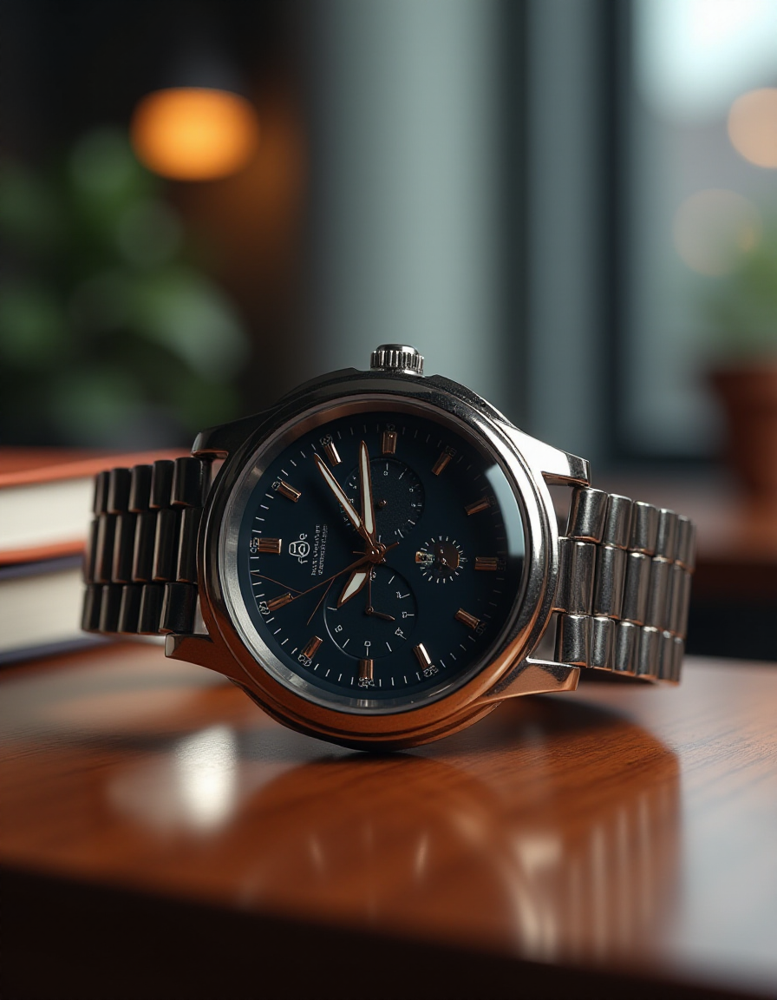 | 32 seconds          |
| `flux1-dev-fp8.safetensors`                        | 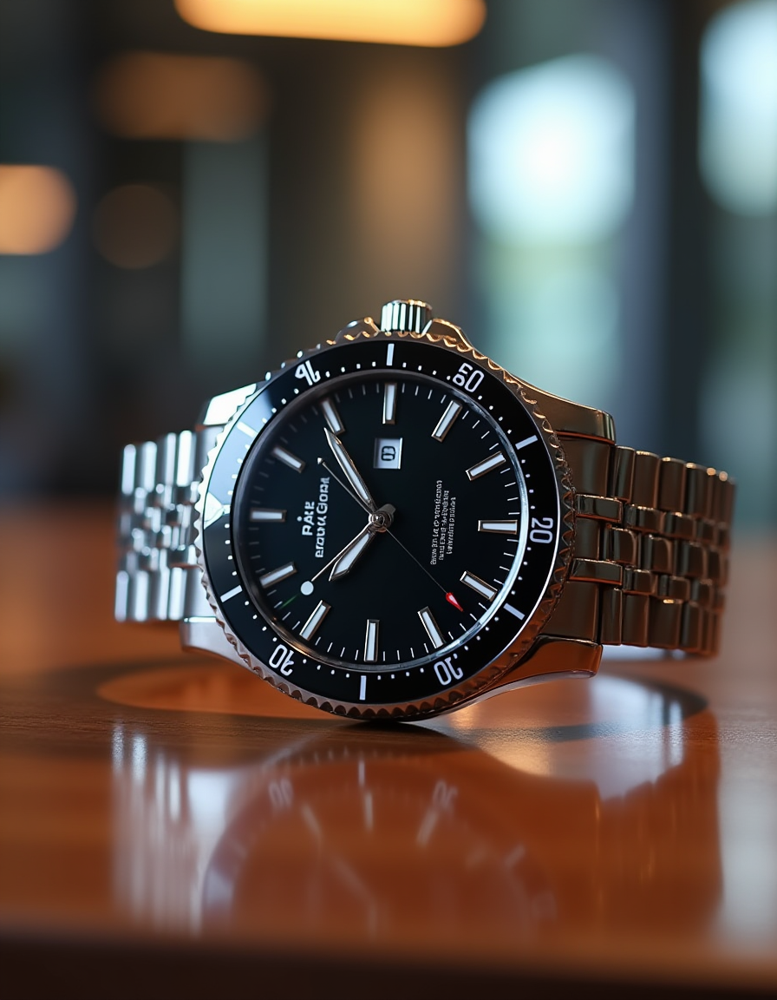        | 3 minutes 4 seconds |
| `flux1-schnell-bnb-nf4.safetensors`                | 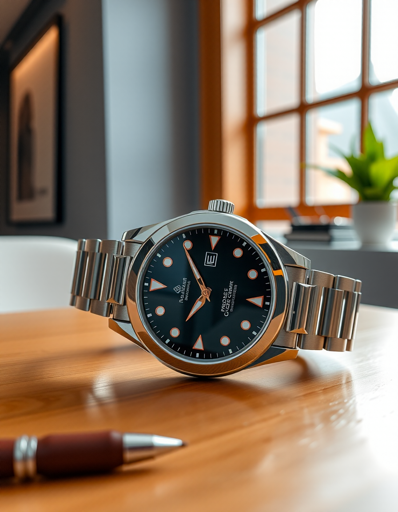 | 31 seconds          |
| `flux1DevV1V2Flux1_flux1SchnellBNBNF4.safetensors` | 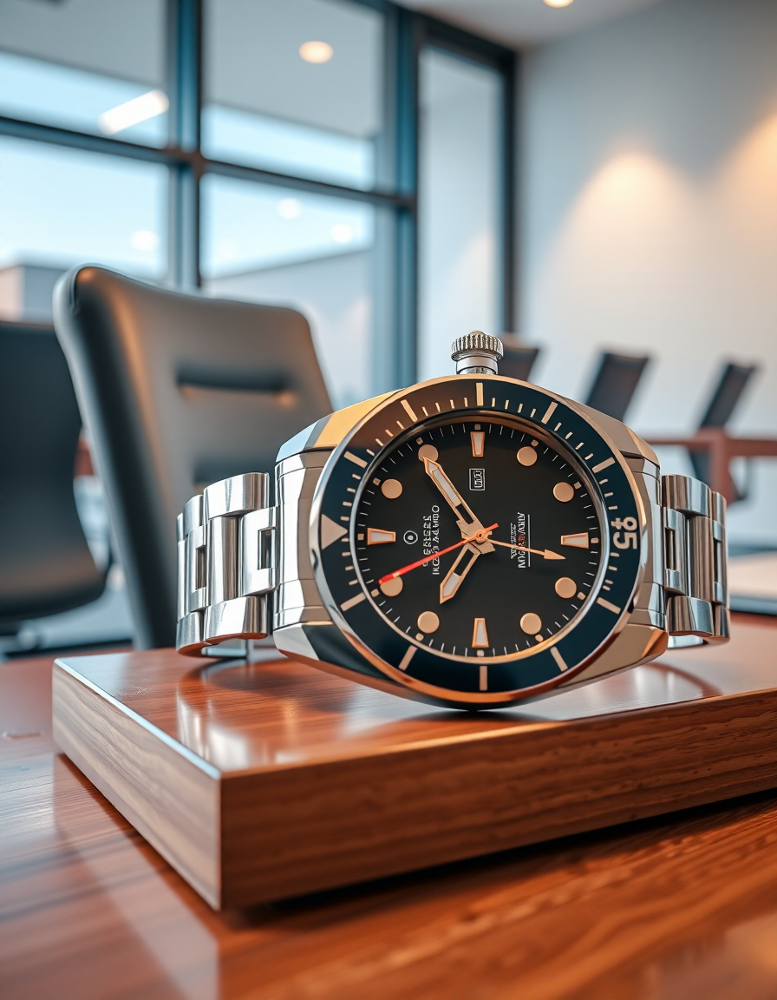 | 28 seconds          |
| `realisticVisionV51_v51VAE.safetensors`            | 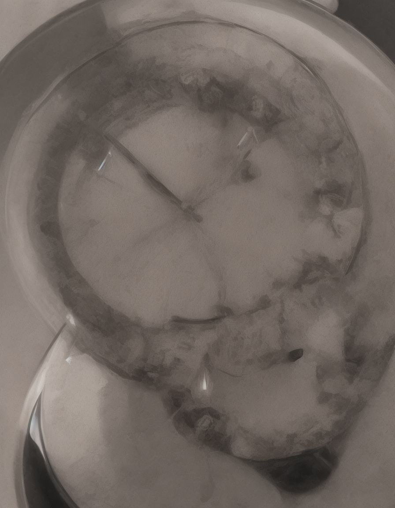 | 7.6 seconds         |

---

## Test 2: Conceptual Branding/Logo Design

**Prompt**:  
Design a futuristic logo for a tech startup specializing in AI and machine learning. The logo should feature abstract geometric shapes in blue and silver tones, with a dynamic 3D look. The concept should convey innovation and cutting-edge technology.

**Use Case**:  
Testing the model's ability to generate abstract conceptual designs for branding purposes, which can be used in logos or corporate identities.

**Expected Strengths**:  
- Creativity in shapes
- Color blending
- Modern dynamic designs

**Weaknesses to Observe**:  
- Challenges with meaningful symbolism
- Lack of originality in abstract designs
- Coherence in brand messaging

| Model                                              | Picture                                                        | Time                 |
| -------------------------------------------------- | -------------------------------------------------------------- | -------------------- |
| `flux1-dev-bnb-nf4-v2.safetensors`                 | 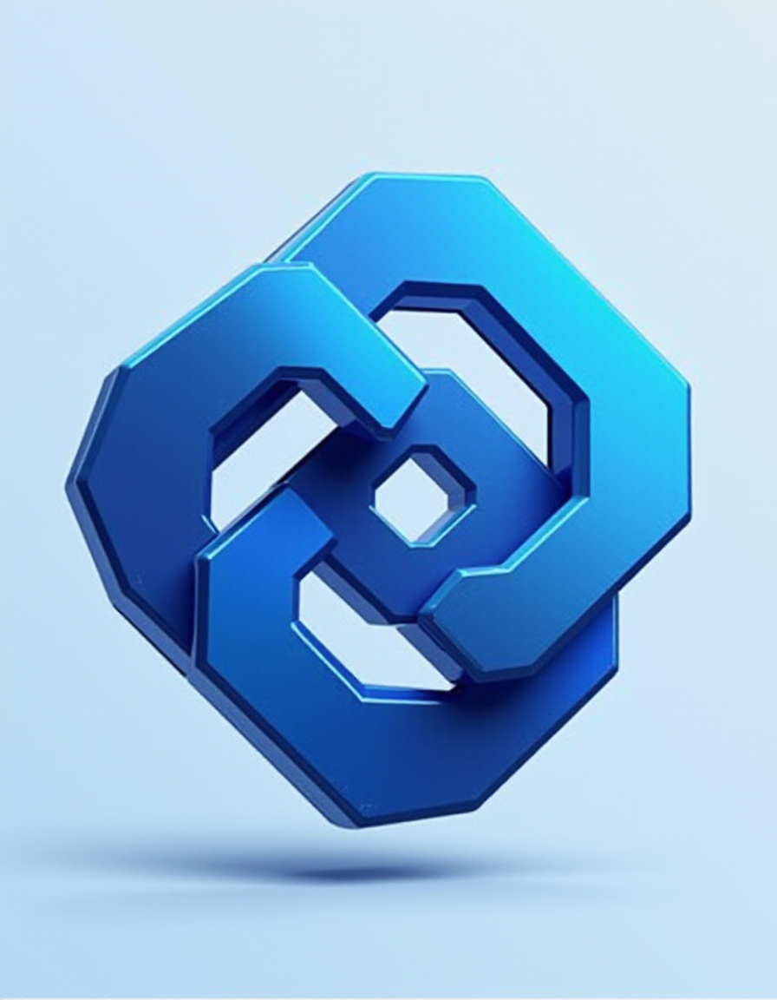 | 31 seconds           |
| `flux1-dev-fp8.safetensors`                        | 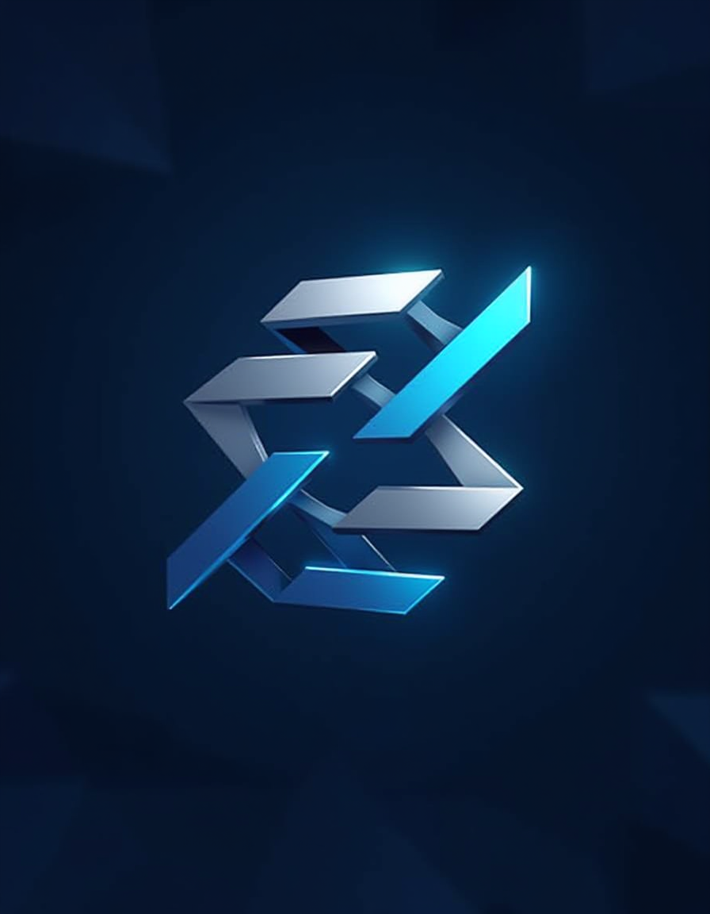        | 3 minutes 15 seconds |
| `flux1-schnell-bnb-nf4.safetensors`                | 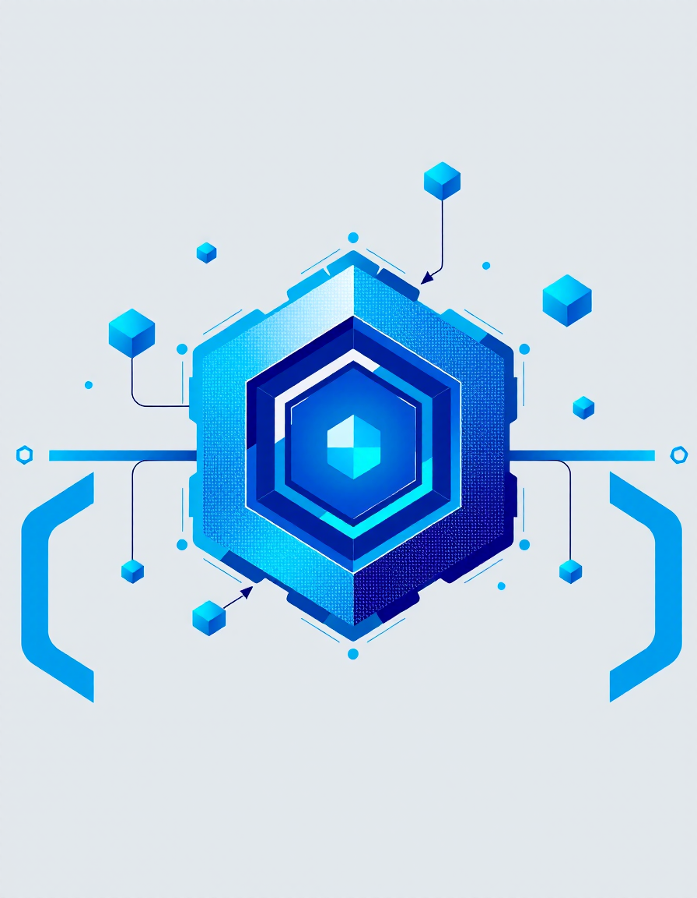 | 28 seconds           |
| `flux1DevV1V2Flux1_flux1SchnellBNBNF4.safetensors` | 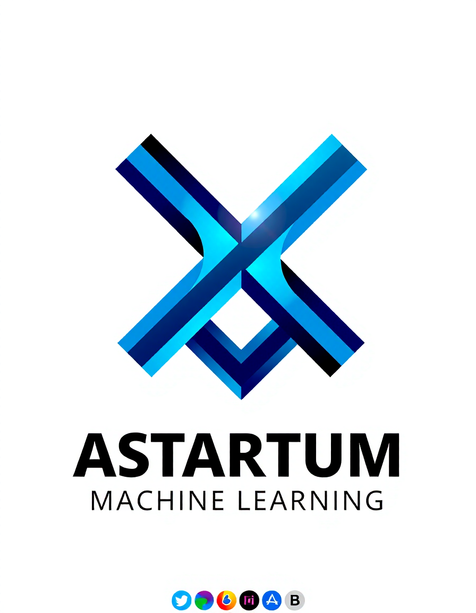 | 22 seconds           |
| `realisticVisionV51_v51VAE.safetensors`            |  | 2.6 seconds          |

---

## Test 3: Fantasy Scene Illustration

**Prompt**:  
Create a detailed fantasy landscape of a floating island in the sky, with a large ancient tree at the center of the island. The roots should be hanging off the sides, and the island is surrounded by waterfalls flowing into clouds below. The sky is filled with vibrant pink and orange hues of a sunset, and there are mystical creatures flying around.

**Use Case**:  
Testing the model's ability to create detailed fantasy scenes for use in video games, book covers, or concept art.

**Expected Strengths**:  
- Artistic creativity
- Rendering fantastical elements (floating islands, glowing creatures, surreal colors)

**Weaknesses to Observe**:  
- Complexity in spatial depth
- Balance between realism and fantasy
- Quality of finer details like creatures and textures

| Model                                              | Picture                                                        | Time                 |
| -------------------------------------------------- | -------------------------------------------------------------- | -------------------- |
| `flux1-dev-bnb-nf4-v2.safetensors`                 | 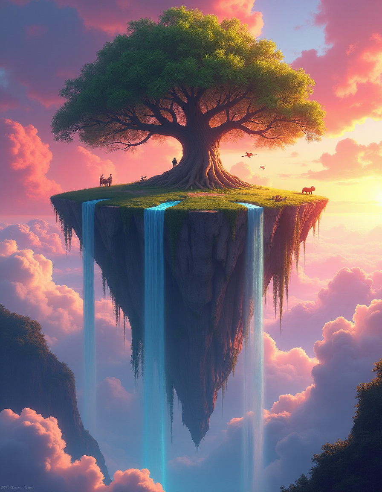 | 33 seconds           |
| `flux1-dev-fp8.safetensors`                        | 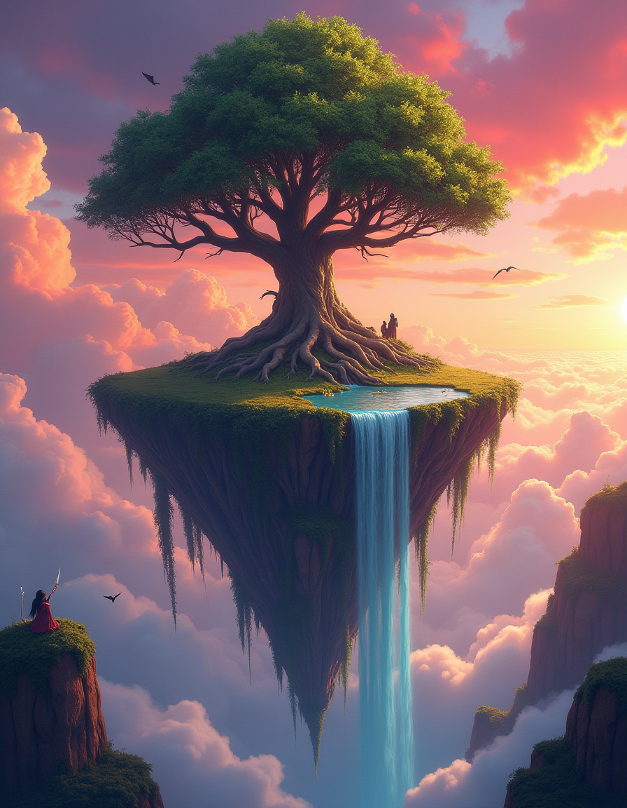        | 3 minutes 12 seconds |
| `flux1-schnell-bnb-nf4.safetensors`                |  | 30 seconds           |
| `flux1DevV1V2Flux1_flux1SchnellBNBNF4.safetensors` | 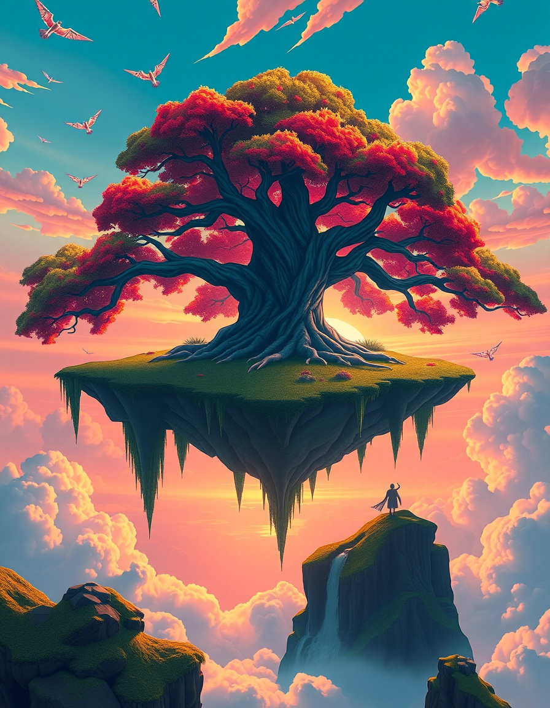 | 22 seconds           |
| `realisticVisionV51_v51VAE.safetensors`            | 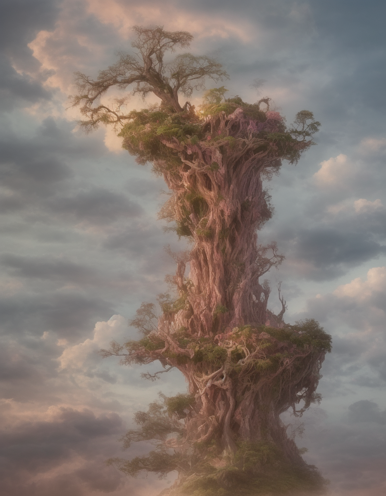 | 2.5 seconds          |

---

## Test 4: Human with Text on Clothing

**Prompt**:  
Create an image of a young man standing in a casual environment, wearing a t-shirt with the phrase "Think Different" printed in bold on the front. The t-shirt should be white with black text, and the man should be smiling in a relaxed pose. Ensure the text is legible, clear, and integrates naturally with the fabric's contours. The background should be a simple park setting with soft natural lighting.

**Use Case**:  
Evaluating the model’s ability to incorporate human figures with custom text on clothing for use in advertising, promotional materials, or personalized product mockups.

**Expected Strengths**:  
- Clear and natural integration of text with the clothing's texture
- Accurate human proportions
- Realistic lighting

**Weaknesses to Observe**:  
- Issues with text legibility
- Unnatural distortion of fabric or unrealistic human appearance

| Model                                              | Picture                                                        | Time                 |
| -------------------------------------------------- | -------------------------------------------------------------- | -------------------- |
| `flux1-dev-bnb-nf4-v2.safetensors`                 | 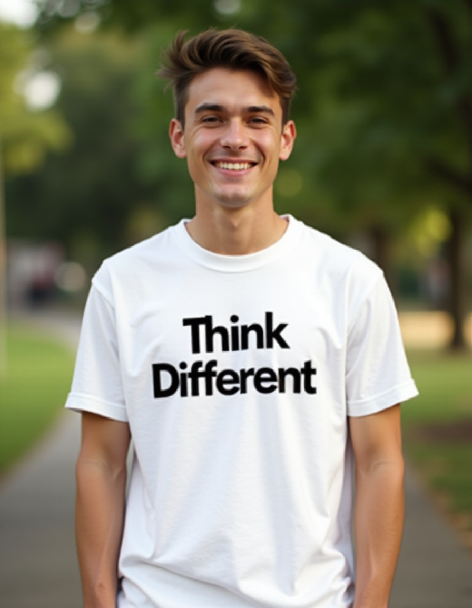 | 31 seconds           |
| `flux1-dev-fp8.safetensors`                        |         | 4 minutes 48 seconds |
| `flux1-schnell-bnb-nf4.safetensors`                | 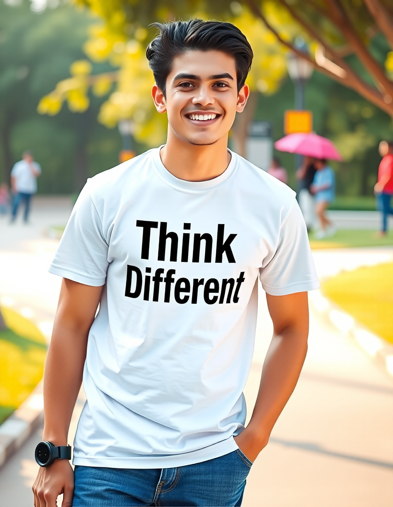 | 29 seconds           |
| `flux1DevV1V2Flux1_flux1SchnellBNBNF4.safetensors` |  | 23 seconds           |
| `realisticVisionV51_v51VAE.safetensors`            | 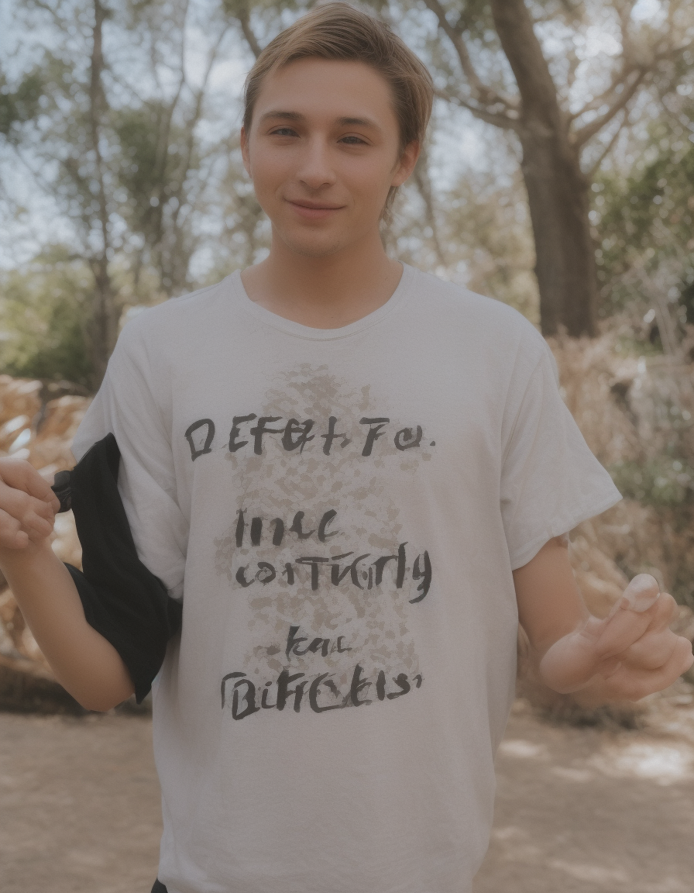 | 2.7 seconds          |

---

### Conclusion

Each model performed differently in terms of time and accuracy. Future testing could include further fine-tuning and customization to achieve optimal results for specific use cases.

Feel free to test these models yourself and adapt the prompts to your needs.

## Paired with KlingAI
- Used [KlingAI](https://www.klingai.com/) with this prompt:
	Describe a mystical, floating island with a large, ancient tree at its center. The island hovers above the clouds with a small waterfall flowing off its edge, surrounded by a serene, pastel sunset. Two figures stand near the tree, gazing out at the horizon. Another figure, holding a staff, watches from a distant cliff. Birds glide through the sky, adding a sense of peace and wonder to the scene. Narrate the story of this land, its history, and the purpose of the people in this world.

https://github.com/user-attachments/assets/d6d9c8a2-d752-4d4b-8d57-5c0d66b6b88b

- For the technology right now I believe this is great. In the future we will see much longer generated videos.
- Just look at [SoraAI](https://openai.com/index/sora/) when this launches it hopefully will be better then KlingAI
- There is also a [OpenSource variant](https://github.com/hpcaitech/Open-Sora) for this image to video or text to video stuff
- In the future we might can make our own little short movies. Isn't that crazy?
  Just like that, Back to the Future Part 4

---

_Made by: Weier Matthias_  
_Date: 11.09.2024_
