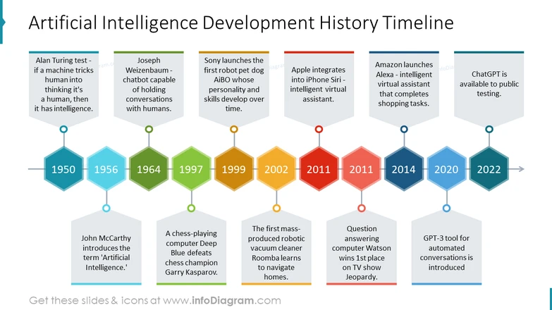

# 🌟 Introduction to Machine Learning & Artificial Intelligence

Artificial Intelligence (AI) and Machine Learning (ML) are two of the most transformative technologies of our time. These technologies have become essential in numerous industries, including healthcare 🏥, finance 💰, manufacturing 🏭, and retail 🛒. AI and ML are powering intelligent systems that can make decisions, learn from experience, and adapt to new data. Their importance cannot be overstated, as they represent a leap forward in how computers solve problems, interact with humans, and optimize operations.

## 🔍 Why Do We Need AI and Machine Learning?

The modern world is increasingly data-driven. Every day, businesses and organizations generate massive amounts of data 📊 that need to be processed, analyzed, and interpreted. Traditional computing approaches struggle to handle this scale and complexity. AI and ML provide the tools to process vast amounts of information more quickly and accurately than human beings ever could.
### Key Benefits:
- **Automation 🤖**: AI automates repetitive tasks, freeing up human resources for more complex and creative work.
- **Enhanced Decision Making 💡**: AI systems analyze vast datasets to make decisions based on patterns humans might miss.
- **Improved Accuracy 🎯**: ML algorithms excel in tasks like image recognition, speech processing, and predictive analytics.
- **Scalability 📈**: AI enables businesses to scale operations, offering personalized experiences and optimizing logistics.

## 🤖 What Makes AI and Machine Learning Cool?

One of the most exciting aspects of AI and ML is their ability to **learn** and **adapt**. Unlike traditional software that follows explicit instructions, ML models can learn from data and improve over time without needing to be reprogrammed. Some examples of what makes AI and ML revolutionary include:

- **Natural Language Processing (NLP) 🗣**: Machines can now understand and generate human language. This technology powers virtual assistants like Siri and Alexa.
- **Computer Vision 👁**: AI can interpret and process visual data, allowing for facial recognition, medical image analysis, and self-driving cars 🚗.
- **Predictive Analytics 📈**: AI predicts future trends based on past data, revolutionizing finance, marketing, and logistics.
- **Robotics 🤖**: AI-driven robots can perform complex tasks in manufacturing, healthcare, and even space exploration 🚀.

## ⚡ The Rapid Evolution of AI and Machine Learning

AI and ML are rapidly evolving fields. Advancements in algorithms, computational power 💻, and data availability are expanding their capabilities. As the field progresses, expect new applications and more sophisticated AI systems to emerge.

### 🌱 Emerging Trends:
- **Reinforcement Learning 🏆**: Teaching agents to interact with environments to maximize rewards. Applications include game-playing AIs and self-driving cars.
- **Generative AI 🎨**: Models like GPT or DALL·E generate text, images, and even videos, sparking creativity in fields like content creation and design.
- **Ethical AI ⚖️**: Ensuring that AI systems are fair, transparent, and free from bias, and addressing ethical concerns in AI development.

## ⚠️ The Dangers and Risks of AI

While AI offers incredible benefits, it also poses significant risks. Its powerful capabilities can be exploited by bad actors, or its use may lead to unintended consequences. Some of the most pressing risks include:

- **Security Threats 🔒**: Attackers can use AI to automate cyberattacks or exploit weaknesses in AI-driven systems.
- **Autonomous Weapons ⚔️**: AI weaponization raises ethical concerns, especially regarding autonomous military systems.
- **Bias and Discrimination 🚫**: AI models trained on biased data can perpetuate harmful biases, affecting hiring, law enforcement, and lending.
- **Job Displacement 🏢**: Automation powered by AI may displace jobs, especially in sectors like manufacturing and customer service.

## 🧠 Types of AI and Machine Learning

There are several classifications of AI and ML, each with its own characteristics and applications.

### 🤖 Types of AI
| **Type of AI**          | **Description**                                                                                                 |
| ----------------------- | --------------------------------------------------------------------------------------------------------------- |
| **Narrow AI**           | AI designed to perform a specific task (e.g., facial recognition, language translation). Also known as Weak AI. |
| **General AI**          | Hypothetical AI that can perform any intellectual task a human can. General AI does not yet exist.              |
| **Superintelligent AI** | AI that far exceeds human intelligence. This is a theoretical concept and raises ethical concerns.              |

### 🔄 Types of Machine Learning
| **Type of ML**              | **Description**                                                                                         |
|-----------------------------|---------------------------------------------------------------------------------------------------------|
| **Supervised Learning 🎯**   | The model is trained on labeled data. Examples include classification (e.g., spam detection) and regression (e.g., predicting house prices). |
| **Unsupervised Learning 🧩** | The model is trained on unlabeled data. Used for clustering and anomaly detection (e.g., customer segmentation). |
| **Reinforcement Learning 🏅**| The model learns by interacting with an environment, receiving rewards or penalties for actions. Used in robotics and gaming. |
| **Deep Learning 🧠**         | A subset of machine learning using neural networks with many layers to model complex patterns, such as in image or speech recognition. |

## 🌍 Applications of AI and Machine Learning

AI and ML have vast applications across numerous industries:

- **Healthcare 🏥**: AI-driven diagnostics, personalized medicine, drug discovery, and robotic surgery.
- **Finance 💰**: Fraud detection, algorithmic trading, and risk management.
- **Retail 🛒**: Personalized product recommendations, demand forecasting, and inventory optimization.
- **Autonomous Vehicles 🚗**: Self-driving cars depend on AI to process sensor data and navigate environments.
- **Customer Service 📞**: Chatbots and virtual assistants are increasingly used to provide efficient customer support.
- **Entertainment 🎬**: AI-driven recommendation engines power platforms like Netflix and Spotify.

## 📈 Constantly Evolving Landscape

AI and ML are dynamic fields, constantly evolving thanks to new research and technologies like GPUs and TPUs that improve computational power. The landscape will continue to shift, driven by several factors:

- **Regulation 🛑**: Governments and organizations will likely implement stricter regulations to ensure the ethical use of AI.
- **Data Privacy 🔐**: Protecting user data is crucial as AI becomes more data-hungry, especially with regulations like GDPR.
- **Edge AI 🌐**: Running AI models directly on devices like smartphones or IoT devices, rather than in the cloud, will become more common as processing capabilities improve.

## 🚀 The Future of AI and Machine Learning

The future of AI holds endless possibilities. Innovations such as **quantum computing** could enable even more powerful AI systems. From curing complex diseases 🧬 to tackling climate change 🌍 by optimizing resource use, AI could be a key player in solving global challenges.

However, with this tremendous potential comes responsibility. Ensuring that AI is developed and used ethically is critical to avoid harmful consequences. AI must be a tool for good, benefitting humanity rather than becoming a threat.

---

### Conclusion

Artificial Intelligence and Machine Learning are no longer science fiction—they are reshaping the world we live in. While AI opens the door to endless possibilities, it also raises critical ethical, security, and social concerns. Responsible development and regulation are crucial as we embrace the future of AI. Stay informed, stay engaged, and be prepared for a future driven by intelligent machines.

---

### Further Reading 📚:
- [The Machine Learning Crash Course by Google](https://developers.google.com/machine-learning/crash-course)
- [Artificial Intelligence: A Modern Approach (Book)](https://www.amazon.com/Artificial-Intelligence-Modern-Approach-3rd/dp/0136042597)
- [Deep Learning (Book by Ian Goodfellow)](https://www.deeplearningbook.org/)

